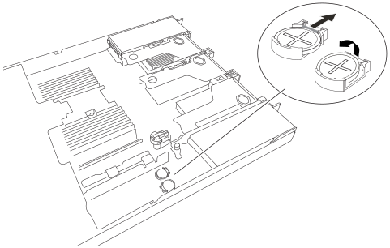

= 
:allow-uri-read: 

.步骤
. 将 ESD 腕带的腕带一端绕在腕带上，并将扣具一端固定到金属接地，以防止静电放电。
. 取下第一块 CMOS 电池。
+
.. 在系统板上找到 CMOS 电池。
.. 使用手指或塑料撬起工具将固定夹从电池上压出、以将其从插槽中弹簧取出。
+

.. 取出电池并正确处置。

. 安装更换后的 CMOS 电池。
+
.. 从其包装中取出更换的 CMOS 电池。
.. 将替代电池按入系统板上的空插槽中，使正极(+)面朝上，直至电池卡入到位。

. 对第二块 CMOS 电池重复这些步骤。
. 如果您不需要对设备执行其他维护步骤、请重新安装设备盖、将设备装回机架、连接电缆并接通电源。
. 如果您更换的设备已为SED驱动器启用驱动器加密、则必须执行此操作 link:../installconfig/optional-enabling-node-encryption.html#access-an-encrypted-drive["输入驱动器加密密码短语"] 在更换设备首次启动时访问加密驱动器。
. 如果您更换的设备使用密钥管理服务器(KMS)管理节点加密的加密密钥、则可能需要进行其他配置、节点才能加入网格。如果节点未自动加入网格、请确保这些配置设置已传输到新设备、并手动配置任何不具有预期配置的设置：
+
** link:../installconfig/accessing-storagegrid-appliance-installer.html["配置StorageGRID 连接"]
** https://docs.netapp.com/us-en/storagegrid/admin/kms-overview-of-kms-and-appliance-configuration.html#set-up-the-appliance["为此设备配置节点加密"^]

. 登录到设备：
+
.. 输入以下命令： `ssh admin@_grid_node_IP_`
.. 输入中列出的密码 `Passwords.txt` 文件
.. 输入以下命令切换到root： `su -`
.. 输入中列出的密码 `Passwords.txt` 文件

. 使用以下选项之一恢复设备的 BMC 网络连接：
+
** 使用静态IP、网络掩码和网关
** 使用DHCP获取IP、网络掩码和网关
+
... 要还原BMC配置以使用静态IP、网络掩码和网关、请输入以下命令：
+
`*run-host-command ipmitool lan set 1 ipsrc static*`

+
`*run-host-command ipmitool lan set 1 ipaddr _Appliance_IP_*`

+
`*run-host-command ipmitool lan set 1 netmask _Netmask_IP_*`

+
`*run-host-command ipmitool lan set 1 defgw ipaddr _Default_gateway_*`

... 要还原BMC配置以使用DHCP获取IP、网络掩码和网关、请输入以下命令：
+
`*run-host-command ipmitool lan set 1 ipsrc dhcp*`

. 还原BMC网络连接后、连接到BMC界面以审核和还原可能已应用的任何其他自定义BMC配置。例如、您应确认SNMP陷阱目标和电子邮件通知的设置。请参见 link:../installconfig/configuring-bmc-interface.html["配置BMC接口"]。
. 确认设备节点显示在网格管理器中且未显示任何警报。

