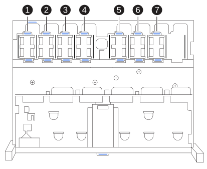
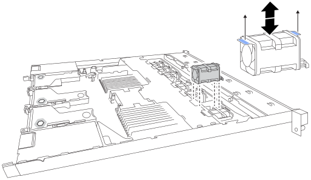

= 
:allow-uri-read: 

.步骤
. 将 ESD 腕带的腕带一端绕在腕带上，并将扣具一端固定到金属接地，以防止静电放电。
. 找到需要更换的风扇。
+
七个风扇在机箱中处于以下位置（显示了移除顶盖的 StorageGRID 设备的前半部分）：

+

+
|===
| 机箱位置 | 风扇单元 

 a| 
1.
 a| 
FAN_SYS

 a| 
2.
 a| 
FAN_SYS1

 a| 
3.
 a| 
FAN_SYS2

 a| 
4.
 a| 
FAN_SYS3

 a| 
5.
 a| 
FAN_SYS4

 a| 
6.
 a| 
FAN_SYS5

 a| 
7.
 a| 
FAN_SYS6

|===
. 使用风扇上的蓝色卡舌、将故障风扇从机箱中提出。
+

. 将替代风扇滑入机箱中的打开插槽。
+
将风扇上的连接器与电路板上的插座对齐。

. 将风扇连接器稳固地按入电路板。

