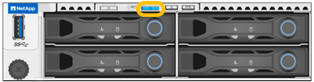

= 
:allow-uri-read: 

.开始之前
您知道要标识的设备的BMC IP地址。

.步骤
. link:../installconfig/accessing-bmc-interface.html["访问设备BMC界面"]。
. 选择 * 服务器标识 * 。
+
已选择识别LED的当前状态。

. 选择 *ON*、*OFF* 或 *BLINK*，然后选择 *Perform Action*。
+
选择 *ON* 时，设备前后蓝色识别 LED 指示灯亮起。

+

+

NOTE: 如果控制器上安装了挡板，则可能很难看到正面的识别 LED 。

+
后部标识 LED 位于设备中心的 Micro-SD 插槽旁边。

. 根据需要打开和关闭识别LED。

