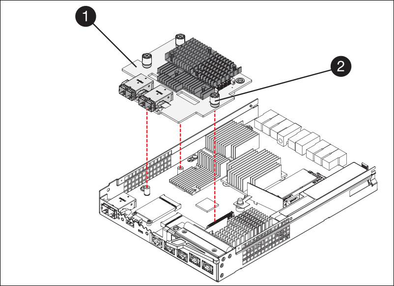

= 第5步：根据需要将HIC移至新控制器
:allow-uri-read: 

== 第5步：根据需要将HIC移至新控制器

如果故障控制器包含主机接口卡(HIC)、请将HIC从故障控制器移至更换控制器。

单独的HIC仅用于E2800B控制器。HIC安装在主控制器板上、并包含两个SPF连接器。

NOTE: 此操作步骤 中的插图显示了一个双端口HIC。控制器中的HIC可能具有不同数量的端口。

[role="tabbed-block"]
====
.E2800A
--
E2800A控制器没有HIC。

装回E2800A控制器护盖、然后转至 <<step6_replace_controller,第6步：更换控制器>>

--
.E2800B
--
将HIC从发生故障的E2800B控制器移至替代控制器。

.步骤
. 从HIC中删除所有SFP。
. 使用1号十字螺丝刀卸下将HIC面板连接到控制器的螺钉。
+
有四个螺钉：一个在顶部，一个在侧面，两个在正面。

+
image::../media/28_dwg_e2800_hic_faceplace_screws_maint-e2800.png[E2800面板螺钉]

. 卸下 HIC 面板。
. 使用您的手指或十字螺丝刀松开将 HIC 固定到控制器卡的三个翼形螺钉。
. 小心地将 HIC 从控制器卡上卸下，方法是将该卡抬起并滑回。
+

CAUTION: 请注意，不要擦除或撞击 HIC 底部或控制器卡顶部的组件。

+

+
[cols="1a,2a"]
|===
| Label | Description 

 a| 
1.
 a| 
主机接口卡

 a| 
2.
 a| 
翼形螺钉

|===
. 将 HIC 放置在无静电表面上。
. 使用1号十字螺丝刀卸下将空白面板连接到更换用控制器的四个螺钉、然后卸下面板。
. 将HIC上的三个翼形螺钉与更换用的控制器上的相应孔对齐、并将HIC底部的连接器与控制器卡上的HIC接口连接器对齐。
+
请注意，不要擦除或撞击 HIC 底部或控制器卡顶部的组件。

. 小心地将 HIC 放低到位，然后轻按 HIC 以固定 HIC 连接器。
+

CAUTION: *设备可能损坏*--小心不要在HIC和指旋螺钉之间夹住控制器LED的金色带状连接器。

+
image::../media/28_dwg_e2800_hic_thumbscrews_maint-e2800.gif[E2800A HIC拧紧螺钉]

+
[cols="1a,2a"]
|===
| Label | Description 

 a| 
1.
 a| 
主机接口卡

 a| 
2.
 a| 
翼形螺钉

|===
. 手动拧紧 HIC 翼形螺钉。
+
请勿使用螺丝刀、否则可能会将螺钉拧得过紧。

. 使用1号十字螺丝刀、使用四个螺钉将从原始控制器上卸下的HIC面板连接到新控制器。
+
image::../media/28_dwg_e2800_hic_faceplace_screws_maint-e2800.png[E2800A面板螺钉]

. 将所有已删除的SFP重新安装到HIC中。

--
====