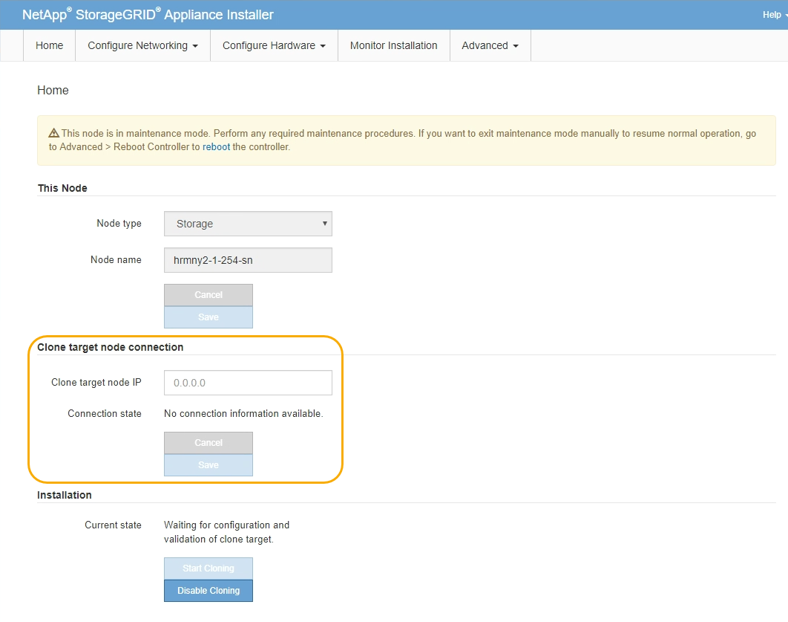

= 克隆设备节点
:allow-uri-read: 
:icons: font
:imagesdir: ../media/

[role="lead"]
克隆过程可能需要几天时间才能在源节点（正在更换的设备）和目标（新）设备之间传输数据。

.开始之前
* 您已将兼容的目标设备安装到机柜或机架中，并已连接所有缆线并已接通电源。
* 您已确认替代设备上的StorageGRID设备安装程序版本与StorageGRID系统的软件版本匹配、并在必要时升级和降级StorageGRID设备安装程序固件。
* 您已配置目标设备，包括配置 StorageGRID 连接， SANtricity 系统管理器（仅限存储设备）和 BMC 接口。
+
** 配置 StorageGRID 连接时，请使用临时 IP 地址。
** 配置网络链路时，请使用最终的链路配置。

NOTE: 完成初始目标设备配置后，保持 StorageGRID 设备安装程序处于打开状态。启动节点克隆过程后，您将返回到目标设备的安装程序页面。

* 您也可以选择为目标设备启用节点加密。
* 您也可以为目标设备（仅限存储设备）设置 RAID 模式。
* 您已查看 link:considerations-and-requirements-for-appliance-node-cloning.html["设备节点克隆的注意事项和要求"]。

一次只应克隆一个设备节点，以保持 StorageGRID 网络性能和数据可用性。

.步骤
. link:../commonhardware/placing-appliance-into-maintenance-mode.html["将要克隆的源节点置于维护模式"]。
. 从源节点上的 StorageGRID 设备安装程序中，在主页的安装部分中，选择 * 启用克隆 * 。
+
主管理节点连接部分将替换为克隆目标节点连接部分。

+

. 对于 * 克隆目标节点 IP* ，输入分配给目标节点的临时 IP 地址，以便网络用于克隆数据传输流量，然后选择 * 保存 * 。
+
通常，您可以输入网格网络的 IP 地址，但如果需要使用其他网络来传输克隆数据传输流量，请输入该网络上目标节点的 IP 地址。

+

NOTE: 使用 1-GbE 管理网络进行克隆数据传输会导致克隆速度变慢。

+
配置并验证目标设备后，在 "Installation" 部分中，源节点上会启用 * 开始克隆 * 。

+
如果存在阻止克隆的问题，则不会启用 * 启动克隆 * ，必须解决的问题将列为 * 连接状态 * 。源节点和目标设备的 StorageGRID 设备安装程序主页均列出了这些问题。一次仅显示一个问题描述 ，状态会随着条件的变化自动更新。解决所有克隆问题以启用 * 开始克隆 * 。

+
启用 * 开始克隆 * 后， * 当前状态 * 将指示为克隆流量选择的 StorageGRID 网络以及有关使用该网络连接的信息。请参见 link:considerations-and-requirements-for-appliance-node-cloning.html["设备节点克隆的注意事项和要求"]。

. 在源节点上选择 * 开始克隆 * 。
. 在源节点或目标节点上使用 StorageGRID 设备安装程序监控克隆进度。
+
源节点和目标节点上的 StorageGRID 设备安装程序指示相同的状态。

+
image::../media/cloning_progress.png[克隆进度]

+
"Monitor Cloning" 页面提供了克隆过程每个阶段的详细进度：

+
** * 建立克隆对等关系 * 显示克隆设置和配置的进度。
** * 从此节点克隆另一个节点 * 将显示数据传输的进度。（克隆过程的这一部分可能需要几天时间才能完成。）
** * 激活克隆的节点并使其脱机 * 将显示在数据传输完成后将控制权移交给目标节点并将源节点置于预安装状态的进度。

. 如果需要在克隆完成之前终止克隆过程并将源节点恢复服务，请在源节点上转到 StorageGRID 设备安装程序主页页面，选择 * 高级 * > * 重新启动控制器 * ，然后选择 * 重新启动到 StorageGRID * 。
+
如果克隆过程终止：

+
** 源节点将退出维护模式并重新加入 StorageGRID 。
** 目标节点将保持预安装状态。
要重新启动源节点的克隆，请从步骤 1 中重新启动克隆过程。

成功完成克隆后：

* 源节点和目标节点交换 IP 地址：
+
** 现在，目标节点将使用最初分配给源节点的网格网络，管理网络和客户端网络 IP 地址。
** 现在，源节点将使用最初分配给目标节点的临时 IP 地址。

* 目标节点将退出维护模式并加入 StorageGRID ，从而替换源节点。
* 源设备处于预安装状态，就像您已安装一样 https://docs.netapp.com/us-en/storagegrid-118/maintain/preparing-appliance-for-reinstallation-platform-replacement-only.html["已准备好重新安装"^]。

NOTE: 如果设备未重新加入网格，请转到源节点的 StorageGRID 设备安装程序主页页面，选择 * 高级 * > * 重新启动控制器 * ，然后选择 * 重新启动到维护模式 * 。在源节点以维护模式重新启动后，重复节点克隆操作步骤 。

* 如果目标节点发生意外的问题描述 ，则用户数据将作为恢复选项保留在源设备上。目标节点成功重新加入 StorageGRID 后，源设备上的用户数据已过时，不再需要。
+
在其他网格中将源设备作为新节点安装或扩展时、过时的用户数据将被覆盖。

+
您还可以重置源设备上的控制器配置、以使此数据无法访问：

+
.. 打开 link:../installconfig/accessing-storagegrid-appliance-installer.html["StorageGRID 设备安装程序"] 使用最初分配给目标节点的临时IP地址的源设备。
.. 选择*帮助*>*支持和调试工具*。
.. 选择*重置存储控制器配置*。
+

NOTE: 如果需要、请联系技术支持以帮助重置存储控制器配置。

+

NOTE: 覆盖数据或重置控制器配置会使过时的数据难以或无法检索；但是、这两种方法都无法安全地从源设备中删除数据。如果需要安全擦除、请使用数据擦除工具或服务从源设备中永久安全地删除数据。

您可以

* 将源设备用作其他克隆操作的目标：不需要其他配置。此设备已分配最初为第一个克隆目标指定的临时 IP 地址。
* 将源设备安装为新设备节点并进行设置。
* 如果源设备不再用于 StorageGRID ，请丢弃该源设备。

