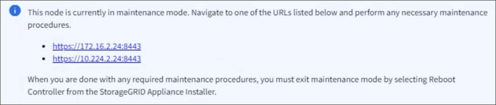

= 将 StorageGRID 设备置于维护模式
:allow-uri-read: 
:icons: font
:imagesdir: ../media/

[role="lead"]
在执行特定维护过程之前，您必须将设备置于维护模式。

.开始之前
* 您已使用登录到网格管理器 https://docs.netapp.com/us-en/storagegrid/admin/web-browser-requirements.html["支持的 Web 浏览器"^]。
* 您具有维护或 root 访问权限。有关详细信息，请参见有关管理 StorageGRID 的说明。

.关于此任务
在极少数情况下，将 StorageGRID 设备置于维护模式可能会使该设备无法进行远程访问。

NOTE: 处于维护模式的 StorageGRID 设备的管理员帐户密码和 SSH 主机密钥与该设备运行时的密码和主机密钥保持不变。

.步骤
. 在网格管理器中，选择 *节点* 。
. 从节点页面的树视图中，选择设备存储节点。
. 选择 * 任务 * 。
. 选择 * 维护模式 * 。此时将显示确认对话框。
. 输入配置密码短语，然后选择 * 确定 * 。
+
进度条和一系列消息（包括 " 已发送请求 " ， " 正在停止 StorageGRID " 和 " 正在重新启动 " ）表示设备正在完成进入维护模式的步骤。

+
设备处于维护模式时，会显示一条确认消息，其中列出了可用于访问 StorageGRID 设备安装程序的 URL 。

+

. 要访问 StorageGRID 设备安装程序，请浏览到显示的任何 URL 。
+
如果可能，请使用包含设备管理网络端口 IP 地址的 URL 。

+

NOTE: 如果直接连接到设备的管理端口、请使用 `+https://169.254.0.1:8443+` 以访问StorageGRID 设备安装程序页面。

. 在 StorageGRID 设备安装程序中，确认设备处于维护模式。
. 执行任何必要的维护任务。
. 完成维护任务后，退出维护模式并恢复正常节点操作。在 StorageGRID 设备安装程序中，选择 * 高级 * > * 重新启动控制器 * ，然后选择 * 重新启动至 StorageGRID * 。
+
设备重新启动并重新加入电网最多可能需要 20 分钟。要确认重启已完成且节点已重新加入网格：

+
.. 在 Grid Manager 中，选择 *Nodes* 。
.. 验证设备节点是否处于正常状态（绿色复选标记图标image:../media/icon_alert_green_checkmark.png["绿色复选标记"]（在节点名称左侧），这表示没有活动警报并且该节点已连接到电网。

