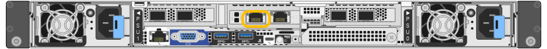
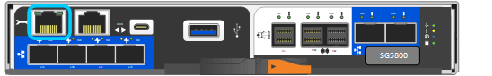

= 访问 StorageGRID 设备安装程序
:allow-uri-read: 
:icons: font
:imagesdir: ../media/

[role="lead"]
您必须访问 StorageGRID 设备安装程序以验证安装程序版本，并配置设备与三个 StorageGRID 网络之间的连接：网格网络，管理网络（可选）和客户端网络（可选）。

.开始之前
* 您正在使用可以连接到 StorageGRID 管理网络的任何管理客户端，或者您使用的是服务笔记本电脑。
* 客户端或服务笔记本电脑具有 https://docs.netapp.com/us-en/storagegrid/admin/web-browser-requirements.html["支持的 Web 浏览器"^]。
* 服务设备或存储设备控制器已连接到您计划使用的所有StorageGRID 网络。
* 您知道这些网络上的服务设备或存储设备控制器的IP地址、网关和子网。
* 您已配置计划使用的网络交换机。

.关于此任务
要首次访问StorageGRID设备安装程序、您可以使用服务设备或存储设备控制器上的管理网络端口(假设已连接到管理网络)的DHCP分配IP地址。 或者、您也可以将服务笔记本电脑直接连接到服务设备或存储设备控制器。

.步骤
. 如果可能、请对服务设备或存储设备控制器上的管理网络端口使用DHCP地址。下图突出显示了管理网络端口。(如果未连接管理网络、请使用网格网络上的IP地址。)
+
[role="tabbed-block"]
====
.SG100
--
image::../media/sg100_admin_network_port.png[SG100 上的管理网络端口]

--
.SG110
--

--
.SG1000
--
image::../media/sg1000_admin_network_port.png[SG1000 上的管理网络端口]

--
.SG1100
--
image::../media/sg1100_admin_network_port.png[SG1100上的管理网络端口]

--
.E5700SG
--
对于E5700SG、您可以执行以下任一操作：

** 查看 E5700SG 控制器上的七段显示器。如果 E5700SG 控制器上的管理端口 1 和 10/25GbE 端口 2 和 4 连接到使用 DHCP 服务器的网络，则控制器会在打开机箱电源时尝试获取动态分配的 IP 地址。控制器完成启动过程后，其七段显示屏将显示 * HO* ，然后是两个数字的重复序列。
+
[listing]
----
HO -- IP address for Admin Network -- IP address for Grid Network HO
----
+
顺序：

+
*** 第一组数字是管理网络上设备存储节点的 DHCP 地址（如果已连接）。此 IP 地址将分配给 E5700SG 控制器上的管理端口 1 。
*** 第二组数字是网格网络上设备存储节点的 DHCP 地址。首次为设备接通电源时，此 IP 地址将分配给 10/225-GbE 端口 2 和 4 。
+

NOTE: 如果无法使用 DHCP 分配 IP 地址，则会显示 0.0.0.0 。

--
.SGs了
--
image::../media/sg5800_admin_network_port.png[SG波特 控制器上的管理网络端口]

--
.SG6000-CN
--
image::../media/sg6000_cn_admin_network_port.png[SG6000-CN 控制器上的管理网络端口]

--
.SG6100-CN
--

--
.GF6112
--

--
====
+
.. 从网络管理员处获取管理网络上设备的DHCP地址。
.. 在客户端中、输入StorageGRID 设备安装程序的以下URL：+
`*https://_Appliance_IP_:8443*`
+
适用于 `_Appliance_IP_`，请使用DHCP地址(如果有，请使用管理网络的IP地址)。

.. 如果系统提示您显示安全警报，请使用浏览器的安装向导查看并安装证书。
+
下次访问此 URL 时，不会显示此警报。

+
此时将显示 StorageGRID 设备安装程序主页页面。首次访问此页面时显示的信息和消息取决于设备当前与 StorageGRID 网络的连接方式。可能会显示错误消息，这些消息将在后续步骤中解决。

+
image::../media/appliance_installer_home_5700_5600.png[StorageGRID设备安装程序主页顶部的屏幕截图]

. 如果无法使用DHCP获取IP地址、则可以使用链路本地连接。
+
[role="tabbed-block"]
====
.SG100
--
使用以太网缆线将服务笔记本电脑直接连接到服务设备上最右侧的 RJ-45 端口。

image::../media/sg100_link_local_port.png[SG100 链路本地连接]

--
.SG110
--
使用以太网电缆将服务笔记本电脑直接连接到设备最右侧的RJ-45端口。

image::../media/sg6100_link_local_port.png[SG110链路本地连接]

--
.SG1000
--
使用以太网缆线将服务笔记本电脑直接连接到服务设备上最右侧的 RJ-45 端口。

image::../media/sg1000_link_local_port.png[SG1000 链路本地连接]

--
.SG1100
--
使用以太网电缆将服务笔记本电脑直接连接到设备最右侧的RJ-45端口。

image::../media/sg1100_link_local_port.png[SG1100链路本地连接]

--
.E5700SG
--
使用以太网缆线将服务笔记本电脑连接到 E5700SG 控制器上的管理端口 2 。

image::../media/e5700sg_mgmt_port_2.gif[管理端口 2 在 E5700SG 控制器上的位置]

--
.SGs了
--
使用以太网缆线将服务笔记本电脑连接到SG波特5控制器上的管理端口1。

--
.SG6000-CN
--
使用以太网缆线将服务笔记本电脑直接连接到 SG6000-CN 控制器上最右侧的 RJ-45 端口。

--
.SG6100-CN
--
使用以太网电缆将服务笔记本电脑直接连接到SG6100-CN控制器上最右侧的RJ-45端口。

image::../media/sg6100_cn_link_local_port.png[SG6100-CN的管理端口位置]

--
.GF6112
--
使用以太网电缆将服务笔记本电脑直接连接到设备最右侧的RJ-45端口。

image::../media/sg6100_link_local_port.png[SGF6112链路本地连接]

--
====
+
.. 在服务笔记本电脑上打开 Web 浏览器。
.. 输入StorageGRID 设备安装程序的URL：+
`*\https://169.254.0.1:8443*`
+
此时将显示 StorageGRID 设备安装程序主页页面。首次访问此页面时显示的信息和消息取决于设备当前与 StorageGRID 网络的连接方式。可能会显示错误消息，这些消息将在后续步骤中解决。

+

NOTE: 如果无法通过链路本地连接访问主页、请将服务笔记本电脑的IP地址配置为 `169.254.0.2`、然后重试。

.完成后
访问 StorageGRID 设备安装程序后：

* 验证设备上的 StorageGRID 设备安装程序版本是否与 StorageGRID 系统上安装的软件版本匹配。如有必要，请升级 StorageGRID 设备安装程序。
+
link:verifying-and-upgrading-storagegrid-appliance-installer-version.html["验证并升级 StorageGRID 设备安装程序版本"]

* 查看 StorageGRID 设备安装程序主页页面上显示的所有消息，并根据需要配置链路配置和 IP 配置。
+
image::../media/appliance_installer_home_services_appliance.png[设备安装程序主页]

