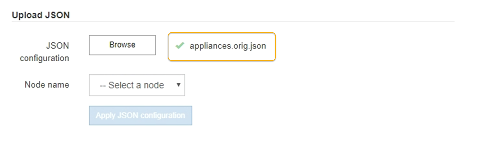

= 自动安装和配置设备
:allow-uri-read: 
:icons: font
:imagesdir: ../media/

[role="lead"]
自动化安装和配置对于部署多个 StorageGRID 实例或一个大型复杂的 StorageGRID 实例非常有用。

您可以使用NetApp StorageGRID 工具自动安装和配置StorageGRID 设备。安装和配置设备后、您可以执行此操作 link:automating-configuration-of-storagegrid.html["自动配置整个StorageGRID 系统"]。

您可以自动配置以下内容：

* 网格网络，管理网络和客户端网络 IP 地址
* BMC 接口
* 网络链路
+
** 端口绑定模式
** 网络绑定模式
** 链路速度

== 自动化选项

要自动安装和配置设备、请使用以下一个或多个选项：

* 生成包含配置详细信息的JSON文件。请咨询NetApp专业服务顾问以使用 link:https://configbuilder.netapp.com/index.aspx["NetApp ConfigBuilder工具"^] 要完成以下步骤：
+
.. 请咨询NetApp专业服务以获取销售订单号。
.. 从ConfigBuilder获取工作簿。
.. 请咨询专业服务以完成工作手册。
.. 使用ConfigBuilder上传工作簿。
.. 使用ConfigBuilder生成JSON文件。
.. 请咨询专业服务以将JSON文件上传到设备。
+
请参见 <<automate-with-appliance-installer,使用设备安装程序自动执行>>。

+

NOTE: 您可以使用同一个JSON文件配置多个设备。

+
使用上传的JSON文件配置设备通常比手动执行配置更高效、尤其是在您需要配置多个节点时。手动执行配置需要在StorageGRID 设备安装程序中使用多个页面、并为每个节点逐个应用配置文件。

* 如果您是高级用户、则可以使用以下StorageGRID Python脚本来安装和配置系统：
+
** `configure-sga.py`：自动安装和配置设备。请参见 <<automate-with-configure-sga-py-script,使用configure-sga.py脚本自动安装和配置设备>>。
** `configure-storagegrid.py`：配置整个StorageGRID 系统的其他组件("网格")。请参见 link:automating-configuration-of-storagegrid.html["自动执行StorageGRID 配置"]。

+

NOTE: 您可以直接使用 StorageGRID 自动化 Python 脚本，也可以使用它们作为示例，说明如何在您自己开发的网格部署和配置工具中使用 StorageGRID 安装 REST API 。请参阅的说明 https://docs.netapp.com/us-en/storagegrid/maintain/downloading-and-extracting-storagegrid-installation-files.html["下载并提取 StorageGRID 安装文件"^]。

== 使用 StorageGRID 设备安装程序自动配置设备

生成JSON文件后、您可以使用StorageGRID 设备安装程序上传JSON文件、从而自动配置一个或多个设备。

.开始之前
* 此设备已安装在机架中，并已连接到您的网络并已启动。
* 您已拥有 <<automation-options,已生成JSON文件>> 在NetApp专业服务顾问的指导下。
* 您的设备包含与StorageGRID 11.5或更高版本兼容的最新固件。
* 您已使用连接到要配置的设备上的StorageGRID设备安装程序 https://docs.netapp.com/us-en/storagegrid/admin/web-browser-requirements.html["支持的 Web 浏览器"^]。

.步骤
. 在StorageGRID 设备安装程序中，选择*高级*>*更新设备配置*。此时将显示更新设备配置页面。
. 浏览并选择包含要上传的配置的JSON文件。
+
已上传并验证此文件。验证过程完成后，文件名会显示在绿色复选标记旁边。

+

NOTE: 如果JSON文件中的配置包含的部分、则可能会断开与设备的连接 `link_config`， `networks`或两者。如果您未在1分钟内重新连接、请使用分配给设备的其他IP地址之一重新输入设备URL。

+

+
此时将使用 JSON 文件中定义的顶级节点名称填充 * 节点名称 * 下拉列表。

+

NOTE: 如果文件无效，则文件名将显示为红色，并在黄色横幅中显示一条错误消息。此无效文件不会应用于此设备。ConfigBuilder将验证您是否具有有效的JSON文件。

. 从 * 节点名称 * 下拉列表中选择一个节点。
+
此时将启用*应用JSON配置*按钮。

. 选择 * 应用 JSON 配置 * 。
+
此配置将应用于选定节点。

== 使用configure-sga.py脚本自动安装和配置设备

如果您是高级用户、则可以使用 `configure-sga.py` 用于自动执行StorageGRID 设备节点的许多安装和配置任务的脚本、包括安装和配置主管理节点。如果要配置大量设备，此脚本可能会很有用。

您也可以使用此脚本生成包含设备配置信息的 JSON 文件。您可以将JSON文件上传到StorageGRID 设备安装程序以同时配置所有设备节点。您也可以编辑JSON文件、然后将其上传以将新配置应用于一个或多个设备。

NOTE: 此操作步骤 适用于具有命令行界面使用经验的高级用户。或者，您也可以 <<automate-with-appliance-installer,使用 StorageGRID 设备安装程序自动执行配置>>。

.开始之前
* 此设备已安装在机架中，并已连接到您的网络并已启动。
* 您已拥有 <<automation-options,已生成JSON文件>> 在NetApp专业服务顾问的指导下。
* 您的设备包含与StorageGRID 11.5或更高版本兼容的最新固件。
* 您已为此设备配置管理网络的IP地址。
* 您已下载 `configure-sga.py` 文件该文件包含在安装归档中，您也可以通过单击 StorageGRID 设备安装程序中的 * 帮助 * > * 设备安装脚本 * 来访问该文件。

.步骤
. 登录到用于运行 Python 脚本的 Linux 计算机。
. 要获得有关脚本语法的一般帮助以及查看可用参数列表，请输入以下内容：
+
[listing]
----
./configure-sga.py --help
----
+
。 `configure-sga.py` 脚本使用五个子命令：

+
** `advanced` 用于高级StorageGRID 设备交互、包括BMC配置和创建包含设备当前配置的JSON文件
** `configure` 用于配置RAID模式、节点名称和网络参数
** `install` 开始StorageGRID 安装
** `monitor` 用于监控StorageGRID 安装
** `reboot` 用于重新启动设备
+
如果输入子命令(高级、配置、安装、监控或重新启动)参数、然后输入 `--help` 选项您将看到另一个帮助文本、其中提供了有关该子命令+中可用选项的更多详细信息
`./configure-sga.py _subcommand_ --help`

+
如果您愿意 <<back-up-appliance-config,将设备配置备份到JSON文件>>，请确保节点名称符合以下要求：

+
*** 如果要使用JSON文件自动配置所有设备节点、则每个节点名称都是唯一的。
*** 必须是一个有效的主机名、其中至少包含1个且不超过32个字符。
*** 可以使用字母、数字和连字符。
*** 不能以连字符开头或结尾。
*** 不能仅包含数字。

. 要将JSON文件中的配置应用于设备、请输入以下命令、其中 `_SGA-INSTALL-IP_` 是设备的管理网络IP地址、 `_json-file-name_` 是JSON文件的名称、和 `_node-name-inside-json-file_` 是应用了配置的节点的名称：+
`./configure-sga.py advanced --restore-file _json-file-name_ --restore-node _node-name-inside-json-file_ _SGA-INSTALL-IP_`
. 要确认设备节点的当前配置、请在其中输入以下内容 `_SGA-INSTALL-IP_` 是设备的管理网络IP地址：+
`./configure-sga.py configure _SGA-INSTALL-IP_`
+
结果将显示设备的当前 IP 信息，包括主管理节点的 IP 地址以及有关管理，网格和客户端网络的信息。

+
[listing]
----
Connecting to +https://10.224.2.30:8443+ (Checking version and connectivity.)
2021/02/25 16:25:11: Performing GET on /api/versions... Received 200
2021/02/25 16:25:11: Performing GET on /api/v2/system-info... Received 200
2021/02/25 16:25:11: Performing GET on /api/v2/admin-connection... Received 200
2021/02/25 16:25:11: Performing GET on /api/v2/link-config... Received 200
2021/02/25 16:25:11: Performing GET on /api/v2/networks... Received 200
2021/02/25 16:25:11: Performing GET on /api/v2/system-config... Received 200

  StorageGRID Appliance
    Name:        LAB-SGA-2-30
    Node type:   storage

  StorageGRID primary Admin Node
    IP:        172.16.1.170
    State:     unknown
    Message:   Initializing...
    Version:   Unknown

  Network Link Configuration
    Link Status
          Link      State      Speed (Gbps)
          ----      -----      -----
          1         Up         10
          2         Up         10
          3         Up         10
          4         Up         10
          5         Up         1
          6         Down       N/A

    Link Settings
        Port bond mode:      FIXED
        Link speed:          10GBE

        Grid Network:        ENABLED
            Bonding mode:    active-backup
            VLAN:            novlan
            MAC Addresses:   00:a0:98:59:8e:8a  00:a0:98:59:8e:82

        Admin Network:       ENABLED
            Bonding mode:    no-bond
            MAC Addresses:   00:80:e5:29:70:f4

        Client Network:      ENABLED
            Bonding mode:    active-backup
            VLAN:            novlan
            MAC Addresses:   00:a0:98:59:8e:89  00:a0:98:59:8e:81

  Grid Network
    CIDR:      172.16.2.30/21 (Static)
    MAC:       00:A0:98:59:8E:8A
    Gateway:   172.16.0.1
    Subnets:   172.17.0.0/21
               172.18.0.0/21
               192.168.0.0/21
    MTU:       1500

  Admin Network
    CIDR:      10.224.2.30/21 (Static)
    MAC:       00:80:E5:29:70:F4
    Gateway:   10.224.0.1
    Subnets:   10.0.0.0/8
               172.19.0.0/16
               172.21.0.0/16
    MTU:       1500

  Client Network
    CIDR:      47.47.2.30/21 (Static)
    MAC:       00:A0:98:59:8E:89
    Gateway:   47.47.0.1
    MTU:       2000

##############################################################
#####   If you are satisfied with this configuration,    #####
##### execute the script with the "install" sub-command. #####
##############################################################
----
. 如果需要更改当前配置中的任何值、请使用 `configure` 用于更新它们的子命令。例如、如果要将设备用于连接到主管理节点的IP地址更改为 `172.16.2.99`下，输入以下内容：
+
`./configure-sga.py configure --admin-ip 172.16.2.99 _SGA-INSTALL-IP_`

+
[NOTE]
====
请勿对任何节点的网格网络、管理网络或客户端网络使用包含以下 IPv4 地址的子网：

** 192,168,130,101
** 192,168,131,101
** 192,168,130,102
** 192,168,131,102
** 198.51.100.2
** 198.51.100.4

例如，不要对任何节点的网格网络、管理网络或客户端网络使用以下子网范围：

** 192.168.130.0/24，因为此子网范围包含 IP 地址 192.168.130.101 和 192.168.130.102
** 192.168.131.0/24，因为此子网范围包含 IP 地址 192.168.131.101 和 192.168.131.102
** 198.51.100.0/24，因为此子网范围包含 IP 地址 198.51.100.2 和 198.51.100.4

====
. [[back-UP设备-config]]如果要将设备配置备份到JSON文件、请使用高级和 `backup-file` 子命令。例如、如果要备份具有IP地址的设备的配置 `_SGA-INSTALL-IP_` 到名为的文件 `appliance-SG1000.json`、输入以下内容：+
`./configure-sga.py advanced --backup-file appliance-SG1000.json _SGA-INSTALL-IP_`
+
包含配置信息的JSON文件将写入到指定输出文件的路径中、此处为该文件的相对路径 `appliance-SG1000.json`。

+

CAUTION: 检查生成的 JSON 文件中的顶级节点名称是否与设备名称匹配。除非您是经验丰富的用户并全面了解StorageGRID API、否则请勿对此文件进行任何更改。

. 如果您对设备配置满意、请使用 `install` 和 `monitor` 用于安装设备的子命令：+
`./configure-sga.py install --monitor _SGA-INSTALL-IP_` +
`./configure-sga.py monitor --monitor-storagegrid-install _SGA-INSTALL-IP_`
. 如果要重新启动设备、请输入以下内容：+
`./configure-sga.py reboot _SGA-INSTALL-IP_`

