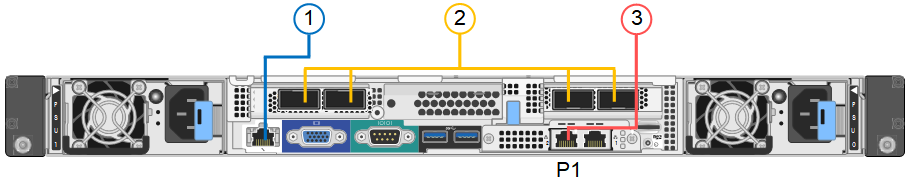
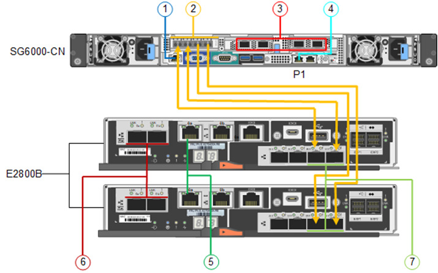

= 电缆设备
:allow-uri-read: 
:icons: font
:imagesdir: ../media/

[role="lead"]
将设备或控制器上的网络端口连接到网格网络和适用于StorageGRID的可选客户端网络。对于某些设备、您还可以将设备上的管理端口连接到服务笔记本电脑或在控制器管理端口之间建立连接。

[role="tabbed-block"]
====
.SG100和SG1000
--
您必须将设备上的管理端口连接到服务笔记本电脑，并将设备上的网络端口连接到网格网络和适用于 StorageGRID 的可选客户端网络。

.开始之前
* 您有一根 RJ-45 以太网缆线用于连接管理端口。
* 您可以选择以下网络端口之一。这些物品不随设备提供。
+
** 一到四根双轴缆线，用于连接四个网络端口。
** 对于 SG100 ，如果您计划使用光缆连接端口，则需要一到四个 SFP+ 或 SFP28 收发器。
** 对于 SG1000 ，如果您计划使用光缆连接端口，则需要一到四个 QSFP+ 或 QSFP28 收发器。

CAUTION: *暴露于激光辐射的风险*--请勿拆卸或拆除SFP或QSFP收发器的任何部件。您可能受到激光辐射的影响。

.关于此任务
下图显示了设备背面的端口。

SG100端口连接：

image::../media/sg100_connections.png[SG100 后部连接器]

SG1000端口连接：

[cols="1a,2a,2a,3a"]
|===
| Callout | Port | 端口类型 | 使用 ... 

 a| 
1.
 a| 
设备上的 BMC 管理端口
 a| 
1-GbE （ RJ-45 ）
 a| 
连接到访问 BMC 接口的网络。

 a| 
2.
 a| 
设备上有四个网络端口
 a| 
* 对于 SG100 ： 10/225-GbE
* 对于 SG1000 ： 10/25/40/100-GbE

 a| 
连接到网格网络和 StorageGRID 客户端网络。  请参见 link:../installconfig/gathering-installation-information-sg100-and-sg1000.html#port-bond-modes["端口绑定模式(端口绑定模式(SG100和SG1000)"]。

 a| 
3.
 a| 
设备上的管理网络端口(图中标记为P1)
 a| 
1-GbE （ RJ-45 ）

* 重要信息： * 此端口仅以 1000 BASE/ 全满运行，不支持 10 或 100 MB 速度。
 a| 
将设备连接到 StorageGRID 的管理网络。

 a| 
 a| 
设备上最右侧的 RJ-45 端口
 a| 
1-GbE （ RJ-45 ）

* 重要信息： * 此端口仅以 1000 BASE/ 全满运行，不支持 10 或 100 MB 速度。
 a| 
* 如果要与管理网络建立冗余连接，则可以与管理端口 1 绑定。
* 可以保持断开连接，并可用于临时本地访问（ IP 169.254.0.1 ）。
* 在安装期间、如果DHCP分配的IP地址不可用、则可以使用将设备连接到服务笔记本电脑。

|===
.步骤
. 使用以太网缆线将设备上的 BMC 管理端口连接到管理网络。
+
虽然此连接是可选的，但建议便于支持。

. 使用双轴缆线或光缆和收发器将设备上的网络端口连接到相应的网络交换机。
+
有关硬件和链路速度所需的设备、请参见下表。

+
[cols="2a,2a"]
|===
| SG100 链路速度（ GbE ） | 所需设备 

 a| 
10
 a| 
SFP+ 收发器

 a| 
25.
 a| 
SFP28 收发器

| SG1000 链路速度（ GbE ） | 所需设备 

 a| 
10
 a| 
QSA 和 SFP+ 收发器

 a| 
25.
 a| 
QSA 和 SFP28 收发器

 a| 
40
 a| 
QSFP + 收发器

 a| 
100
 a| 
QSP28 收发器

|===
+
** 在支持自动协议作为端口速度选项的型号上、如果选择了固定端口绑定模式、则可以使用与专用于客户端网络的端口不同的速度运行专用于StorageGRID网格网络的端口。
** 在不支持使用自动协议作为端口速度选项的型号上、所有四个网络端口都必须使用相同的链路速度。
** 如果您计划使用固定端口绑定模式（默认），请将端口连接到 StorageGRID 网格和客户端网络，如表所示。
+
[cols="1a,2a"]
|===
| Port | 连接到 ... 

 a| 
端口 1
 a| 
客户端网络（可选）

 a| 
端口 2
 a| 
网格网络

 a| 
端口 3
 a| 
客户端网络（可选）

 a| 
端口 4
 a| 
网格网络

|===
** 如果您计划使用聚合端口绑定模式，请将一个或多个网络端口连接到一个或多个交换机。您应至少连接四个端口中的两个，以避免发生单点故障。如果在一个 LACP 绑定中使用多个交换机，则这些交换机必须支持 MLAG 或等效项。

. 如果您计划使用 StorageGRID 管理网络，请使用以太网缆线将设备上的管理网络端口连接到管理网络。

--
.SG110和SG1100
--
您可以将设备上的管理端口连接到服务笔记本电脑、并将设备上的网络端口连接到网格网络和StorageGRID 的可选客户端网络。

.开始之前
* 您有一根 RJ-45 以太网缆线用于连接管理端口。
* 您可以选择以下网络端口之一。这些物品不随设备提供。
+
** 一到四根双轴缆线，用于连接四个网络端口。
** 对于SG110、如果您计划对端口使用光缆、则需要一到四个SFP+或SFP28收发器。
** 对于SG1100、如果您计划对端口使用光缆、则需要一到四个QSFP+或QSFP28收发器。

CAUTION: *暴露于激光辐射的风险*--请勿拆卸或拆除SFP或QSFP收发器的任何部件。您可能受到激光辐射的影响。

.关于此任务
下图显示了设备背面的端口。

SG110端口连接：

image::../media/sgf6112_connections.png[SG110背面连接器]

SG1100端口连接：

image::../media/sg1100_connections.png[SG1000 端口连接]

[cols="1a,2a,2a,3a"]
|===
| Callout | Port | 端口类型 | 使用 ... 

 a| 
1.
 a| 
设备上的 BMC 管理端口
 a| 
1-GbE （ RJ-45 ）
 a| 
连接到访问 BMC 接口的网络。

 a| 
2.
 a| 
设备上有四个网络端口
 a| 
* 对于SG110：10/C5-GbE
* 对于SG1100：10/C5/40/100-GbE

 a| 
连接到网格网络和 StorageGRID 客户端网络。请参见 link:gathering-installation-information-sg110-and-sg1100.html#port-bond-modes["端口绑定模式(SG110和SG1100)"]

 a| 
3.
 a| 
设备上的管理网络端口
 a| 
1-GbE （ RJ-45 ）

*重要信息：*此端口仅以1/10 GbE (RJ-45)运行，不支持100兆位速度。
 a| 
将设备连接到 StorageGRID 的管理网络。

 a| 
 a| 
设备上最右侧的 RJ-45 端口
 a| 
1-GbE （ RJ-45 ）

*重要信息：*此端口仅以1/10 GbE (RJ-45)运行，不支持100兆位速度。
 a| 
* 如果要与管理网络建立冗余连接，则可以与管理端口 1 绑定。
* 可以保持断开连接，并可用于临时本地访问（ IP 169.254.0.1 ）。
* 在安装期间、如果DHCP分配的IP地址不可用、则可以使用将设备连接到服务笔记本电脑。

|===
.步骤
. 使用以太网缆线将设备上的 BMC 管理端口连接到管理网络。
+
虽然此连接是可选的，但建议便于支持。

. 使用双轴缆线或光缆和收发器将设备上的网络端口连接到相应的网络交换机。
+
有关硬件和链路速度所需的设备、请参见下表。

+
[cols="2a,2a"]
|===
| SG110链路速度(GbE) | 所需设备 

 a| 
10
 a| 
SFP+ 收发器

 a| 
25.
 a| 
SFP28 收发器

| SG1100链路速度(GbE) | 所需设备 

 a| 
10
 a| 
QSA 和 SFP+ 收发器

 a| 
25.
 a| 
QSA 和 SFP28 收发器

 a| 
40
 a| 
QSFP + 收发器

 a| 
100
 a| 
QSP28 收发器

|===
+
** 在支持自动协议作为端口速度选项的型号上、如果选择了固定端口绑定模式、则可以使用与专用于客户端网络的端口不同的速度运行专用于StorageGRID网格网络的端口。
** 在不支持使用自动协议作为端口速度选项的型号上、所有四个网络端口都必须使用相同的链路速度。
** 如果您计划使用固定端口绑定模式（默认），请将端口连接到 StorageGRID 网格和客户端网络，如表所示。
+
[cols="1a,2a"]
|===
| Port | 连接到 ... 

 a| 
端口 1
 a| 
客户端网络（可选）

 a| 
端口 2
 a| 
网格网络

 a| 
端口 3
 a| 
客户端网络（可选）

 a| 
端口 4
 a| 
网格网络

|===
** 如果您计划使用聚合端口绑定模式，请将一个或多个网络端口连接到一个或多个交换机。您应至少连接四个端口中的两个，以避免发生单点故障。如果在一个 LACP 绑定中使用多个交换机，则这些交换机必须支持 MLAG 或等效项。

. 如果您计划使用 StorageGRID 管理网络，请使用以太网缆线将设备上的管理网络端口连接到管理网络。

--
.SG5700
--
将两个控制器相互连接、连接每个控制器上的管理端口、然后将E5700SG控制器上的10/C5-GbE端口连接到网格网络和适用于StorageGRID 的可选客户端网络。

.开始之前
* 您已解压缩设备附带的以下物品：
+
** 两根电源线。
** 两根光缆用于控制器上的 FC 互连端口。
** 八个 SFP+ 收发器，支持 10-GbE 或 16-Gbps FC 。如果您希望网络端口使用 10-GbE 链路速度，则可以将收发器与两个控制器上的两个互连端口以及 E5700SG 控制器上的四个 10/25GbE 网络端口结合使用。

* 您已获得以下设备未附带的物品：
+
** 一到四根光缆，用于您计划使用的 10/225-GbE 端口。
** 如果您计划使用 25 GbE 链路速度，则需要一到四个 SFP28 收发器。
** 用于连接管理端口的以太网缆线。

CAUTION: *暴露于激光辐射的风险*--请勿拆卸或拆除SFP收发器的任何部件。您可能受到激光辐射的影响。

.关于此任务
图中显示了SG5760和SG5760X中的两个控制器、其中顶部是E2800系列存储控制器、底部是E5700SG控制器。在SG5712和SG5712X中、从背面看、E2800系列存储控制器位于E5700SG控制器的左侧。

SG5760连接：

image::../media/sg5760_connections.gif[SG5760 设备上的连接]

SG5760X连接：

image::../media/sg5760X_connections.png[SG5760X设备上的连接]

[cols="1a,2a,2a,2a"]
|===
| Callout | Port | 端口类型 | 使用 ... 

 a| 
1.
 a| 
每个控制器上两个互连端口
 a| 
16 GB/s FC 光纤 SFP+
 a| 
将两个控制器彼此连接。

 a| 
2.
 a| 
E2800系列控制器上的管理端口1
 a| 
1-GbE （ RJ-45 ）
 a| 
连接到访问 SANtricity System Manager 的网络。您可以使用适用于 StorageGRID 的管理网络或独立的管理网络。

 a| 
2.
 a| 
E2800系列控制器上的管理端口2
 a| 
1-GbE （ RJ-45 ）
 a| 
为技术支持预留。

 a| 
3.
 a| 
E5700SG 控制器上的管理端口 1
 a| 
1-GbE （ RJ-45 ）
 a| 
将 E5700SG 控制器连接到 StorageGRID 管理网络。

 a| 
3.
 a| 
E5700SG 控制器上的管理端口 2
 a| 
1-GbE （ RJ-45 ）
 a| 
* 如果要与管理网络建立冗余连接，则可以与管理端口 1 绑定。
* 可以保持未连接状态，并可用于临时本地访问（ IP 169.254.0.1 ）。
* 在安装期间、如果DHCP分配的IP地址不可用、可使用将E5700SG控制器连接到服务笔记本电脑。

 a| 
4.
 a| 
E5700SG 控制器上的 10/225-GbE 端口 1-4
 a| 
10-GbE 或 25-GbE

* 注： * 设备附带的 SFP+ 收发器支持 10-GbE 链路速度。如果要对四个网络端口使用 25 GbE 链路速度，则必须提供 SFP28 收发器。
 a| 
连接到网格网络和 StorageGRID 客户端网络。请参见 link:gathering-installation-information-sg5700.html#port-bond-modes["端口绑定模式(E5700SG控制器)"]。

|===
.步骤
. 使用两根光缆和八个 SFP+ 收发器中的四根光缆将 E2800 控制器连接到 E5700SG 控制器。
+
[cols="1a,1a"]
|===
| 连接此端口 ... | 到此端口 ... 

 a| 
E2800 控制器上的互连端口 1
 a| 
E5700SG 控制器上的互连端口 1

 a| 
E2800 控制器上的互连端口 2
 a| 
E5700SG 控制器上的互连端口 2

|===
. 如果您计划使用 SANtricity System Manager ，请使用以太网缆线将 E2800 控制器上的管理端口 1 （ P1 ）（左侧的 RJ-45 端口）连接到 SANtricity System Manager 的管理网络。
+
不要使用E2800控制器上的管理端口2 (P2)(右侧的RJ-45端口)。此端口是为技术支持预留的。

. 如果您计划使用 StorageGRID 管理网络，请使用以太网缆线将 E5700SG 控制器上的管理端口 1 （左侧的 RJ-45 端口）连接到管理网络。
+
如果您计划对管理网络使用主动备份网络绑定模式，请使用以太网缆线将 E5700SG 控制器上的管理端口 2 （右侧的 RJ-45 端口）连接到管理网络。

. 使用光缆和 SFP+ 或 SFP28 收发器将 E5700SG 控制器上的 10/225-GbE 端口连接到相应的网络交换机。
+

NOTE: 如果您计划使用 10-GbE 链路速度，请安装 SFP+ 收发器。如果您计划使用 25 GbE 链路速度，请安装 SFP28 收发器。

+
** 在支持自动协议作为端口速度选项的型号上、如果选择了固定端口绑定模式、则可以使用与专用于客户端网络的端口不同的速度运行专用于StorageGRID网格网络的端口。
** 在不支持使用自动协议作为端口速度选项的型号上、所有四个网络端口都必须使用相同的链路速度。
** 如果您计划使用固定端口绑定模式（默认），请将端口连接到 StorageGRID 网格和客户端网络，如表所示。
+
[cols="1a,1a"]
|===
| Port | 连接到 ... 

 a| 
端口 1
 a| 
客户端网络（可选）

 a| 
端口 2
 a| 
网格网络

 a| 
端口 3
 a| 
客户端网络（可选）

 a| 
端口 4
 a| 
网格网络

|===
** 如果您计划使用聚合端口绑定模式，请将一个或多个网络端口连接到一个或多个交换机。您应至少连接四个端口中的两个，以避免发生单点故障。如果在一个 LACP 绑定中使用多个交换机，则这些交换机必须支持 MLAG 或等效项。

--
.SG6000
--
您可以将存储控制器连接到SG6000-CN控制器、将所有三个控制器上的管理端口连接起来、然后将SG6000-CN控制器上的网络端口连接到网格网络和适用于StorageGRID 的可选客户端网络。

.开始之前
* 设备附带有四根光缆，用于将两个存储控制器连接到 SG6000-CN 控制器。
* 您可以使用 RJ-45 以太网缆线（至少四根）连接管理端口。
* 您可以选择以下网络端口之一。这些物品不随设备提供。
+
** 一到四根双轴缆线，用于连接四个网络端口。
** 如果您计划使用光缆连接端口，则需要一到四个 SFP+ 或 SFP28 收发器。
+

CAUTION: *暴露于激光辐射的风险*--请勿拆卸或拆除SFP收发器的任何部件。您可能受到激光辐射的影响。

.关于此任务
下图显示了SG6060和SG6060X设备中的三个控制器、其中SG6000-CN计算控制器位于顶部、两个E2800存储控制器位于底部。SG6060使用E2800A控制器、SG6060X使用两个E2800B控制器版本之一。

NOTE: 除了互连端口的位置之外、两个版本的E2800控制器的规格和功能都相同。

CAUTION: 请勿在同一设备中使用E2800A和E2800B控制器。

SG6060连接：

image::../media/sg6000_e2800_connections.png[SG6060到E2800A连接]

SG6060X连接：

* 版本1
+
image::../media/sg6000x_e2800B_connections.png[SG6060到E2800B连接]

* 版本2
+

NOTE: 如果E2800B控制器中的FC收发器安装在上部FC连接端口(6)中、请将其移至右下角的FC连接端口(7)。

+

下图显示了 SG6024 设备中的三个控制器，其中 SG6000-CN 计算控制器位于顶部，两个 EF570 存储控制器并排位于计算控制器下方。

GF6024连接：

image::../media/sg6000_ef570_connections.png[SG6000 到 SGF570 连接]

[cols="1a,2a,2a,3a"]
|===
| Callout | Port | 端口类型 | 使用 ... 

 a| 
1.
 a| 
SG6000-CN 控制器上的 BMC 管理端口
 a| 
1-GbE （ RJ-45 ）
 a| 
连接到访问 BMC 接口的网络。

 a| 
2.
 a| 
FC 连接端口：

* 4 个用于 SG6000-CN 控制器
* 每个存储控制器上 2 个

 a| 
16 Gb/ 秒 FC 光纤 SFP+
 a| 
将每个存储控制器连接到 SG6000-CN 控制器。

 a| 
3.
 a| 
SG6000-CN 控制器上的四个网络端口
 a| 
10/225-GbE
 a| 
连接到网格网络和 StorageGRID 客户端网络。请参见 link:../installconfig/gathering-installation-information-sg6000.html#port-bond-modes["端口绑定模式(SG6000-CN控制器)"]。

 a| 
4.
 a| 
SG6000-CN控制器上的管理网络端口(图中标记为P1)
 a| 
1-GbE （ RJ-45 ）

* 重要信息： * 此端口仅以 1000 BASE/ 全满运行，不支持 10 或 100 MB 速度。
 a| 
将 SG6000-CN 控制器连接到 StorageGRID 管理网络。

 a| 
 a| 
SG6000-CN 控制器上最右侧的 RJ-45 端口
 a| 
1-GbE （ RJ-45 ）

* 重要信息： * 此端口仅以 1000 BASE/ 全满运行，不支持 10 或 100 MB 速度。
 a| 
* 如果要与管理网络建立冗余连接，则可以与管理端口 1 绑定。
* 可以保持未连接状态，并可用于临时本地访问（ IP 169.254.0.1 ）。
* 在安装期间、如果DHCP分配的IP地址不可用、可使用将SG6000-CN控制器连接到服务笔记本电脑。

 a| 
5.
 a| 
每个存储控制器上的管理端口 1
 a| 
1-GbE （ RJ-45 ）
 a| 
连接到访问 SANtricity System Manager 的网络。

 a| 
 a| 
每个存储控制器上的管理端口 2
 a| 
1-GbE （ RJ-45 ）
 a| 
为技术支持预留。

|===
.步骤
. 使用以太网缆线将 SG6000-CN 控制器上的 BMC 管理端口连接到管理网络。
+
虽然此连接是可选的，但建议便于支持。

. 使用四根光缆和四个 SFP+ 收发器将每个存储控制器上的两个 FC 端口连接到 SG6000-CN 控制器上的 FC 端口。
. 使用双轴缆线或光缆以及 SFP+ 或 SFP28 收发器将 SG6000-CN 控制器上的网络端口连接到相应的网络交换机。
+

NOTE: 如果您计划使用 10-GbE 链路速度，请安装 SFP+ 收发器。如果您计划使用 25 GbE 链路速度，请安装 SFP28 收发器。

+
** 在支持自动协议作为端口速度选项的型号上、如果选择了固定端口绑定模式、则可以使用与专用于客户端网络的端口不同的速度运行专用于StorageGRID网格网络的端口。
** 在不支持使用自动协议作为端口速度选项的型号上、所有四个网络端口都必须使用相同的链路速度。
** 如果您计划使用固定端口绑定模式（默认），请将端口连接到 StorageGRID 网格和客户端网络，如表所示。
+
[cols="1a,2a"]
|===
| Port | 连接到 ... 

 a| 
端口 1
 a| 
客户端网络（可选）

 a| 
端口 2
 a| 
网格网络

 a| 
端口 3
 a| 
客户端网络（可选）

 a| 
端口 4
 a| 
网格网络

|===
+
*** 如果您计划使用聚合端口绑定模式，请将一个或多个网络端口连接到一个或多个交换机。您应至少连接四个端口中的两个，以避免发生单点故障。如果在一个 LACP 绑定中使用多个交换机，则这些交换机必须支持 MLAG 或等效项。

. 如果您计划使用 StorageGRID 管理网络，请使用以太网缆线将 SG6000-CN 控制器上的管理网络端口连接到管理网络。
. 如果您计划使用 SANtricity System Manager 的管理网络，请使用以太网缆线将每个存储控制器上的管理端口 1 （ P1 ）（左侧的 RJ-45 端口）连接到 SANtricity System Manager 的管理网络。
+
请勿使用存储控制器上的管理端口2 (P2)(右侧的RJ-45端口)。此端口是为技术支持预留的。

--
.SG6100
--
您可以将设备上的管理端口连接到服务笔记本电脑、并将设备上的网络端口连接到网格网络和StorageGRID 的可选客户端网络。

.开始之前
* 您有一根 RJ-45 以太网缆线用于连接管理端口。
* 您可以选择以下网络端口之一。这些物品不随设备提供。
+
** 一到四根双轴缆线，用于连接四个网络端口。
** 如果您计划使用光缆连接端口，则需要一到四个 SFP+ 或 SFP28 收发器。

CAUTION: *暴露于激光辐射的风险*--请勿拆卸或拆除SFP收发器的任何部件。您可能受到激光辐射的影响。

.关于此任务
下图显示了SGF6112背面的端口。

image::../media/sgf6112_connections.png[SGF6112后部接头]

[cols="1a,2a,2a,3a"]
|===
| Callout | Port | 端口类型 | 使用 ... 

 a| 
1.
 a| 
设备上的 BMC 管理端口
 a| 
1-GbE （ RJ-45 ）
 a| 
连接到访问 BMC 接口的网络。

 a| 
2.
 a| 
设备上的四个10/C5-GbE网络端口
 a| 
 a| 
连接到网格网络和 StorageGRID 客户端网络。请参见 link:gathering-installation-information-sg6100.html#port-bond-modes["端口绑定模式(SGF6112)"]

 a| 
3.
 a| 
设备上的管理网络端口(图中标记为P1)
 a| 
1-GbE （ RJ-45 ）

*重要信息：*此端口仅以1/10 GbE (RJ-45)运行，不支持100兆位速度。
 a| 
将设备连接到 StorageGRID 的管理网络。

 a| 
 a| 
设备上最右侧的 RJ-45 端口
 a| 
1-GbE （ RJ-45 ）

*重要信息：*此端口仅以1/10 GbE (RJ-45)运行，不支持100兆位速度。
 a| 
* 如果要与管理网络建立冗余连接，则可以与管理端口 1 绑定。
* 可以保持断开连接，并可用于临时本地访问（ IP 169.254.0.1 ）。
* 在安装期间、如果DHCP分配的IP地址不可用、则可以使用将设备连接到服务笔记本电脑。

|===
.步骤
. 使用以太网缆线将设备上的 BMC 管理端口连接到管理网络。
+
虽然此连接是可选的，但建议便于支持。

. 使用双轴缆线或光缆和收发器将设备上的网络端口连接到相应的网络交换机。
+
[cols="2a,2a"]
|===
| SGF6112链路速度(GbE) | 所需设备 

 a| 
10
 a| 
SFP+ 收发器

 a| 
25.
 a| 
SFP28 收发器

|===
+
** 在支持自动协议作为端口速度选项的型号上、如果选择了固定端口绑定模式、则可以使用与专用于客户端网络的端口不同的速度运行专用于StorageGRID网格网络的端口。
** 在不支持使用自动协议作为端口速度选项的型号上、所有四个网络端口都必须使用相同的链路速度。
** 如果您计划使用固定端口绑定模式（默认），请将端口连接到 StorageGRID 网格和客户端网络，如表所示。
+
[cols="1a,2a"]
|===
| Port | 连接到 ... 

 a| 
端口 1
 a| 
客户端网络（可选）

 a| 
端口 2
 a| 
网格网络

 a| 
端口 3
 a| 
客户端网络（可选）

 a| 
端口 4
 a| 
网格网络

|===
** 如果您计划使用聚合端口绑定模式，请将一个或多个网络端口连接到一个或多个交换机。您应至少连接四个端口中的两个，以避免发生单点故障。如果在一个 LACP 绑定中使用多个交换机，则这些交换机必须支持 MLAG 或等效项。

. 如果您计划使用 StorageGRID 管理网络，请使用以太网缆线将设备上的管理网络端口连接到管理网络。

--
====