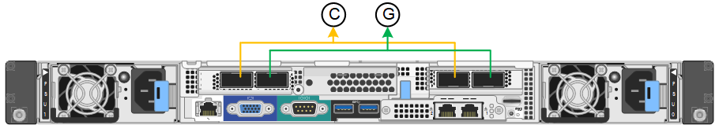

= 配置网络链路
:allow-uri-read: 
:icons: font
:imagesdir: ../media/

[role="lead"]
您可以为用于将设备连接到网格网络，客户端网络和管理网络的端口配置网络链路。您可以设置链路速度以及端口和网络绑定模式。

TIP: 如果使用ConfigBuilder生成JSON文件、则可以自动配置网络链路。请参见 link:automating-appliance-installation-and-configuration.html["自动安装和配置设备"]。

.开始之前
* 您已拥有 link:obtaining-additional-equipment-and-tools.html["已获取附加设备"] 电缆类型和链路速度所需。
* 您已根据计划使用的链路速度在端口中安装了正确的收发器。
* 您已将网络端口连接到支持所选速度的交换机。

如果您计划使用聚合端口绑定模式， LACP 网络绑定模式或 VLAN 标记：

* 您已将设备上的网络端口连接到可支持 VLAN 和 LACP 的交换机。
* 如果多个交换机参与 LACP 绑定，则这些交换机支持多机箱链路聚合组（ MLAG ）或等效项。
* 您了解如何将交换机配置为使用 VLAN ， LACP 和 MLAG 或等效项。
* 您知道要用于每个网络的唯一 VLAN 标记。此 VLAN 标记将添加到每个网络数据包中，以确保网络流量路由到正确的网络。

.关于此任务
只有在要使用非默认设置时，才需要在链路配置页面上配置设置。

NOTE: LACP传输哈希策略为layer2+3。

这些图和表汇总了每个设备的端口绑定模式和网络绑定模式选项。有关详细信息，请参见以下内容：

* link:gathering-installation-information-sg100-and-sg1000.html#port-bond-modes["端口绑定模式(SG1000和SG100)"]
* link:gathering-installation-information-sg110-and-sg1100.html#port-bond-modes["端口绑定模式(SG1100和SG110)"]
* link:gathering-installation-information-sg5700.html#port-bond-modes["端口绑定模式(E5700SG)"]
* link:gathering-installation-information-sg6000.html#port-bond-modes["端口绑定模式(SG6000-CN)"]
* link:gathering-installation-information-sg6100.html#port-bond-modes["端口绑定模式(SGF6112)"]

[role="tabbed-block"]
====
.SG100和SG1000
--
固定端口绑定模式(默认)::
+
--
图中显示了SG1000或SG100上的四个网络端口是如何在固定端口绑定模式(默认配置)下绑定的。

SG1000 ：

SG100 ：

image::../media/sg100_fixed_port_draft.png[SG100 固定端口绑定模式]

[cols="1a,3a"]
|===
| Callout | 哪些端口已绑定 

 a| 
C
 a| 
如果使用此网络，则端口 1 和 3 将绑定到客户端网络。

 a| 
g
 a| 
网格网络的端口 2 和 4 绑定在一起。

|===
下表总结了用于配置四个网络端口的选项。只有在要使用非默认设置时，才需要在链路配置页面上配置设置。

[cols="1a,2a,2a"]
|===
| 网络绑定模式 | 客户端网络已禁用（默认） | 已启用客户端网络 

 a| 
Active-Backup （默认）
 a| 
* 端口 2 和 4 对网格网络使用主动备份绑定。
* 未使用端口1和3。
* VLAN 标记是可选的。

 a| 
* 端口 2 和 4 对网格网络使用主动备份绑定。
* 端口 1 和 3 对客户端网络使用主动备份绑定。
* 为了方便网络管理员，可以为两个网络指定 VLAN 标记。

 a| 
LACP （ 802.3ad ）
 a| 
* 端口 2 和 4 对网格网络使用 LACP 绑定。
* 未使用端口1和3。
* VLAN 标记是可选的。

 a| 
* 端口 2 和 4 对网格网络使用 LACP 绑定。
* 端口 1 和 3 对客户端网络使用 LACP 绑定。
* 为了方便网络管理员，可以为两个网络指定 VLAN 标记。

|===
--
聚合端口绑定模式::
+
--
这些图显示了四个网络端口如何在聚合端口绑定模式下绑定。

SG1000 ：

image::../media/sg1000_aggregate_ports.png[聚合端口绑定模式 SG1000]

SG100 ：

image::../media/sg100_aggregate_ports.png[聚合端口绑定模式 SG100]

[cols="1a,3a"]
|===
| Callout | 哪些端口已绑定 

 a| 
1.
 a| 
所有四个端口都分组在一个 LACP 绑定中，从而允许所有端口用于网格网络和客户端网络流量。

|===
下表总结了用于配置四个网络端口的选项。只有在要使用非默认设置时，才需要在链路配置页面上配置设置。

[cols="1a,2a,2a"]
|===
| 网络绑定模式 | 客户端网络已禁用（默认） | 已启用客户端网络 

 a| 
仅 LACP （ 802.3ad ）
 a| 
* 端口 1-4 对网格网络使用一个 LACP 绑定。
* 一个 VLAN 标记用于标识网格网络数据包。

 a| 
* 端口 1-4 对网格网络和客户端网络使用一个 LACP 绑定。
* 通过两个 VLAN 标记，可以将网格网络数据包与客户端网络数据包隔离。

|===
--
管理端口的Active-Backup网络绑定模式::
+
--
这些图显示了设备上的两个1-GbE管理端口是如何在管理网络的Active-Backup网络绑定模式下绑定的。

SG1000 ：

image::../media/sg1000_bonded_management_ports.png[管理网络端口绑定 SG1000]

SG100 ：

image::../media/sg100_bonded_management_ports.png[管理网络端口绑定 SG100]

--

--
.SG110和SG1100
--
固定端口绑定模式(默认)::
+
--
图中显示了SG1100或SG110上的四个网络端口是如何在固定端口绑定模式(默认配置)下绑定的。

SG1100：

image::../media/sg1100_fixed_port.png[SG1100固定端口绑定模式]

SG110：

image::../media/sgf6112_fixed_port.png[SG110固定端口绑定模式]

[cols="1a,3a"]
|===
| Callout | 哪些端口已绑定 

 a| 
C
 a| 
如果使用此网络，则端口 1 和 3 将绑定到客户端网络。

 a| 
g
 a| 
网格网络的端口 2 和 4 绑定在一起。

|===
下表总结了用于配置四个网络端口的选项。只有在要使用非默认设置时，才需要在链路配置页面上配置设置。

[cols="1a,2a,2a"]
|===
| 网络绑定模式 | 客户端网络已禁用（默认） | 已启用客户端网络 

 a| 
Active-Backup （默认）
 a| 
* 端口 2 和 4 对网格网络使用主动备份绑定。
* 未使用端口1和3。
* VLAN 标记是可选的。

 a| 
* 端口 2 和 4 对网格网络使用主动备份绑定。
* 端口 1 和 3 对客户端网络使用主动备份绑定。
* 为了方便网络管理员，可以为两个网络指定 VLAN 标记。

 a| 
LACP （ 802.3ad ）
 a| 
* 端口 2 和 4 对网格网络使用 LACP 绑定。
* 未使用端口1和3。
* VLAN 标记是可选的。

 a| 
* 端口 2 和 4 对网格网络使用 LACP 绑定。
* 端口 1 和 3 对客户端网络使用 LACP 绑定。
* 为了方便网络管理员，可以为两个网络指定 VLAN 标记。

|===
--
聚合端口绑定模式::
+
--
这些图显示了四个网络端口如何在聚合端口绑定模式下绑定。

SG1100：

image::../media/sg1100_aggregate_ports.png[聚合端口绑定模式SG1100]

SG110：

image::../media/sgf6112_aggregate_ports.png[SG110聚合端口绑定模式]

[cols="1a,3a"]
|===
| Callout | 哪些端口已绑定 

 a| 
1.
 a| 
所有四个端口都分组在一个 LACP 绑定中，从而允许所有端口用于网格网络和客户端网络流量。

|===
下表总结了用于配置网络端口的选项。只有在要使用非默认设置时，才需要在链路配置页面上配置设置。

[cols="1a,2a,2a"]
|===
| 网络绑定模式 | 客户端网络已禁用（默认） | 已启用客户端网络 

 a| 
仅 LACP （ 802.3ad ）
 a| 
* 端口 1-4 对网格网络使用一个 LACP 绑定。
* 一个 VLAN 标记用于标识网格网络数据包。

 a| 
* 端口 1-4 对网格网络和客户端网络使用一个 LACP 绑定。
* 通过两个 VLAN 标记，可以将网格网络数据包与客户端网络数据包隔离。

|===
--
管理端口的Active-Backup网络绑定模式::
+
--
这些图显示了设备上的两个1-GbE管理端口是如何在管理网络的Active-Backup网络绑定模式下绑定的。

SG1100：

image::../media/sg1100_bonded_management_ports.png[管理绑定的网络端口SG1100]

SG110：

image::../media/sgf6112_bonded_management_ports.png[管理绑定的网络端口SG110]

--

--
.SG5700
--
固定端口绑定模式(默认)::
+
--
此图显示了在固定端口绑定模式（默认配置）下四个 10/225-GbE 端口的绑定方式。

image::../media/e5700sg_fixed_port.gif[图中显示了 E5700SG 控制器上的 10/225-GbE 端口如何在固定模式下绑定]

[cols="1a,3a"]
|===
| Callout | 哪些端口已绑定 

 a| 
C
 a| 
如果使用此网络，则端口 1 和 3 将绑定到客户端网络。

 a| 
g
 a| 
网格网络的端口 2 和 4 绑定在一起。

|===
下表总结了用于配置四个 10/225-GbE 端口的选项。只有在要使用非默认设置时，才需要在链路配置页面上配置设置。

[cols="1a,2a,2a"]
|===
| 网络绑定模式 | 客户端网络已禁用（默认） | 已启用客户端网络 

 a| 
Active-Backup （默认）
 a| 
* 端口 2 和 4 对网格网络使用主动备份绑定。
* 未使用端口1和3。
* VLAN 标记是可选的。

 a| 
* 端口 2 和 4 对网格网络使用主动备份绑定。
* 端口 1 和 3 对客户端网络使用主动备份绑定。
* 为了方便网络管理员，可以为两个网络指定 VLAN 标记。

 a| 
LACP （ 802.3ad ）
 a| 
* 端口 2 和 4 对网格网络使用 LACP 绑定。
* 未使用端口1和3。
* VLAN 标记是可选的。

 a| 
* 端口 2 和 4 对网格网络使用 LACP 绑定。
* 端口 1 和 3 对客户端网络使用 LACP 绑定。
* 为了方便网络管理员，可以为两个网络指定 VLAN 标记。

|===
--
聚合端口绑定模式::
+
--
此图显示了四个 10/25GbE 端口在聚合端口绑定模式下的绑定方式。

image::../media/e5700sg_aggregate_port.gif[图中显示了 E5700SG 控制器上的 10/225-GbE 端口如何在聚合模式下绑定]

[cols="1a,3a"]
|===
| Callout | 哪些端口已绑定 

 a| 
1.
 a| 
所有四个端口都分组在一个 LACP 绑定中，从而允许所有端口用于网格网络和客户端网络流量。

|===
下表总结了用于配置四个 10/225-GbE 端口的选项。只有在要使用非默认设置时，才需要在链路配置页面上配置设置。

[cols="1a,2a,2a"]
|===
| 网络绑定模式 | 客户端网络已禁用（默认） | 已启用客户端网络 

 a| 
仅 LACP （ 802.3ad ）
 a| 
* 端口 1-4 对网格网络使用一个 LACP 绑定。
* 一个 VLAN 标记用于标识网格网络数据包。

 a| 
* 端口 1-4 对网格网络和客户端网络使用一个 LACP 绑定。
* 通过两个 VLAN 标记，可以将网格网络数据包与客户端网络数据包隔离。

|===
--
管理端口的Active-Backup网络绑定模式::
+
--
此图显示了 E5700SG 控制器上的两个 1-GbE 管理端口如何在管理网络的主动备份网络绑定模式下绑定。

image::../media/e5700sg_bonded_management_ports.gif[E5700SG绑定管理端口]

--

--
.SG6000
--
固定端口绑定模式(默认)::
+
--
此图显示了四个网络端口如何在固定端口绑定模式下绑定(默认配置)

image::../media/sg6000_cn_fixed_port.gif[图中显示了 SG6000-CN 控制器上的网络端口如何在固定模式下绑定]

[cols="1a,3a"]
|===
| Callout | 哪些端口已绑定 

 a| 
C
 a| 
如果使用此网络，则端口 1 和 3 将绑定到客户端网络。

 a| 
g
 a| 
网格网络的端口 2 和 4 绑定在一起。

|===
下表总结了用于配置网络端口的选项。只有在要使用非默认设置时，才需要在链路配置页面上配置设置。

[cols="1a,3a,3a"]
|===
| 网络绑定模式 | 客户端网络已禁用（默认） | 已启用客户端网络 

 a| 
Active-Backup （默认）
 a| 
* 端口 2 和 4 对网格网络使用主动备份绑定。
* 未使用端口1和3。
* VLAN 标记是可选的。

 a| 
* 端口 2 和 4 对网格网络使用主动备份绑定。
* 端口 1 和 3 对客户端网络使用主动备份绑定。
* 为了方便网络管理员，可以为两个网络指定 VLAN 标记。

 a| 
LACP （ 802.3ad ）
 a| 
* 端口 2 和 4 对网格网络使用 LACP 绑定。
* 未使用端口1和3。
* VLAN 标记是可选的。

 a| 
* 端口 2 和 4 对网格网络使用 LACP 绑定。
* 端口 1 和 3 对客户端网络使用 LACP 绑定。
* 为了方便网络管理员，可以为两个网络指定 VLAN 标记。

|===
--
聚合端口绑定模式::
+
--
此图显示了四个网络端口在聚合端口绑定模式下的绑定方式。

image::../media/sg6000_cn_aggregate_port.gif[图中显示了 SG6000-CN 控制器上的网络端口如何在聚合模式下绑定]

[cols="1a,3a"]
|===
| Callout | 哪些端口已绑定 

 a| 
1.
 a| 
所有四个端口都分组在一个 LACP 绑定中，从而允许所有端口用于网格网络和客户端网络流量。

|===
下表总结了用于配置网络端口的选项。只有在要使用非默认设置时，才需要在链路配置页面上配置设置。

[cols="1a,3a,3a"]
|===
| 网络绑定模式 | 客户端网络已禁用（默认） | 已启用客户端网络 

 a| 
仅 LACP （ 802.3ad ）
 a| 
* 端口 1-4 对网格网络使用一个 LACP 绑定。
* 一个 VLAN 标记用于标识网格网络数据包。

 a| 
* 端口 1-4 对网格网络和客户端网络使用一个 LACP 绑定。
* 通过两个 VLAN 标记，可以将网格网络数据包与客户端网络数据包隔离。

|===
--
管理端口的Active-Backup网络绑定模式::
+
--
此图显示了 SG6000-CN 控制器上的两个 1-GbE 管理端口如何在管理网络的主动备份网络绑定模式下绑定。

image::../media/sg6000_cn_bonded_managemente_ports.png[已绑定管理网络端口]

--

--
.GF6112
--
固定端口绑定模式(默认)::
+
--
此图显示了四个网络端口如何在固定端口绑定模式下绑定(默认配置)。

image::../media/sgf6112_fixed_port.png[GF6112固定端口绑定模式]

[cols="1a,3a"]
|===
| Callout | 哪些端口已绑定 

 a| 
C
 a| 
如果使用此网络，则端口 1 和 3 将绑定到客户端网络。

 a| 
g
 a| 
网格网络的端口 2 和 4 绑定在一起。

|===
下表总结了用于配置网络端口的选项。只有在要使用非默认设置时，才需要在链路配置页面上配置设置。

[cols="1a,2a,2a"]
|===
| 网络绑定模式 | 客户端网络已禁用（默认） | 已启用客户端网络 

 a| 
Active-Backup （默认）
 a| 
* 端口 2 和 4 对网格网络使用主动备份绑定。
* 未使用端口1和3。
* VLAN 标记是可选的。

 a| 
* 端口 2 和 4 对网格网络使用主动备份绑定。
* 端口 1 和 3 对客户端网络使用主动备份绑定。
* 为了方便网络管理员，可以为两个网络指定 VLAN 标记。

 a| 
LACP （ 802.3ad ）
 a| 
* 端口 2 和 4 对网格网络使用 LACP 绑定。
* 未使用端口1和3。
* VLAN 标记是可选的。

 a| 
* 端口 2 和 4 对网格网络使用 LACP 绑定。
* 端口 1 和 3 对客户端网络使用 LACP 绑定。
* 为了方便网络管理员，可以为两个网络指定 VLAN 标记。

|===
--
聚合端口绑定模式::
+
--
此图显示了四个网络端口如何在聚合端口绑定模式下绑定。

image::../media/sgf6112_aggregate_ports.png[GF6112聚合端口绑定模式]

[cols="1a,3a"]
|===
| Callout | 哪些端口已绑定 

 a| 
1.
 a| 
所有四个端口都分组在一个 LACP 绑定中，从而允许所有端口用于网格网络和客户端网络流量。

|===
下表总结了用于配置网络端口的选项。只有在要使用非默认设置时，才需要在链路配置页面上配置设置。

[cols="1a,2a,2a"]
|===
| 网络绑定模式 | 客户端网络已禁用（默认） | 已启用客户端网络 

 a| 
仅 LACP （ 802.3ad ）
 a| 
* 端口 1-4 对网格网络使用一个 LACP 绑定。
* 一个 VLAN 标记用于标识网格网络数据包。

 a| 
* 端口 1-4 对网格网络和客户端网络使用一个 LACP 绑定。
* 通过两个 VLAN 标记，可以将网格网络数据包与客户端网络数据包隔离。

|===
--
管理端口的Active-Backup网络绑定模式::
+
--
此图显示了如何在管理网络的Active-Backup网络绑定模式下绑定SGF6112上的两个1-GbE管理端口。

image::../media/sgf6112_bonded_management_ports.png[管理绑定的网络端口SGF6112]

--

--
====
.步骤
. 从 StorageGRID 设备安装程序的菜单栏中，单击 * 配置网络连接 * > * 链接配置 * 。
+
" 网络链路配置 " 页面显示设备示意图，其中包含编号为的网络和管理端口。

+
链路状态表列出了已编号端口的链路状态、链路速度和其他统计信息。

+
首次访问此页面时：

+
** * 链路速度 * 设置为 * 自动 * 。
** * 端口绑定模式 * 设置为 * 固定 * 。
** 对于网格网络， * 网络绑定模式 * 设置为 * 主动备份 * 。
** 此时将启用 * 管理网络 * ，并将网络绑定模式设置为 * 独立 * 。
** 已禁用 * 客户端网络 * 。

. 从 * 链路速度 * 下拉列表中选择网络端口的链路速度。
+
您用于网格网络和客户端网络的网络交换机也必须支持此速度并为此速度进行配置。您必须使用适当的适配器或收发器来设置所配置的链路速度。请尽可能使用自动链路速度，因为此选项会与链路配对节点协商链路速度和正向错误更正（ FEC ）模式。

+
如果您计划对SG6000或SG5700网络端口使用25-GbE链路速度：

+
** 使用SFP28收发器和SFP28双轴电缆或光缆。
** 对于SG5700，从*链接速度*下拉列表中选择*25GbE*。
** 对于SG6000，请从*Link speed*下拉列表中选择*Auto*。

. 启用或禁用计划使用的 StorageGRID 网络。
+
网格网络为必填项。您无法禁用此网络。

+
.. 如果设备未连接到管理网络，请清除管理网络的*Enable network*复选框。
.. 如果设备已连接到客户端网络，请选中客户端网络的*Enable network*复选框。
+
此时将显示数据 NIC 端口的客户端网络设置。

. 请参见表，并配置端口绑定模式和网络绑定模式。
+
此示例显示：

+
** 为网格和客户端网络选择了 * 聚合 * 和 * LACP * 。您必须为每个网络指定唯一的 VLAN 标记。您可以选择 0 到 4095 之间的值。
** 已为管理网络选择 * 主动备份 * 。
+
image::../media/sg1000_network_link_configuration_aggregate.png[网络链路配置聚合]

. 对所做的选择感到满意后，单击 * 保存 * 。
+

NOTE: 如果更改了所连接的网络或链路，则可能会断开连接。如果您未在1分钟内重新连接、请使用分配给设备的其他IP地址之一重新输入StorageGRID 设备安装程序的URL：+
`*https://_appliance_IP_:8443*`

