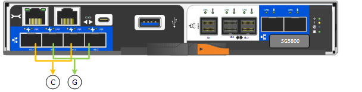

= 收集网络信息(SG信 元)
:allow-uri-read: 
:icons: font
:imagesdir: ../media/

[role="lead"]
使用表记录连接到设备的每个网络所需的信息。安装和配置硬件需要这些值。

TIP: 请使用随ConfigBuilder提供的工作簿、而不是使用这些表。通过使用ConfigBuilder工作簿、您可以上传系统信息并生成JSON文件、以自动完成StorageGRID 设备安装程序中的某些配置步骤。请参见 link:automating-appliance-installation-and-configuration.html["自动安装和配置设备"]。

== 连接到E4000控制器上的SANtricity系统管理器所需的信息

您将使用SANtricity系统管理器将E4000系列控制器连接到管理网络。

[cols="2a,1a"]
|===
| 所需信息 | 您的价值 

 a| 
要连接到管理端口 1 的以太网交换机端口
 a| 

 a| 
管理端口 1 的 MAC 地址（印在端口 P1 附近的标签上）
 a| 

 a| 
DHCP 为管理端口 1 分配的 IP 地址（如果在启动后可用）

*注：*如果要连接到E4000控制器的网络包含DHCP服务器，网络管理员可以使用MAC地址来确定DHCP服务器分配的IP地址。
 a| 

 a| 
速度和双工模式

* 注： * 您必须确保 SANtricity System Manager 管理网络的以太网交换机设置为自动协商。
 a| 
必须为：

* 自动协商（默认）

 a| 
IP 地址格式
 a| 
选择一项：

* IPv4
* IPv6

 a| 
您计划在管理网络上用于设备的静态 IP 地址
 a| 
对于 IPv4 ：

* IPv4 地址：
* 子网掩码：
* 网关

对于 IPv6 ：

* IPv6 地址：
* 可路由的 IP 地址：
* E4000控制器路由器IP地址：

|===

== 将SG可能性 控制器连接到管理网络所需的信息

StorageGRID 管理网络是一个可选网络，用于系统管理和维护。该设备使用SG波特 控制器上的1-GbE管理端口连接到管理网络。

[cols="2a,1a"]
|===
| 所需信息 | 您的价值 

 a| 
已启用管理网络
 a| 
选择一项：

* 否
* 是（默认）

 a| 
端口 1 的交换机端口
 a| 

 a| 
DHCP 为管理端口 1 分配的 IP 地址（如果在启动后可用）

*注：*如果管理网络包含DHCP服务器，您可以使用MAC地址查找分配的IP地址来确定DHCP分配的IP地址。
 a| 
* IPv4 地址（ CIDR ）：
* 网关

 a| 
您计划在管理网络上用于设备存储节点的静态 IP 地址

* 注： * 如果您的网络没有网关，请为此网关指定相同的静态 IPv4 地址。
 a| 
* IPv4 地址（ CIDR ）：
* 网关

 a| 
管理网络子网（ CIDR ）
 a| 

|===

== 连接和配置SG在于 控制器上的10/C5-GbE端口所需的信息

SG在于 控制器上的四个10/C5-GbE端口连接到StorageGRID网格网络和客户端网络。

NOTE: 请参见 link:gathering-installation-information-sg5800.html#port-bond-modes["端口绑定模式(SG波特 性控制器)"]。

[cols="2a,1a"]
|===
| 所需信息 | 您的价值 

 a| 
链路速度
 a| 
选择一项：

* 自动（默认）
* 10 GbE
* 25 GbE

 a| 
端口绑定模式
 a| 
选择一项：

* FIXED （默认）
* 聚合

 a| 
端口 1 的交换机端口（客户端网络）
 a| 

 a| 
端口 2 的交换机端口（网格网络）
 a| 

 a| 
端口 3 的交换机端口（客户端网络）
 a| 

 a| 
端口 4 的交换机端口（网格网络）
 a| 

|===

== 将SG信 标(SG）控制器连接到网格网络所需的信息

适用于 StorageGRID 的网格网络是一个必需的网络，用于所有内部 StorageGRID 流量。该设备使用SG在于 控制器上的10/C5-GbE端口连接到网格网络。

NOTE: 请参见 link:gathering-installation-information-sg5800.html#port-bond-modes["端口绑定模式(SG波特 性控制器)"]。

[cols="2a,1a"]
|===
| 所需信息 | 您的价值 

 a| 
网络绑定模式
 a| 
选择一项：

* Active-Backup （默认）
* LACP （ 802.3ad ）

 a| 
已启用 VLAN 标记
 a| 
选择一项：

* 否（默认）
* 是的。

 a| 
VLAN标记(如果启用了VLAN标记)
 a| 
输入一个介于 0 到 4095 之间的值：

 a| 
DHCP 为网格网络分配的 IP 地址（如果在启动后可用）
 a| 
* IPv4 地址（ CIDR ）：
* 网关

 a| 
您计划用于网格网络上设备存储节点的静态 IP 地址

* 注： * 如果您的网络没有网关，请为此网关指定相同的静态 IPv4 地址。
 a| 
* IPv4 地址（ CIDR ）：
* 网关

 a| 
网格网络子网（ CIDR ）

* 注： * 如果未启用客户端网络，则控制器上的默认路由将使用此处指定的网关。
 a| 

|===

== 将SG信 控器连接到客户端网络所需的信息

适用于 StorageGRID 的客户端网络是一个可选网络，通常用于提供对网格的客户端协议访问。该设备使用SG在于 控制器上的10/C5-GbE端口连接到客户端网络。

NOTE: 请参见 link:gathering-installation-information-sg5800.html#port-bond-modes["端口绑定模式(SG波特 性控制器)"]。

[cols="2a,1a"]
|===
| 所需信息 | 您的价值 

 a| 
已启用客户端网络
 a| 
选择一项：

* 否（默认）
* 是的。

 a| 
网络绑定模式
 a| 
选择一项：

* Active-Backup （默认）
* LACP （ 802.3ad ）

 a| 
已启用 VLAN 标记
 a| 
选择一项：

* 否（默认）
* 是的。

 a| 
VLAN 标记

（如果启用了 VLAN 标记）
 a| 
输入一个介于 0 到 4095 之间的值：

 a| 
DHCP 为客户端网络分配的 IP 地址（如果在启动后可用）
 a| 
* IPv4 地址（ CIDR ）：
* 网关

 a| 
您计划在客户端网络上用于设备存储节点的静态 IP 地址

* 注： * 如果启用了客户端网络，则控制器上的默认路由将使用此处指定的网关。
 a| 
* IPv4 地址（ CIDR ）：
* 网关

|===

== 端口绑定模式

时间 link:configuring-network-links.html["正在配置网络链路"] 对于SG5、您可以对连接到网格网络和可选客户端网络的10/C5-GbE端口使用端口绑定。端口绑定可在 StorageGRID 网络和设备之间提供冗余路径，从而有助于保护数据。对于网格网络和客户端网络连接、SGish-she控制器上的10/C5-GbE网络端口支持固定端口绑定模式或聚合端口绑定模式。

=== 固定端口绑定模式

固定模式是 10/225-GbE 网络端口的默认配置。

[cols="1a,3a"]
|===
| Callout | 哪些端口已绑定 

 a| 
C
 a| 
如果使用此网络，则端口 1 和 3 将绑定到客户端网络。

 a| 
g
 a| 
网格网络的端口 2 和 4 绑定在一起。

|===
使用固定端口绑定模式时，您可以使用两种网络绑定模式之一：主动备份或链路聚合控制协议（ LACP ）。

* 在主动备份模式（默认）下，一次只有一个端口处于活动状态。如果活动端口发生故障，其备份端口会自动提供故障转移连接。端口 4 为端口 2 （网格网络）提供备份路径，端口 3 为端口 1 （客户端网络）提供备份路径。
* 在 LACP 模式下，每对端口在控制器和网络之间形成一个逻辑通道，从而提高吞吐量。如果一个端口发生故障，另一个端口将继续提供通道。吞吐量会降低，但连接不会受到影响。

NOTE: 如果不需要冗余连接、则每个网络只能使用一个端口。但是，请注意，安装 StorageGRID 后，网格管理器中将发出警报，指示已拔下缆线。您可以安全地确认此警报以将其清除。

=== 聚合端口绑定模式

聚合端口绑定模式可显著提高每个 StorageGRID 网络的吞吐量，并提供额外的故障转移路径。

image::../media/sg5800_aggregate_port.png[用于聚合端口绑定模式的端口]

[cols="1a,3a"]
|===
| Callout | 哪些端口已绑定 

 a| 
1.
 a| 
所有连接的端口都分组在一个 LACP 绑定中，从而允许所有端口用于网格网络和客户端网络流量。

|===
如果您计划使用聚合端口绑定模式：

* 您必须使用 LACP 网络绑定模式。
* 您必须为每个网络指定唯一的 VLAN 标记。此 VLAN 标记将添加到每个网络数据包中，以确保网络流量路由到正确的网络。
* 这些端口必须连接到可支持 VLAN 和 LACP 的交换机。如果多个交换机参与 LACP 绑定，则这些交换机必须支持多机箱链路聚合组（ MLAG ）或等效项。
* 您了解如何将交换机配置为使用VLAN、LACP和MAG或等效设备。

如果不想使用全部四个10/C5-GbE端口、则可以使用一个、两个或三个端口。如果使用多个端口，则在一个 10/225-GbE 端口出现故障时，某些网络连接将保持可用的可能性最大。

NOTE: 如果您选择使用的端口少于四个，请注意，安装 StorageGRID 后，网格管理器中将发出一个或多个警报，指示缆线已拔出。您可以安全地确认警报以将其清除。

.相关信息
* link:cabling-appliance.html["电缆设备(SG(EG9))"]
* link:gathering-installation-information-sg5800.html#port-bond-modes["端口绑定模式(SG波特 性控制器)"]
* link:configuring-hardware.html["配置硬件(SGs太 少)"]

