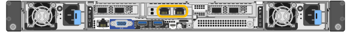

= 收集网络信息(SG6100)
:allow-uri-read: 
:icons: font
:imagesdir: ../media/

[role="lead"]
使用下表记录连接到设备的每个网络所需的信息。安装和配置硬件需要这些值。

TIP: 请使用随ConfigBuilder提供的工作簿、而不是使用这些表。通过使用ConfigBuilder工作簿、您可以上传系统信息并生成JSON文件、以自动完成StorageGRID 设备安装程序中的某些配置步骤。请参见 link:automating-appliance-installation-and-configuration.html["自动安装和配置设备"]。

== 检查StorageGRID 版本

在安装SGF6112或SG6160设备之前、请确认您的StorageGRID系统正在使用所需版本的StorageGRID软件。

[cols="1a,2a"]
|===
| 设备 | 所需的 StorageGRID 版本 

 a| 
GF6112
 a| 
11.7或更高版本(建议使用最新的修补程序)

 a| 
SG6160
 a| 
11．8或更高版本(建议使用最新的修补程序)

|===

== 连接到SANtricity系统管理器

您可以将SG6160设备中的两个存储控制器连接到要用于SANtricity系统管理器的管理网络。控制器A位于顶部、控制器B位于底部。

[cols="2a,1a,1a"]
|===
| 所需信息 | 控制器 A 的值 | 控制器 B 的值 

 a| 
要连接到管理端口 1 的以太网交换机端口（在控制器上标记为 P1 ）
 a| 
 a| 

 a| 
管理端口 1 的 MAC 地址（印在端口 P1 附近的标签上）
 a| 
 a| 

 a| 
DHCP 为管理端口 1 分配的 IP 地址（如果在启动后可用）

* 注： * 如果要连接到存储控制器的网络包含 DHCP 服务器，则网络管理员可以使用 MAC 地址确定 DHCP 服务器分配的 IP 地址。
 a| 
 a| 

 a| 
您计划在管理网络上用于设备的静态 IP 地址
 a| 
对于 IPv4 ：

* IPv4 地址：
* 子网掩码：
* 网关

对于 IPv6 ：

* IPv6 地址：
* 可路由的 IP 地址：
* 存储控制器路由器 IP 地址：

 a| 
对于 IPv4 ：

* IPv4 地址：
* 子网掩码：
* 网关

对于 IPv6 ：

* IPv6 地址：
* 可路由的 IP 地址：
* 存储控制器路由器 IP 地址：

 a| 
IP 地址格式
 a| 
选择一项：

* IPv4
* IPv6

 a| 
选择一项：

* IPv4
* IPv6

 a| 
速度和双工模式

* 注： * 您必须确保 SANtricity System Manager 管理网络的以太网交换机设置为自动协商。
 a| 
必须为：

* 自动协商（默认）

 a| 
必须为：

* 自动协商（默认）

|===

== 管理和维护端口

StorageGRID 管理网络是一个可选网络，用于系统管理和维护。设备使用设备上的以下1/10-GbE端口连接到管理网络。

GF6112设备上的RJ-45端口：

SG6100-CN控制器上的RJ-45端口：

image::../media/sg6100_cn_rj_45_ports_circled.png[SG6100-CN RJ-45端口]

[cols="2a,1a"]
|===
| 所需信息 | 您的价值 

 a| 
已启用管理网络
 a| 
选择一项：

* 否
* 是（默认）

 a| 
网络绑定模式
 a| 
选择一项：

* 独立（默认）
* 主动备份

 a| 
图中圈出的左侧端口的交换机端口（独立网络绑定模式的默认活动端口）
 a| 

 a| 
图中圈出的右侧端口的交换机端口（仅限主动备份网络绑定模式）
 a| 

 a| 
DHCP 为管理网络端口分配的 IP 地址（如果在启动后可用）

*注意:*请联系您的网络管理员以获取管理网络端口DHCP分配的IP地址。
 a| 
* IPv4 地址（ CIDR ）：
* 网关

 a| 
您计划在管理网络上用于设备节点的静态 IP 地址

* 注： * 如果您的网络没有网关，请为此网关指定相同的静态 IPv4 地址。
 a| 
* IPv4 地址（ CIDR ）：
* 网关

 a| 
管理网络子网（ CIDR ）
 a| 

|===

== 网络端口

设备上的四个网络端口连接到 StorageGRID 网格网络和可选客户端网络。

[cols="2a,1a"]
|===
| 所需信息 | 您的价值 

 a| 
链路速度
 a| 
选择一项：

* 自动（默认）
* 10 GbE
* 25 GbE
* 40GbE、带有可选的100G NIC SKU (仅限SG6160)
* 100 GbE (仅SG6160)

 a| 
端口绑定模式
 a| 
选择一项：

* FIXED （默认）
* 聚合

 a| 
端口 1 的交换机端口（固定模式的客户端网络）
 a| 

 a| 
端口 2 的交换机端口（固定模式的网格网络）
 a| 

 a| 
端口 3 的交换机端口（固定模式的客户端网络）
 a| 

 a| 
端口 4 的交换机端口（固定模式的网格网络）
 a| 

|===

== 网格网络端口

适用于 StorageGRID 的网格网络是一个必需的网络，用于所有内部 StorageGRID 流量。此设备使用四个网络端口连接到网格网络。

[cols="2a,1a"]
|===
| 所需信息 | 您的价值 

 a| 
网络绑定模式
 a| 
选择一项：

* Active-Backup （默认）
* LACP （ 802.3ad ）

 a| 
已启用 VLAN 标记
 a| 
选择一项：

* 否（默认）
* 是的。

 a| 
VLAN标记(如果启用了VLAN标记)
 a| 
输入一个介于 0 到 4095 之间的值：

 a| 
DHCP 为网格网络分配的 IP 地址（如果在启动后可用）
 a| 
* IPv4 地址（ CIDR ）：
* 网关

 a| 
您计划用于网格网络上设备节点的静态 IP 地址

* 注： * 如果您的网络没有网关，请为此网关指定相同的静态 IPv4 地址。
 a| 
* IPv4 地址（ CIDR ）：
* 网关

 a| 
网格网络子网（ GRID ）
 a| 

 a| 
最大传输单元(MTU)设置(可选)。您可以使用默认值1500、也可以将MTU设置为适合巨型帧的值、例如9000。
 a| 

|===

== 客户端网络端口

适用于 StorageGRID 的客户端网络是一个可选网络，通常用于提供对网格的客户端协议访问。此设备使用四个网络端口连接到客户端网络。

[cols="2a,1a"]
|===
| 所需信息 | 您的价值 

 a| 
已启用客户端网络
 a| 
选择一项：

* 否（默认）
* 是的。

 a| 
网络绑定模式
 a| 
选择一项：

* Active-Backup （默认）
* LACP （ 802.3ad ）

 a| 
已启用 VLAN 标记
 a| 
选择一项：

* 否（默认）
* 是的。

 a| 
VLAN标记(如果启用了VLAN标记)
 a| 
输入一个介于 0 到 4095 之间的值：

 a| 
DHCP 为客户端网络分配的 IP 地址（如果在启动后可用）
 a| 
* IPv4 地址（ CIDR ）：
* 网关

 a| 
您计划在客户端网络上用于设备节点的静态 IP 地址

* 注意： * 如果启用了客户端网络，则设备上的默认路由将使用此处指定的网关。
 a| 
* IPv4 地址（ CIDR ）：
* 网关

|===

== BMC 管理网络端口

您可以使用图中圈出的1-GbE管理端口访问设备上的BMC接口。此端口支持使用智能平台管理接口（ Intelligent Platform Management Interface ， IPMI ）标准通过以太网远程管理控制器硬件。

NOTE: 您可以为包含BMC的所有设备启用或禁用远程IPMI访问。远程IPMI接口允许任何具有BMC帐户和密码的人对StorageGRID设备进行低级硬件访问。如果不需要对BMC进行远程IPMI访问、请使用以下方法之一禁用此选项：+
在网格管理器中，转至*configuration*>*Security*>*Security settings *>*Appliance，然后清除*Enable remote IPMI access*复选框。+
在网格管理API中、使用专用端点： `PUT /private/bmc`。

下图显示了SGF6112和SG6100-CN上的BMC管理端口。

_GF6112_

image::../media/sgf6112_cn_bmc_management_port.png[GF6112管理端口]

_SG6100-CN_

[cols="2a,1a"]
|===
| 所需信息 | 您的价值 

 a| 
要连接到 BMC 管理端口的以太网交换机端口（在图中圈出）
 a| 

 a| 
为 BMC 管理网络分配的 DHCP IP 地址（如果在启动后可用）
 a| 
* IPv4 地址（ CIDR ）：
* 网关

 a| 
您计划用于 BMC 管理端口的静态 IP 地址
 a| 
* IPv4 地址（ CIDR ）：
* 网关

|===

== 端口绑定模式

时间 link:configuring-network-links.html["正在配置网络链路"] 对于SGF6112设备、您可以对连接到网格网络和可选客户端网络的端口以及连接到可选管理网络的1/10-GbE管理端口使用端口绑定。端口绑定可在 StorageGRID 网络和设备之间提供冗余路径，从而有助于保护数据。

=== 网络绑定模式

对于网格网络和客户端网络连接、设备上的网络端口支持固定端口绑定模式或聚合端口绑定模式。

==== 固定端口绑定模式

固定端口绑定模式是网络端口的默认配置。

_SGF6112：_

image::../media/sgf6112_fixed_port.png[GF6112固定端口绑定模式]

_SG6100-CN：_

image::../media/sg6100_cn_fixed_port.png[SG6100-CN固定端口绑定模式]

[cols="1a,3a"]
|===
| Callout | 哪些端口已绑定 

 a| 
C
 a| 
如果使用此网络，则端口 1 和 3 将绑定到客户端网络。

 a| 
g
 a| 
网格网络的端口 2 和 4 绑定在一起。

|===
使用固定端口绑定模式时，可以使用主动备份模式或链路聚合控制协议模式（ LACP 802.3ad ）绑定端口。

* 在主动备份模式（默认）下，一次只有一个端口处于活动状态。如果活动端口发生故障，其备份端口会自动提供故障转移连接。端口 4 为端口 2 （网格网络）提供备份路径，端口 3 为端口 1 （客户端网络）提供备份路径。
* 在LACP模式下、每对端口都会在设备和网络之间形成一个逻辑通道、从而提高吞吐量。如果一个端口发生故障，另一个端口将继续提供通道。吞吐量会降低，但连接不会受到影响。

NOTE: 如果不需要冗余连接、则每个网络只能使用一个端口。但是、请注意、安装StorageGRID 后、可能会在网格管理器中触发*存储设备链路断开*警报、指示缆线已拔下。您可以安全地禁用此警报规则。

==== 聚合端口绑定模式

聚合端口绑定模式可显著提高每个 StorageGRID 网络的吞吐量，并提供额外的故障转移路径。

_SGF6112：_

image::../media/sgf6112_aggregate_ports.png[SGF6112聚合端口绑定模式]

_SG6100-CN：_

image::../media/sg6100_cn_aggregate_ports.png[SG6100-CN聚合端口绑定模式]

[cols="1a,3a"]
|===
| Callout | 哪些端口已绑定 

 a| 
1.
 a| 
所有连接的端口都分组在一个 LACP 绑定中，从而允许所有端口用于网格网络和客户端网络流量。

|===
如果您计划使用聚合端口绑定模式：

* 您必须使用 LACP 网络绑定模式。
* 您必须为每个网络指定唯一的 VLAN 标记。此 VLAN 标记将添加到每个网络数据包中，以确保网络流量路由到正确的网络。
* 这些端口必须连接到可支持 VLAN 和 LACP 的交换机。如果多个交换机参与 LACP 绑定，则这些交换机必须支持多机箱链路聚合组（ MLAG ）或等效项。
* 您了解如何将交换机配置为使用VLAN、LACP和MAG或等效设备。

如果不想使用所有四个端口、可以使用一个、两个或三个端口。使用多个端口可以最大程度地提高在其中一个端口出现故障时某些网络连接仍可用的可能性。

NOTE: 如果您选择使用的网络端口少于四个，请注意，在安装设备节点后，可能会在网格管理器中触发 * 服务设备链路已关闭 * 警报，指示已拔下缆线。您可以安全地为触发的警报禁用此警报规则。

=== 管理端口的网络绑定模式

对于两个1/10-GbE管理端口、您可以选择独立网络绑定模式或Active-Backup网络绑定模式以连接到可选的管理网络。

_SGF6112：_

image::../media/sgf6112_bonded_management_ports.png[SGF6112网络管理端口]

_SG6100-CN：_

image::../media/sg6100_cn_bonded_management_ports.png[SG6100-CN网络管理端口]

[cols="1a,3a"]
|===
| Callout | 网络绑定模式 

 a| 
答
 a| 
主动备份模式。这两个管理端口都绑定到一个连接到管理网络的逻辑管理端口。

 a| 
I
 a| 
独立模式。左侧端口连接到管理网络。右侧端口可用于临时本地连接（ IP 地址 169.254.0.1 ）。

|===
在独立模式下，只有左侧的管理端口连接到管理网络。此模式不提供冗余路径。右侧的管理端口未连接、可用于临时本地连接(使用IP地址169.254..1)。

在主动备份模式下，两个管理端口均连接到管理网络。一次只有一个端口处于活动状态。如果活动端口发生故障，其备份端口会自动提供故障转移连接。将这两个物理端口绑定到一个逻辑管理端口可提供指向管理网络的冗余路径。

NOTE: 在将1/10-GbE管理端口配置为主动-备份模式时、如果需要临时本地连接到设备、请从两个管理端口上拔下缆线、将临时缆线插入右侧的管理端口、然后使用IP地址169.254..1访问设备。

.相关信息
* link:cabling-appliance.html["电缆设备"]
* link:setting-ip-configuration.html["配置 StorageGRID IP 地址"]

