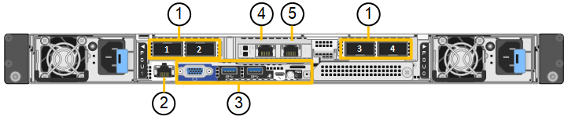

= SG110和SG1100设备：概述
:allow-uri-read: 
:icons: font
:imagesdir: ../media/

[role="lead"]
StorageGRID SG110服务设备和SG1100服务设备可作为网关节点和管理节点运行、以便在StorageGRID系统中提供高可用性负载平衡服务。这两个设备可以同时作为网关节点和管理节点（主节点或非主节点）运行。

== 设备功能

这两种型号的服务设备均可提供以下功能：

* StorageGRID 系统的网关节点或管理节点功能。
* StorageGRID 设备安装程序，用于简化节点部署和配置。
* 部署后，可以从现有管理节点或从下载到本地驱动器的软件访问 StorageGRID 软件。为了进一步简化部署过程，在制造过程中，设备会预加载最新版本的软件。
* 用于监控和诊断某些设备硬件的基板管理控制器（ BMC ）。
* 能够连接到所有三个 StorageGRID 网络，包括网格网络，管理网络和客户端网络：
+
** SG110最多支持四个连接到网格网络和客户端网络的10-GbE或25-GbE连接。
** SG1100最多支持四个到网格网络和客户端网络的10-GbE、25-GbE、40-GbE或100-GbE连接。

== SG110和SG1100图表

此图显示了卸下挡板的SG110和SG1100的正面。从正面看，除了挡板上的产品名称之外，这两个设备是相同的。

image::../media/sg1100_front_with_ssds.png[正面、包含SSD SG110和SG1100]

橙色轮廓线表示的两个固态驱动器(SSD)用于存储StorageGRID 操作系统、并使用RAID 1进行镜像以实现冗余。将SG110或SG1100服务设备配置为管理节点时、这些驱动器可能会用于存储审核日志、指标和数据库表。

其余驱动器插槽为空。

此图显示了电源的位置、并确定了SG110和SG1100背面的LED。设备端口上还有其他状态和活动LED。这些LED可能因设备型号而异。

image::../media/q2024_rear_leds.png[背面LED SG110和SG1100]

[cols="1a,2a,3a"]
|===
| Callout | LED | State 

 a| 
1.
 a| 
电源指示灯
 a| 
* 绿色、稳定亮起：设备已通电、电源按钮已打开。
* 绿色、闪烁：设备已通电、电源按钮已关闭。
* 熄灭：设备未通电。
* 琥珀色：电源故障。

 a| 
2.
 a| 
识别LED
 a| 
* 蓝色，闪烁：表示机柜或机架中的设备。
* 蓝色，实心：表示机柜或机架中的设备。
* off ：无法在机柜或机架中直观地识别设备。

|===

== SG110连接器

此图显示了SG110的背面、包括端口、风扇和电源。

image::../media/sg110_rear_view.png[背面连接器SG110]

[cols="1a,2a,2a,2a"]
|===
| Callout | Port | Type | 使用 ... 

 a| 
1.
 a| 
网络端口 1-4
 a| 
10/225-GbE ，根据缆线或 SFP 收发器类型（支持 SFP28 和 SFP+ 模块），交换机速度和已配置的链路速度
 a| 
连接到网格网络和 StorageGRID 客户端网络。

 a| 
2.
 a| 
BMC 管理端口
 a| 
1-GbE （ RJ-45 ）
 a| 
连接到设备基板管理控制器。

 a| 
3.
 a| 
诊断和支持端口
 a| 
* VGA
* USB
* 微型USB控制台端口
* 微型SD插槽模块

 a| 
保留供技术支持使用。

 a| 
4.
 a| 
管理网络端口 1
 a| 
1/10 GbE (RJ-45)
 a| 
将设备连接到 StorageGRID 的管理网络。

 a| 
5.
 a| 
管理网络端口 2
 a| 
1/10 GbE (RJ-45)
 a| 
选项：

* 与管理端口 1 绑定，以便与 StorageGRID 的管理网络建立冗余连接。
* 保持断开连接并可用于临时本地访问（ IP 169.254.0.1 ）。
* 在安装期间、如果DHCP分配的IP地址不可用、请使用端口2进行IP配置。

|===

== SG1100连接器

此图显示了SG1100背面的连接器。

[cols="1a,2a,2a,2a"]
|===
| Callout | Port | Type | 使用 ... 

 a| 
1.
 a| 
网络端口 1-4
 a| 
10/25/40/100-GbE ，基于缆线或收发器类型，交换机速度和已配置的链路速度。本机支持QSFP56 (仅限100GbE /端口)、QSFP28 (100GbE)和QSFP+(40GbE)。可选SFP+(10GbE)或SFP28 (25GbE)收发器可与QSA (单独出售)结合使用。
 a| 
连接到网格网络和 StorageGRID 客户端网络。

 a| 
2.
 a| 
BMC 管理端口
 a| 
1-GbE （ RJ-45 ）
 a| 
连接到设备基板管理控制器。

 a| 
3.
 a| 
诊断和支持端口
 a| 
* VGA
* USB
* 微型USB控制台端口
* 微型SD插槽模块

 a| 
保留供技术支持使用。

 a| 
4.
 a| 
管理网络端口 1
 a| 
1/10 GbE (RJ-45)
 a| 
将设备连接到 StorageGRID 的管理网络。

 a| 
5.
 a| 
管理网络端口 2
 a| 
1/10 GbE (RJ-45)
 a| 
选项：

* 与管理端口 1 绑定，以便与 StorageGRID 的管理网络建立冗余连接。
* 保持断开连接并可用于临时本地访问（ IP 169.254.0.1 ）。
* 在安装期间、如果DHCP分配的IP地址不可用、请使用端口2进行IP配置。

|===

== SG110和SG1100应用程序

您可以通过各种方式配置 StorageGRID 服务设备，以提供网关服务以及某些网格管理服务的冗余。

可以通过以下方式部署设备：

* 作为网关节点添加到新网格或现有网格中
* 作为主管理节点或非主管理节点添加到新网格中，或者作为非主管理节点添加到现有网格中
* 同时作为网关节点和管理节点（主节点或非主节点）运行

该设备有助于在 S3 或 Swift 数据路径连接中使用高可用性（ HA ）组和智能负载平衡。

以下示例介绍了如何最大限度地提高设备的功能：

* 使用两个SG110或两个SG1100设备通过将其配置为网关节点来提供网关服务。
+

IMPORTANT: 在同一站点中混用具有不同性能级别的服务设备(例如SG100或SG110与SG1000或SG1100)时、如果在高可用性组中使用多个节点、或者在多个服务设备之间平衡客户端负载、可能会导致不可预测和不一致的结果

* 使用两个SG110或两个SG1100设备为某些网格管理服务提供冗余。为此，请将每个设备配置为管理节点。
* 使用两个SG110或两个SG1100设备提供通过一个或多个虚拟IP地址访问的高可用性负载平衡和流量整形服务。为此，请将设备配置为管理节点或网关节点的任意组合，并将这两个节点添加到同一 HA 组。
+

IMPORTANT: 如果在同一HA组中使用管理节点和网关节点、则仅管理节点端口不会进行故障转移。请参阅的说明 https://docs.netapp.com/us-en/storagegrid/admin/configure-high-availability-group.html["配置HA组"^]。

与StorageGRID存储设备结合使用时、SG110和SG1100服务设备均支持部署纯设备网格、而不依赖于外部虚拟机管理程序或计算硬件。
