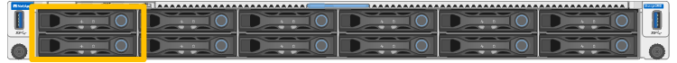
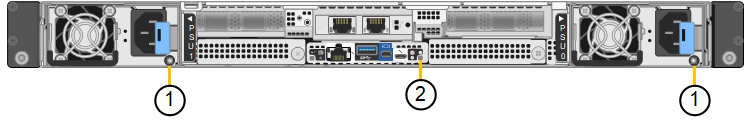
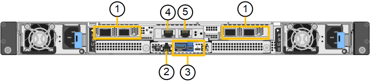
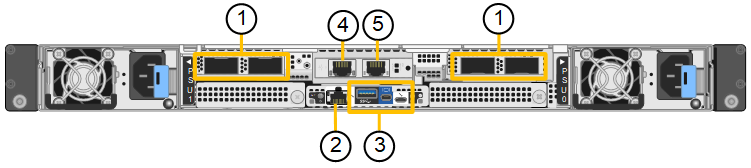

= StorageGRID SG120 和 SG1200 设备
:allow-uri-read: 
:icons: font
:imagesdir: ../media/

[role="lead"]
StorageGRID SG120 服务设备和 SG1200 服务设备可以作为网关节点和管理节点运行，以在 StorageGRID 系统中提供高可用性负载平衡服务。两个设备都可以同时作为网关节点和管理节点（主节点或非主节点）运行。

[[appliance-features]]
== 设备功能

SG120 和 SG1200 设备提供以下功能：

* StorageGRID 系统的网关节点或管理节点功能。
* StorageGRID 设备安装程序，用于简化节点部署和配置。
* 部署后，可以从现有管理节点或从下载到本地驱动器的软件访问 StorageGRID 软件。为了进一步简化部署过程，在制造过程中，设备会预加载最新版本的软件。
* 一个 AMD 3.65 GHz 处理器，提供 16 核（32 线程）
* 用于监控和诊断某些设备硬件的基板管理控制器（ BMC ）。
* 能够连接到所有三个 StorageGRID 网络，包括网格网络，管理网络和客户端网络：
+
** SG120 最多支持四个 10 GbE 或 25 GbE 连接到 Grid Network 和 Client Network。
** SG1200 最多支持四个 10、25、40、100 GbE 连接到网格网络和客户端网络（或使用可选的 200GbE NIC 最多支持四个 200GbE 连接）。

[[sg120-and-sg1200-diagrams]]
== SG120 和 SG1200 示意图

此图显示了卸下挡板的 SG120 和 SG1200 的正面。从正面看，除了挡板上的产品名称外，两台设备完全相同。

由橙色轮廓指示的两个固态驱动器 (SSD) 用于存储 StorageGRID 操作系统，并使用 RAID 1 进行镜像以实现冗余。当 SG120 或 SG1200 服务设备配置为管理节点时，这些驱动器可用于存储审计日志、指标和数据库表。剩余的驱动器插槽为空。

此图显示了电源的位置，并标识了 SG120 和 SG1200 背面的 LED。其他状态和活动指示灯位于设备端口上。这些 LED 可能因设备型号而异。

[cols="1a,2a,3a"]
|===
| Callout | LED | State 

 a| 
1.
 a| 
电源指示灯
 a| 
* 绿色、稳定亮起：设备已通电、电源按钮已打开。
* 绿色、闪烁：设备已通电、电源按钮已关闭。
* 熄灭：设备未通电。
* 琥珀色：电源故障。

 a| 
2.
 a| 
识别LED
 a| 
* 蓝色，闪烁：表示机柜或机架中的设备。
* 蓝色，实心：表示机柜或机架中的设备。
* 关闭：设备在机柜或机架中无法在视觉上识别。

|===

[[sg120-connectors]]
== SG120 连接器

此图显示了 SG120 的背面，包括端口、风扇和电源。

[cols="1a,2a,2a,2a"]
|===
| Callout | Port | Type | 使用 ... 

 a| 
1.
 a| 
网络端口 1-4
 a| 
10/225-GbE ，根据缆线或 SFP 收发器类型（支持 SFP28 和 SFP+ 模块），交换机速度和已配置的链路速度
 a| 
连接到网格网络和 StorageGRID 客户端网络。

 a| 
2.
 a| 
BMC 管理端口
 a| 
1-GbE （ RJ-45 ）
 a| 
连接到设备基板管理控制器。

 a| 
3.
 a| 
诊断和支持端口
 a| 
* Mini DisplayPort 接口
* USB 3.0 端口
* 微型USB控制台端口

 a| 
保留供技术支持使用。

 a| 
4.
 a| 
管理网络端口 1
 a| 
1/10 GbE (RJ-45)
 a| 
将设备连接到 StorageGRID 的管理网络。

 a| 
5.
 a| 
管理网络端口 2
 a| 
1/10 GbE (RJ-45)
 a| 
选项：

* 与管理端口 1 绑定，以便与 StorageGRID 的管理网络建立冗余连接。
* 保持断开连接并可用于临时本地访问（ IP 169.254.0.1 ）。
* 在安装期间、如果DHCP分配的IP地址不可用、请使用端口2进行IP配置。

|===

[[sg1200-connectors]]
== SG1200 连接器

此图显示了 SG1200 背面的连接器。

[cols="1a,2a,2a,2a"]
|===
| Callout | Port | Type | 使用 ... 

 a| 
1.
 a| 
网络端口 1-4
 a| 
10/25/40/100/200-GbE，基于电缆或收发器类型、交换机速度和配置的链路速度。

本机支持 QSFP56（最大 200GbE/端口）、QSFP28（最大 100GbE/端口）和 QSFP+（40GbE）（200GbE 速度需要 200GbE NIC 选项）。可选的 SFP+（10GbE）或 SFP28（25GbE）收发器可以与 QSA（单独出售）一起使用。
 a| 
连接到网格网络和 StorageGRID 客户端网络。

 a| 
2.
 a| 
BMC 管理端口
 a| 
1-GbE （ RJ-45 ）
 a| 
连接到设备基板管理控制器。

 a| 
3.
 a| 
诊断和支持端口
 a| 
* Mini DisplayPort 接口
* USB 3.0 端口
* 微型USB控制台端口

 a| 
保留供技术支持使用。

 a| 
4.
 a| 
管理网络端口 1
 a| 
1/10 GbE (RJ-45)
 a| 
将设备连接到 StorageGRID 的管理网络。

 a| 
5.
 a| 
管理网络端口 2
 a| 
1/10 GbE (RJ-45)
 a| 
选项：

* 与管理端口 1 绑定，以便与 StorageGRID 的管理网络建立冗余连接。
* 保持断开连接并可用于临时本地访问（ IP 169.254.0.1 ）。
* 在安装期间、如果DHCP分配的IP地址不可用、请使用端口2进行IP配置。

|===

[[sg120-and-sg1200-applications]]
== SG120 和 SG1200 应用程序

您可以通过以下方式配置 StorageGRID 服务设备，以提供网关服务以及某些网格管理服务的冗余。

* 作为网关节点添加到新网格或现有网格中
* 作为主管理节点或非主管理节点添加到新网格中，或者作为非主管理节点添加到现有网格中
* 同时作为网关节点和管理节点（主节点或非主节点）运行

该设备有助于在 S3 或 Swift 数据路径连接中使用高可用性（ HA ）组和智能负载平衡。

以下示例介绍了如何最大限度地提高设备的功能：

* 使用两个 SG120 或两个 SG1200 设备，通过将它们配置为网关节点来提供网关服务。
+

IMPORTANT: 在同一站点中混合具有不同性能级别的服务设备，例如 SG110 或 SG120 与 SG1100 或 SG1200，当在高可用性组中使用多个节点或在多个服务设备之间平衡客户端负载时，可能会导致不可预测和不一致的结果

* 使用两台 SG120 或两台 SG1200 设备来提供某些网格管理服务的冗余。为此，请将每个设备配置为管理节点。
* 使用两个 SG120 或两个 SG1200 设备来提供通过一个或多个虚拟 IP 地址访问的高可用性负载平衡和流量整形服务。为此，请将设备配置为管理节点或网关节点的任意组合，并将两个节点添加到同一 HA 组。
+

IMPORTANT: 如果您在同一 HA 组中使用仅限 Admin Node 的端口和 Gateway Node，则仅限 Admin Node 的端口不会进行故障转移。请参阅 https://docs.netapp.com/us-en/storagegrid/admin/configure-high-availability-group.html["配置HA组"^]的说明。

当与 StorageGRID 存储设备一起使用时，SG120 和 SG1200 服务设备都可以部署仅限设备的网格，而不依赖于外部虚拟机管理程序或计算硬件。
