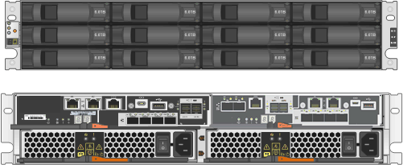

= SG5700 设备：概述
:allow-uri-read: 
:icons: font
:imagesdir: ../media/

[role="lead"]
SG5700 StorageGRID 设备是一个集成的存储和计算平台，作为 StorageGRID 网格中的存储节点运行。此设备可在混合网格环境中使用，该环境将设备存储节点与虚拟（基于软件的）存储节点相结合。

StorageGRID SG5700系列设备具有以下功能：

* 集成 StorageGRID 存储节点的存储和计算要素。
* 包括 StorageGRID 设备安装程序，以简化存储节点的部署和配置。
* 包括用于硬件管理和监控的 E 系列 SANtricity System Manager 。
* 最多支持四个连接到 StorageGRID 网格网络和客户端网络的 10-GbE 或 25-GbE 连接。
* 支持全磁盘加密(Full Disk Encryption、FD)驱动器或FIPS驱动器。如果将这些驱动器与 SANtricity 系统管理器中的驱动器安全功能结合使用，则会阻止未经授权的数据访问。

SG5700设备有四种型号：SG5712和SG5712X以及SG5760和SG5760X。除了存储控制器上互连端口的位置之外、SG5712和SG5712X之间在规格或功能上没有区别。同样、除了存储控制器上互连端口的位置之外、SG5760和SG5760X在规格或功能上没有任何区别。

== SG5700组件

SG5700型号包括以下组件：

[role="tabbed-block"]
====
.SG5712
--
计算控制器:: E5700SG 控制器
存储控制器:: E2800A控制器
机箱:: E 系列 DE212C 机箱，一个双机架单元（ 2U ）机箱
驱动器:: 12 个 NL-SAS 驱动器（ 3.5 英寸）
冗余电源和风扇:: 两个电源风扇箱

--
.SG5712X
--
计算控制器:: E5700SG 控制器
存储控制器:: E2800B控制器
机箱:: E 系列 DE212C 机箱，一个双机架单元（ 2U ）机箱
驱动器:: 12 个 NL-SAS 驱动器（ 3.5 英寸）
冗余电源和风扇:: 两个电源风扇箱

--
.SG5760
--
计算控制器:: E5700SG 控制器
存储控制器:: E2800A控制器
机箱:: E 系列 DE460C 机箱，一个四机架单元（ 4U ）机箱
驱动器:: 60 个 NL-SAS 驱动器（ 3.5 英寸）
冗余电源和风扇:: 两个电源箱和两个风扇箱

--
.SG5760X
--
计算控制器:: E5700SG 控制器
存储控制器:: E2800B控制器
机箱:: E 系列 DE460C 机箱，一个四机架单元（ 4U ）机箱
驱动器:: 60 个 NL-SAS 驱动器（ 3.5 英寸）
冗余电源和风扇:: 两个电源箱和两个风扇箱

--
====
根据每个机箱中的驱动器数量， StorageGRID 设备中可用的最大原始存储空间是固定的。您不能通过添加具有额外驱动器的磁盘架来扩展可用存储。

== SG5700示意图

=== SG5712正面图和背面图

图中显示了SG5712的正面和背面、SG5712是一个2U机箱、可容纳12个驱动器。

image::../media/sg5712_front_and_back_views.gif[SG5712 设备的正面和背面]

=== SG5712组件

SG5712 包括两个控制器和两个电源风扇箱。

image::../media/sg5712_with_callouts.gif[SG5712 设备中的控制器和电源风扇箱]

[cols="1a,3a"]
|===
| Callout | Description 

 a| 
1.
 a| 
E2800A控制器(存储控制器)

 a| 
2.
 a| 
E5700SG 控制器（计算控制器）

 a| 
3.
 a| 
电源风扇箱

|===

=== SG5712X正面图和背面图

图中显示了SG5712X的正面和背面、SG5712X是一个2U机箱、可容纳12个驱动器。

=== SG5712X组件

SG5712X包括两个控制器和两个电源风扇箱。

image::../media/sg5712x_with_callouts.gif[SG5712X设备中的控制器和电源风扇箱]

[cols="1a,3a"]
|===
| Callout | Description 

 a| 
1.
 a| 
E2800B控制器(存储控制器)

 a| 
2.
 a| 
E5700SG 控制器（计算控制器）

 a| 
3.
 a| 
电源风扇箱

|===

=== SG5760正面图和背面图

图中显示了SG5760型号的正面和背面、SG5760是一个4U机箱、可在5个驱动器抽盒中容纳60个驱动器。

image::../media/sg5760_front_and_back_views.gif[SG5760 设备的正面和背面]

=== SG5760组件

SG5760 包括两个控制器，两个风扇箱和两个电源箱。

image::../media/sg5760_with_callouts.gif[SG5760设备中的控制器、风扇箱和电源箱]

[cols="1a,2a"]
|===
| Callout | Description 

 a| 
1.
 a| 
E2800A控制器(存储控制器)

 a| 
2.
 a| 
E5700SG 控制器（计算控制器）

 a| 
3.
 a| 
风扇箱（第 1 页，共 2 页）

 a| 
4.
 a| 
电源箱（第 1 页，共 2 页）

|===

=== SG5760X正面图和背面图

图中显示了SG5760X型号的正面和背面、SG5760X是一个4U机箱、可在5个驱动器抽盒中容纳60个驱动器。

image::../media/sg5760x_front_and_back_views.gif[SG5760X设备的正面和背面]

=== SG5760X组件

SG5760X包括两个控制器、两个风扇箱和两个电源箱。

image::../media/sg5760x_with_callouts.gif[SG5760X设备中的控制器、风扇箱和电源箱]

[cols="1a,3a"]
|===
| Callout | Description 

 a| 
1.
 a| 
E2800B控制器(存储控制器)

 a| 
2.
 a| 
E5700SG 控制器（计算控制器）

 a| 
3.
 a| 
风扇箱（第 1 页，共 2 页）

 a| 
4.
 a| 
电源箱（第 1 页，共 2 页）

|===

== SG5700控制器

StorageGRID 设备的12驱动器SG5712和SG5712X以及60驱动器SG5760和SG5760X型号都包括一个E5700SG计算控制器和一个E系列E2800存储控制器。

* SG5712和SG5760使用E2800A控制器。
* SG5712X和SG5760X使用E2800B控制器。

E2800A和E2800B控制器的规格和功能完全相同、只是互连端口的位置不同。

=== E5700SG计算控制器

* 用作设备的计算服务器。
* 包括 StorageGRID 设备安装程序。
+

NOTE: 设备上未预安装 StorageGRID 软件。部署设备时，可从管理节点访问此软件。

* 可以连接到所有三个 StorageGRID 网络，包括网格网络，管理网络和客户端网络。
* 连接到 E2800 控制器并作为启动程序运行。

==== E5700SG连接器

image::../media/e5700sg_controller_with_callouts.gif[E5700SG 控制器上的连接器]

[cols="1a,2a,2a,2a"]
|===
| Callout | Port | Type | 使用 ... 

 a| 
1.
 a| 
互连端口 1 和 2
 a| 
16 Gb/秒光纤通道(FC)、光纤SFP
 a| 
将 E5700SG 控制器连接到 E2800 控制器。

 a| 
2.
 a| 
诊断和支持端口
 a| 
* RJ-45 串行端口
* 微型 USB 串行端口
* USB 端口

 a| 
为技术支持预留。

 a| 
3.
 a| 
驱动器扩展端口
 a| 
12 Gb/ 秒 SAS
 a| 
未使用。

 a| 
4.
 a| 
网络端口 1-4
 a| 
10-GbE 或 25-GbE ，取决于 SFP 收发器类型，交换机速度和已配置的链路速度
 a| 
连接到网格网络和 StorageGRID 客户端网络。

 a| 
5.
 a| 
管理端口 1
 a| 
1 Gb （ RJ-45 ）以太网
 a| 
连接到 StorageGRID 的管理网络。

 a| 
6.
 a| 
管理端口 2
 a| 
1 Gb （ RJ-45 ）以太网
 a| 
选项：

* 与管理端口 1 绑定，以便与 StorageGRID 的管理网络建立冗余连接。
* 保持未连接状态，并可用于临时本地访问（ IP 169.254.0.1 ）。
* 在安装期间、如果DHCP分配的IP地址不可用、请使用端口2进行IP配置。

|===

=== E2800存储控制器

SG5700设备中使用了两个版本的E2800存储控制器：E2800A和E2800B。E2800A没有HIC、E2800B有四端口HIC。这两个控制器版本的规格和功能相同、但互连端口的位置除外。

E2800系列存储控制器具有以下规格：

* 用作设备的存储控制器。
* 管理驱动器上的数据存储。
* 在单工模式下用作标准 E 系列控制器。
* 包括 SANtricity 操作系统软件（控制器固件）。
* 包括用于监控设备硬件和管理警报的 SANtricity System Manager ， AutoSupport 功能和驱动器安全功能。
* 连接到 E5700SG 控制器并作为目标运行。

==== E2800A连接器

image::../media/e2800_controller_with_callouts.gif[E2800A控制器上的连接器]

==== E2800B连接器

image::../media/e2800B_controller_with_callouts.gif[E2800B控制器上的连接器]

[cols="1a,2a,2a,2a"]
|===
| Callout | Port | Type | 使用 ... 

 a| 
1.
 a| 
互连端口 1 和 2
 a| 
16 Gb/秒FC光纤SFP
 a| 
将 E2800 控制器连接到 E5700SG 控制器。

 a| 
2.
 a| 
管理端口 1 和 2
 a| 
1 Gb （ RJ-45 ）以太网
 a| 
* 端口 1 选项：
+
** 连接到管理网络以启用对 SANtricity 系统管理器的直接 TCP/IP 访问
** 保持未连接状态以保存交换机端口和 IP 地址。  使用网格管理器或存储网格设备安装程序访问SANtricity System Manager。

* 注 * ：如果您选择使端口 1 保持未连接状态，则某些可选的 SANtricity 功能（例如 NTP 同步以获得准确的日志时间戳）将不可用。

* 注 * ：如果不对端口 1 布线，则需要 StorageGRID 11.5 或更高版本以及 SANtricity 11.70 或更高版本。

* 端口 2 预留用于技术支持。

 a| 
3.
 a| 
诊断和支持端口
 a| 
* RJ-45 串行端口
* 微型 USB 串行端口
* USB 端口

 a| 
保留供技术支持使用。

 a| 
4.
 a| 
驱动器扩展端口。
 a| 
12 Gb/ 秒 SAS
 a| 
未使用。

|===
.相关信息
https://docs.netapp.com/us-en/e-series-family/index.html["NetApp E系列文档"^]
