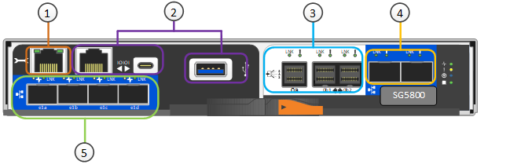

= SG工具：概述
:allow-uri-read: 
:icons: font
:imagesdir: ../media/

[role="lead"]
SG运StorageGRID维设备是集成的存储和计算平台、可作为StorageGRID网格中的存储节点运行。

StorageGRID SG型 工具具有以下功能：

* 集成 StorageGRID 存储节点的存储和计算要素。
* 包括 StorageGRID 设备安装程序，以简化存储节点的部署和配置。
* 包括用于硬件管理和监控的E系列SANtricity System Manager。
* 最多支持四个连接到 StorageGRID 网格网络和客户端网络的 10-GbE 或 25-GbE 连接。
* 支持全磁盘加密(Full Disk Encryption、FD)驱动器或FIPS驱动器。如果将这些驱动器与 SANtricity 系统管理器中的驱动器安全功能结合使用，则会阻止未经授权的数据访问。

SG58800设备有两种型号：SG5812和SG5860。

== SG与SG的 连接

SG型 包含以下组件：

[role="tabbed-block"]
====
.SG5812
--
计算控制器:: SGs了 控制器
存储控制器:: E4000控制器
机箱:: E 系列 DE212C 机箱，一个双机架单元（ 2U ）机箱
驱动器:: 12 个 NL-SAS 驱动器（ 3.5 英寸）
冗余电源和风扇:: 两个电源风扇箱

--
.SG5860
--
计算控制器:: SGs了 控制器
存储控制器:: E4000控制器
机箱:: E 系列 DE460C 机箱，一个四机架单元（ 4U ）机箱
驱动器:: 60 个 NL-SAS 驱动器（ 3.5 英寸）
冗余电源和风扇:: 两个电源箱和两个风扇箱

--
====
根据每个机箱中的驱动器数量， StorageGRID 设备中可用的最大原始存储空间是固定的。您不能通过添加具有额外驱动器的磁盘架来扩展可用存储。

== SG与SG的 图表

=== SG5812正面图和背面图

图中显示了SG5812的正面和背面、SG5812是一个2U机箱、可容纳12个驱动器。

image::../media/sg5812_front_and_back_views.png[SG5812设备的正面和背面]

=== SG5812组件

SG5812包括两个控制器和两个电源风扇箱。

image::../media/sg5812_with_callouts.png[SG5812设备中的控制器和电源风扇箱]

[cols="1a,3a"]
|===
| Callout | Description 

 a| 
1.
 a| 
E4000控制器(存储控制器)

 a| 
2.
 a| 
SG可能性(计算控制器)

 a| 
3.
 a| 
电源风扇箱

|===

=== SG5860正面图和背面图

图中显示了SG5860型号的正面和背面、SG5860是一个4U机箱、可在5个驱动器抽盒中容纳60个驱动器。

image::../media/sg5860_front_and_back_views.png[SG5860设备的正面和背面]

=== SG5860组件

SG5860包括两个控制器、两个风扇箱和两个电源箱。

image::../media/sg5860_with_callouts.png[控制器,fan canisters,and power canisters in SG5860 appliance]

[cols="1a,2a"]
|===
| Callout | Description 

 a| 
1.
 a| 
E4000控制器(存储控制器)

 a| 
2.
 a| 
SG可能性(计算控制器)

 a| 
3.
 a| 
风扇箱（第 1 页，共 2 页）

 a| 
4.
 a| 
电源箱（第 1 页，共 2 页）

|===

== SGs了 控制器

StorageGRID设备的12驱动器SG5812和60驱动器SG5860型号均包含一个SG58800计算控制器和一个E系列E4000存储控制器。

=== SG成本 控制器

* 用作设备的计算服务器。
* 包括 StorageGRID 设备安装程序。
+

NOTE: 设备上未预安装 StorageGRID 软件。部署设备时，可从管理节点访问此软件。

* 可以连接到所有三个 StorageGRID 网络，包括网格网络，管理网络和客户端网络。
* 连接到E4000控制器并作为启动程序运行。

==== SG小型 连接器

[cols="1a,2a,2a,2a"]
|===
| Callout | Port | Type | 使用 ... 

 a| 
1.
 a| 
管理端口 1
 a| 
1 Gb （ RJ-45 ）以太网
 a| 
连接到 StorageGRID 的管理网络。

 a| 
2.
 a| 
诊断和支持端口
 a| 
* RJ-45 串行端口
* USB－C串行端口
* USB 端口

 a| 
为技术支持预留。

 a| 
3.
 a| 
驱动器扩展端口
 a| 
12 Gb/ 秒 SAS
 a| 
未使用。

 a| 
4.
 a| 
互连端口 1 和 2
 a| 
25GbE iSCSI
 a| 
将SG4500控制器连接到E4000控制器。

 a| 
5.
 a| 
网络端口 1-4
 a| 
10-GbE 或 25-GbE ，取决于 SFP 收发器类型，交换机速度和已配置的链路速度
 a| 
连接到网格网络和 StorageGRID 客户端网络。

|===

=== E4000存储控制器

E4000系列存储控制器具有以下规格：

* 用作设备的存储控制器。
* 管理驱动器上的数据存储。
* 在单工模式下用作标准 E 系列控制器。
* 包括 SANtricity 操作系统软件（控制器固件）。
* 包括用于监控设备硬件和管理警报的 SANtricity System Manager ， AutoSupport 功能和驱动器安全功能。
* 连接到SG运 维控制器并作为目标运行。

==== E4000连接器

image::../media/e4000_controller_with_callouts.png[E4000控制器上的连接器]

[cols="1a,2a,2a,2a"]
|===
| Callout | Port | Type | 使用 ... 

 a| 
1.
 a| 
管理端口
 a| 
1 Gb （ RJ-45 ）以太网
 a| 
端口选项：
**连接到管理网络以启用对SANtricity系统管理器的直接TCP/IP访问
**保持未接线状态以保存交换机端口和IP地址。  使用网格管理器或存储网格设备安装程序访问SANtricity System Manager。

*注意*：如果选择使管理端口保持未接线状态，则某些可选的SANtricity功能(例如用于准确日志时间戳的NTP同步)将不可用。

*注意*：保持管理端口未接线状态时，需要StorageGRID 11．8或更高版本以及SANtricity 11．8或更高版本。

 a| 
2.
 a| 
诊断和支持端口
 a| 
* RJ-45 串行端口
* USB－C串行端口
* USB 端口

 a| 
保留供技术支持使用。

 a| 
3.
 a| 
驱动器扩展端口。
 a| 
12 Gb/ 秒 SAS
 a| 
未使用。

 a| 
4.
 a| 
互连端口 1 和 2
 a| 
25GbE iSCSI
 a| 
将E4000控制器连接到SG4500控制器。

|===
.相关信息
https://docs.netapp.com/us-en/e-series-family/index.html["NetApp E系列文档"^]
