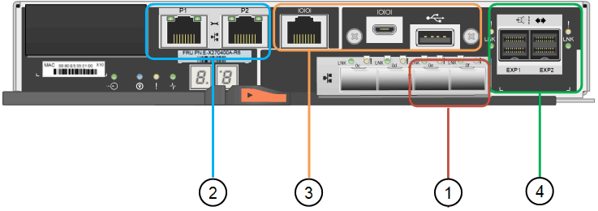

= SG6060和SG6060X设备：概述
:allow-uri-read: 
:icons: font
:imagesdir: ../media/

[role="lead"]
StorageGRID SG6060和SG60X设备各包含一个计算控制器和一个存储控制器架、其中包含两个存储控制器和60个驱动器。

也可以在这两个设备中添加60个驱动器的扩展架。除了存储控制器上互连端口的位置之外、SG6060和SG6060X之间在规格或功能上没有区别。

== SG6060和SG6060X组件

SG6060和SG6060X设备包括以下组件：

计算控制器:: SG6000-CN控制器是一款单机架单元(1U)服务器、其中包括：
+
--
* 40 个核心（ 80 个线程）
* 192 GB RAM
* 高达 4 × 25 Gbps 聚合以太网带宽
* 4 × 16 Gbps 光纤通道（ FC ）互连
* 可简化硬件管理的基板管理控制器（ BMC ）
* 冗余电源

--
存储控制器架:: E系列E2860控制器架(存储阵列)是一个4U磁盘架、包括：
+
--
* 两个E2800系列控制器(双工配置)、用于提供存储控制器故障转移支持
+
** SG6060包含E2800A存储控制器
** SG6060X包含E2800B存储控制器

* 五抽屉驱动器架，可容纳 60 个 3.5 英寸驱动器（ 2 个固态驱动器或 SSD 以及 58 个 NL-SAS 驱动器）
* 冗余电源和风扇

--
可选：存储扩展架:: 每个SG6060和SG6060X设备可以具有一个或两个扩展架、总共可容纳180个驱动器(其中两个驱动器为E系列读取缓存预留)。
+
--
* 注： * 扩展架可以在初始部署期间安装，也可以稍后添加。

E系列DE460C机箱是一个4U磁盘架、其中包括：

* 两个输入 / 输出模块（ IOM ）
* 五个抽盒，每个抽盒容纳 12 个 NL-SAS 驱动器，总共 60 个驱动器
* 冗余电源和风扇

--

== SG6060和SG6060X图表

SG6060和SG60X的正面是相同的。

=== SG6060或SG6060X正面图

此图显示了SG6060或SG6060X的正面、其中包括一个1U计算控制器和一个4U磁盘架、该磁盘架在五个驱动器抽盒中包含两个存储控制器和60个驱动器。

image::../media/sg6060_front_view_with_and_without_bezels.gif[SG6060 正面图]

[cols="1a,2a"]
|===
| Callout | Description 

 a| 
1.
 a| 
带有前挡板的 SG6000-CN 计算控制器

 a| 
2.
 a| 
带前挡板的 E2860 控制器架（可选扩展架看起来相同）

 a| 
3.
 a| 
SG6000-CN 计算控制器，已卸下前挡板

 a| 
4.
 a| 
已卸下前挡板的 E2860 控制器架（可选扩展架看起来相同）

|===

=== SG6060背面图

此图显示了 SG6060 的背面，包括计算和存储控制器，风扇和电源。

image::../media/sg6060_rear_view.gif[SG6060 背面图]

[cols="1a,2a"]
|===
| Callout | Description 

 a| 
1.
 a| 
SG6000-CN 计算控制器的电源（第 1 页，共 2 页）

 a| 
2.
 a| 
用于 SG6000-CN 计算控制器的连接器

 a| 
3.
 a| 
E2860 控制器架的风扇（图 1 ）

 a| 
4.
 a| 
E系列E2800A存储控制器(图1)和连接器

 a| 
5.
 a| 
E2860 控制器架的电源（图 1 ）

|===

=== SG6060X背面图

此图显示了SG6060X的背面。

image::../media/sg6060x_rear_view.gif[SG6060x背面图]

[cols="1a,2a"]
|===
| Callout | Description 

 a| 
1.
 a| 
SG6000-CN 计算控制器的电源（第 1 页，共 2 页）

 a| 
2.
 a| 
用于 SG6000-CN 计算控制器的连接器

 a| 
3.
 a| 
E2860 控制器架的风扇（图 1 ）

 a| 
4.
 a| 
E系列E2800B存储控制器(图1)和连接器

 a| 
5.
 a| 
E2860 控制器架的电源（图 1 ）

|===

=== 扩展架

此图显示了SG6060和SG6060X的可选扩展架的背面、包括输入/输出模块(IOM)、风扇和电源。每个 SG6060 都可以安装一个或两个扩展架，这些扩展架可以包含在初始安装中，也可以稍后添加。

image::../media/de460c_expansion_shelf_rear_view.gif[扩展架背面]

[cols="1a,2a"]
|===
| Callout | Description 

 a| 
1.
 a| 
扩展架的风扇（第 1 张，共 2 张）

 a| 
2.
 a| 
扩展架的 IOM （第 1 张，共 2 张）

 a| 
3.
 a| 
扩展架的电源（图 1 ）

|===

== SG6000控制器

每个型号的 StorageGRID SG6000 设备都在 1U 机箱中包含一个 SG6000-CN 计算控制器，并在 2U 或 4U 机箱中包含双工 E 系列存储控制器，具体取决于型号。查看图表，了解有关每种控制器类型的更多信息。

=== SG6000-CN计算控制器

* 为设备提供计算资源。
* 包括 StorageGRID 设备安装程序。
+

NOTE: 设备上未预安装 StorageGRID 软件。部署设备时，系统会从管理节点检索此软件。

* 可以连接到所有三个 StorageGRID 网络，包括网格网络，管理网络和客户端网络。
* 连接到 E 系列存储控制器并作为启动程序运行。

==== SG6000-CN连接器

image::../media/sg6000_cn_rear_connectors.gif[SG6000-CN 背面连接器]

[cols="1a,2a,2a,3a"]
|===
| Callout | Port | Type | 使用 ... 

 a| 
1.
 a| 
互连端口 1-4
 a| 
16 Gb/ 秒光纤通道（ FC ），具有集成光纤
 a| 
将 SG6000-CN 控制器连接到 E2800 控制器（每个 E2800 有两个连接）。

 a| 
2.
 a| 
网络端口 1-4
 a| 
10-GbE 或 25-GbE ，取决于缆线或 SFP 收发器类型，交换机速度和已配置的链路速度
 a| 
连接到网格网络和 StorageGRID 客户端网络。

 a| 
3.
 a| 
BMC 管理端口
 a| 
1-GbE （ RJ-45 ）
 a| 
连接到 SG6000-CN 基板管理控制器。

 a| 
4.
 a| 
诊断和支持端口
 a| 
* VGA
* 串行， 115200 8-N-1
* USB

 a| 
保留供技术支持使用。

 a| 
5.
 a| 
管理网络端口 1
 a| 
1-GbE （ RJ-45 ）
 a| 
将 SG6000-CN 连接到 StorageGRID 管理网络。

 a| 
6.
 a| 
管理网络端口 2
 a| 
1-GbE （ RJ-45 ）
 a| 
选项：

* 与管理端口 1 绑定，以便与 StorageGRID 的管理网络建立冗余连接。
* 保持未连接状态，并可用于临时本地访问（ IP 169.254.0.1 ）。
* 在安装期间、如果DHCP分配的IP地址不可用、请使用端口2进行IP配置。

|===

=== SGF6024 ： EF570 存储控制器

* 两个控制器，用于提供故障转移支持。
* 管理驱动器上的数据存储。
* 在双工配置中用作标准 E 系列控制器。
* 包括 SANtricity 操作系统软件（控制器固件）。
* 包括用于监控存储硬件和管理警报的 SANtricity System Manager ， AutoSupport 功能和驱动器安全功能。
* 连接到 SG6000-CN 控制器并提供对闪存存储的访问权限。

==== EF570连接器

image::../media/ef570_rear_connectors.gif[EF570 背面连接器]

[cols="1a,2a,2a,3a"]
|===
| Callout | Port | Type | 使用 ... 

 a| 
1.
 a| 
互连端口 1 和 2
 a| 
16 Gb/秒FC光纤SFP
 a| 
将每个 EF570 控制器连接到 SG6000-CN 控制器。

SG6000-CN 控制器有四个连接（每个 EF570 有两个连接）。

 a| 
2.
 a| 
诊断和支持端口
 a| 
* RJ-45 串行端口
* 微型 USB 串行端口
* USB 端口

 a| 
保留供技术支持使用。

 a| 
3.
 a| 
驱动器扩展端口
 a| 
12 Gb/ 秒 SAS
 a| 
未使用。SGF6024 设备不支持扩展驱动器架。

 a| 
4.
 a| 
管理端口 1 和 2
 a| 
1 Gb （ RJ-45 ）以太网
 a| 
* 端口 1 连接到通过浏览器访问 SANtricity 系统管理器的网络。
* 端口 2 预留用于技术支持。

|===

=== SG6060和SG6060X：E2800存储控制器

* 两个控制器，用于提供故障转移支持。
* 管理驱动器上的数据存储。
* 在双工配置中用作标准 E 系列控制器。
* 包括 SANtricity 操作系统软件（控制器固件）。
* 包括用于监控存储硬件和管理警报的 SANtricity System Manager ， AutoSupport 功能和驱动器安全功能。
* 连接到 SG6000-CN 控制器并提供对存储的访问权限。

SG6060和SG6060X使用E2800存储控制器。

[cols="1a,2a,2a"]
|===
| 设备 | 控制器 | 控制器HIC 

 a| 
SG6060
 a| 
两个E2800A存储控制器
 a| 
无

 a| 
SG6060X
 a| 
两个E2800B存储控制器
 a| 
四端口HIC

|===
E2800A和E2800B存储控制器的规格和功能相同、但互连端口的位置除外。

CAUTION: 请勿在同一设备中使用E2800A和E2800B。

==== E2800A连接器

image::../media/e2800_controller_with_callouts.gif[E2800A控制器上的连接器]

[cols="1a,2a,2a,3a"]
|===
| Callout | Port | Type | 使用 ... 

 a| 
1.
 a| 
互连端口 1 和 2
 a| 
16 Gb/秒FC光纤SFP
 a| 
将每个E2800A控制器连接到SG6000-CN控制器。

SG6000-CN控制器有四个连接(每个E2800A两个)。

 a| 
2.
 a| 
管理端口 1 和 2
 a| 
1 Gb （ RJ-45 ）以太网
 a| 
* 端口 1 选项：
+
** 连接到管理网络以启用对 SANtricity 系统管理器的直接 TCP/IP 访问
** 保持未连接状态以保存交换机端口和 IP 地址。  使用网格管理器或存储网格设备安装程序访问SANtricity System Manager。

* 注 * ：如果您选择使端口 1 保持未连接状态，则某些可选的 SANtricity 功能（例如 NTP 同步以获得准确的日志时间戳）将不可用。

* 注 * ：如果不对端口 1 布线，则需要 StorageGRID 11.5 或更高版本以及 SANtricity 11.70 或更高版本。

* 端口 2 预留用于技术支持。

 a| 
3.
 a| 
诊断和支持端口
 a| 
* RJ-45 串行端口
* 微型 USB 串行端口
* USB 端口

 a| 
保留供技术支持使用。

 a| 
4.
 a| 
驱动器扩展端口 1 和 2
 a| 
12 Gb/ 秒 SAS
 a| 
将端口连接到扩展架中 IOM 上的驱动器扩展端口。

|===

==== E2800B连接器

[cols="1a,2a,2a,3a"]
|===
| Callout | Port | Type | 使用 ... 

 a| 
1.
 a| 
互连端口 1 和 2
 a| 
16 Gb/秒FC光纤SFP
 a| 
将每个E2800B控制器连接到SG6000-CN控制器。

SG6000-CN控制器有四个连接(每个E2800B两个)。

 a| 
2.
 a| 
管理端口 1 和 2
 a| 
1 Gb （ RJ-45 ）以太网
 a| 
* 端口 1 选项：
+
** 连接到管理网络以启用对 SANtricity 系统管理器的直接 TCP/IP 访问
** 保持未连接状态以保存交换机端口和 IP 地址。使用网格管理器或存储网格设备安装程序访问SANtricity System Manager。

* 注 * ：如果您选择使端口 1 保持未连接状态，则某些可选的 SANtricity 功能（例如 NTP 同步以获得准确的日志时间戳）将不可用。

* 注 * ：如果不对端口 1 布线，则需要 StorageGRID 11.5 或更高版本以及 SANtricity 11.70 或更高版本。

* 端口 2 预留用于技术支持。

 a| 
3.
 a| 
诊断和支持端口
 a| 
* RJ-45 串行端口
* 微型 USB 串行端口
* USB 端口

 a| 
保留供技术支持使用。

 a| 
4.
 a| 
驱动器扩展端口 1 和 2
 a| 
12 Gb/ 秒 SAS
 a| 
将端口连接到扩展架中 IOM 上的驱动器扩展端口。

|===

=== SG6060和SG6060X：用于可选扩展架的IOM

扩展架包含两个输入 / 输出模块（ IOM ），这些模块连接到存储控制器或其他扩展架。

==== IOM连接器

image::../media/iom_connectors.gif[IOM 背面]

[cols="1a,2a,2a,3a"]
|===
| Callout | Port | Type | 使用 ... 

 a| 
1.
 a| 
驱动器扩展端口 1-4
 a| 
12 Gb/ 秒 SAS
 a| 
将每个端口连接到存储控制器或其他扩展架（如果有）。

|===