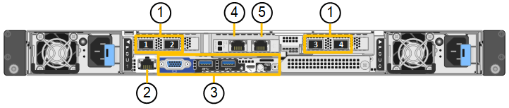

= SG6100设备：概述
:allow-uri-read: 
:icons: font
:imagesdir: ../media/

[role="lead"]
StorageGRID GF6112设备作为StorageGRID 系统中的存储节点运行。此设备可在混合网格环境中使用，该环境将设备存储节点与虚拟（基于软件的）存储节点相结合。

SGF6112设备提供以下功能：

* 12个NVMe (Non易 失性Memory Express、非易失性内存标准) SSD驱动器、具有集成计算和存储控制器。
* 集成 StorageGRID 存储节点的存储和计算要素。
* 包括 StorageGRID 设备安装程序，用于简化存储节点部署和配置。
* 包括一个底板管理控制器(BMC)、用于监控和诊断计算控制器中的硬件。
* 最多支持四个连接到 StorageGRID 网格网络和客户端网络的 10-GbE 或 25-GbE 连接。

== GF6112硬件问题描述

StorageGRID SGF6112是一款全闪存设备、设计紧凑、计算控制器和存储控制器集成到1U机箱中。此设备支持12个SSD NVMe驱动器、每个驱动器的存储容量高达15.3 TB。

=== 具有故障恢复能力的对象存储

SGF6112在RAID中采用SSD设计、可提供以下数据保护功能：

* 能够在单个SSD发生故障后正常运行、而不会影响对象可用性。
* 能够在发生多个SSD故障后正常运行、同时尽可能地降低对象可用性(取决于底层RAID方案的设计)。
* 在使用期间、可从SSD故障中完全恢复、但此故障不会对存放节点根卷的RAID (StorageGRID 操作系统)造成极端损坏。

== GF6112硬件组件

SGF6112设备包括以下组件：

计算和存储平台:: 单机架单元(1U)服务器、包括：
+
--
* 两个2.1/2.6 GHz 165 W处理器、提供48个核心
* 256 GB RAM
* 2×1/10 GBase-T端口
* 4×1025 GbE以太网端口
* 1×256 GB内置启动驱动器(包括StorageGRID 软件)
* 可简化硬件管理的基板管理控制器（ BMC ）
* 冗余电源和风扇

--

== GF6112图

=== GF6112正视图

此图显示了不带挡板的GF6112的正面。该设备包括一个1U计算和存储平台、其中包含12个SSD驱动器。

image::../media/sgf6112_front_with_ssds.png[GF6112正视图]

=== GF6112背面图

此图显示了SGF6112的背面、包括端口、风扇和电源。

[cols="1a,2a,2a,2a"]
|===
| Callout | Port | Type | 使用 ... 

 a| 
1.
 a| 
网络端口 1-4
 a| 
10/C5-GbE、具体取决于缆线或SFP收发器类型(支持SFP28和SFP+模块)、交换机速度和配置的链路速度。
 a| 
连接到网格网络和 StorageGRID 客户端网络。

 a| 
2.
 a| 
BMC 管理端口
 a| 
1-GbE （ RJ-45 ）
 a| 
连接到设备基板管理控制器。

 a| 
3.
 a| 
诊断和支持端口
 a| 
* VGA
* USB
* 微型USB控制台端口
* 微型SD插槽模块

 a| 
保留供技术支持使用。

 a| 
4.
 a| 
管理网络端口 1
 a| 
1/10 GbE (RJ-45)
 a| 
将设备连接到 StorageGRID 的管理网络。

 a| 
5.
 a| 
管理网络端口 2
 a| 
1/10 GbE (RJ-45)
 a| 
选项：

* 与管理网络端口1绑定、以冗余连接到StorageGRID 的管理网络。
* 保持断开连接并可用于临时本地访问（ IP 169.254.0.1 ）。
* 在安装期间、如果DHCP分配的IP地址不可用、请使用端口2进行IP配置。

|===