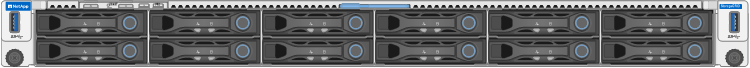
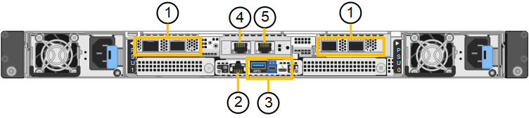
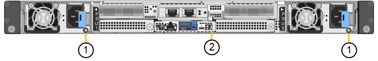
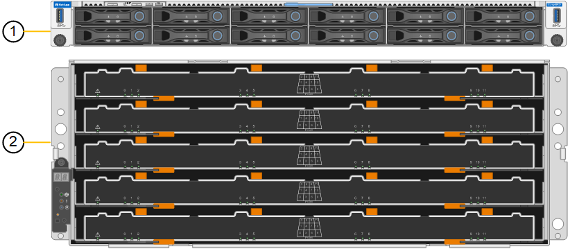
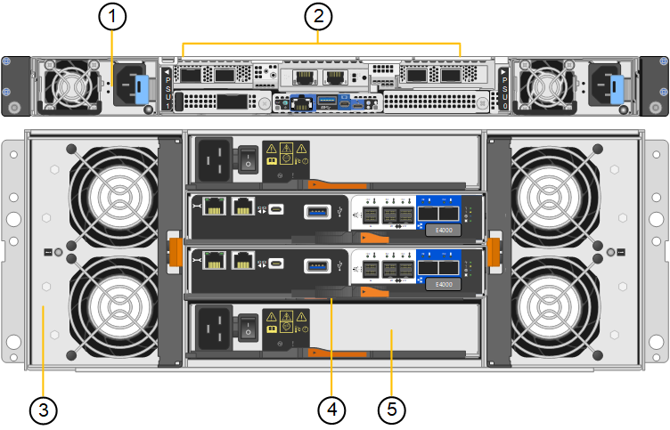
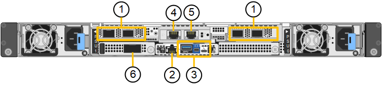
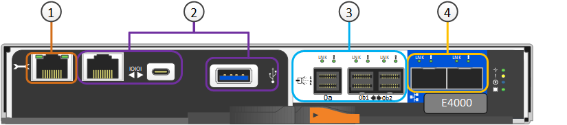
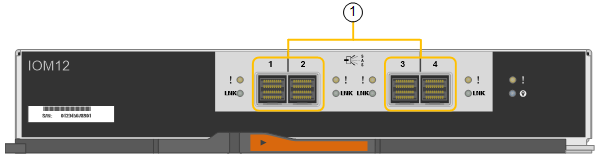

= StorageGRID SG6200 设备
:allow-uri-read: 
:icons: font
:imagesdir: ../media/

[role="lead"]
StorageGRID SG6200 系列设备作为 StorageGRID 系统中的存储节点运行。与所有 StorageGRID 设备一样，它们可以在单个部署中与其他设备型号和仅限软件的节点自由混合。

StorageGRID SG6260 设备包括一个计算控制器，其中一对 NVMe SSD 用作读缓存，以及一个包含两个存储控制器和 60 个 NL-SAS 硬盘驱动器的存储控制器架。通过增加多达两个可选的扩展架，它可以扩展到多达 180 个 NL-SAS 硬盘驱动器。StorageGRID SGF6212 设备是一款全闪存设备，具有紧凑的 1U 外形规格，内置 12 个 NVMe SSD。

[[appliance-features]]
== 设备功能

[[general-features]]
=== 常规功能

SGF6212 和 SG6260 设备具有以下特点：

* 集成 StorageGRID 存储节点的存储和计算要素。
* 包括 StorageGRID 设备安装程序，用于简化存储节点部署和配置。
* 包括一个底板管理控制器(BMC)、用于监控和诊断计算控制器中的硬件。

[[data-protection-features]]
=== 数据保护功能

SGF6212 具有以下数据保护功能：

* 能够在单个SSD发生故障后正常运行、而不会影响对象可用性。
* 能够在发生多个SSD故障后正常运行、同时尽可能地降低对象可用性(取决于底层RAID方案的设计)。
+

NOTE: 根据您配置的ILM策略、对本地不可用对象的请求可以由其他节点处理、因此、可用性通常不会降低。

* 在使用期间、可从SSD故障中完全恢复、但此故障不会对存放节点根卷的RAID (StorageGRID 操作系统)造成极端损坏。
* 如果多个SSD故障导致本地数据丢失、则可以从其他节点上的副本或删除编码块自动还原对象数据。
* 能够作为 https://docs.netapp.com/us-en/storagegrid/admin/managing-load-balancing.html["具有缓存的网关节点"^]。

SG6260 具有以下数据保护功能：

* 能够在任意两个硬盘驱动器(HDD)发生故障后正常工作、而不会影响对象可用性。
* 在发生故障和更换事件期间快速清空和重建HDD (如果在安装期间配置了DDP或DDP16)、从而提高了与标准RAID6相比的数据持久性。
* 在服务期间、可从任意两个HDD故障中完全恢复。
* 如果多个HDD故障导致本地数据丢失、则可以从其他节点上的副本或删除编码块自动还原对象数据。

[[sg6200-hardware-components]]
== SG6200 硬件组件

[[sgf6212-appliance]]
=== SGF6212 设备

SGF6212 设备包括以下组件：

计算和存储平台:: 单机架单元(1U)服务器、包括：
+
--
* 一个 AMD 3.55 GHz 处理器，提供 32 核（64 线程）
* 256 GB RAM
* 256 GB 内部启动驱动器（包括 StorageGRID 软件）
* 2×1/10 GBase-T端口
* 4 个 10/25/40/100GbE 以太网端口，用于 Grid/Client 网络流量（或 4 个 200GbE，可选 200 GbE NIC）
* 12 个 NVMe SSD 用于数据存储
* 可简化硬件管理的基板管理控制器（ BMC ）
* 冗余电源和风扇

--

[[sg6260-appliance]]
=== SG6260 设备

SG6260 设备包含以下组件：

计算控制器:: SG6200-CN 控制器是一款单机架单元（1U）服务器，包括：
+
--
* 一个 AMD 3.55 GHz 处理器，提供 32 核（64 线程）
* 256 GB RAM
* 256 GB 内部启动驱动器（包括 StorageGRID 软件）
* 2×1/10 GBase-T端口
* 4 个 10/25/40/100GbE 以太网端口，用于 Grid/Client 网络流量（或 4 个 200GbE，可选 200 GbE NIC）
* 1 个 100 GbE 存储互连端口
* 两个NVMe SSD用于读取缓存
* 可简化硬件管理的基板管理控制器（ BMC ）
* 冗余电源和风扇

--
存储控制器架:: E系列E4000控制器架(存储阵列)是一个4U磁盘架、包括：
+
--
* 两个E4000系列控制器(双工配置)、用于提供存储控制器故障转移支持
* 五抽屉驱动器架、可容纳60个3.5英寸NL) SAS驱动器
* 冗余电源和风扇

--
可选：存储扩展架:: 每个 SG6260 设备可以有一个或两个扩展架，共计 180 个驱动器。扩展架可以在初始部署期间安装或稍后添加。
+
--
E系列DE460C机箱是一个4U磁盘架、其中包括：

* 两个输入 / 输出模块（ IOM ）
* 五个抽盒，每个抽盒容纳 12 个 NL-SAS 驱动器，总共 60 个驱动器
* 冗余电源和风扇

--

[[sgf6212-and-sg6260-diagrams]]
== SGF6212 和 SG6260 示意图

[[sgf6212-front-view]]
=== SGF6212 正视图

此图显示了 SGF6212 的正面（不带挡板）。该设备包括一个包含 12 个 SSD 驱动器的 1U 计算和存储平台。

[[sgf6212-rear-view]]
=== SGF6212 后视图

此图显示了 SGF6212 的背面，包括端口、风扇和电源。

[cols="1a,2a,2a,2a"]
|===
| Callout | Port | Type | 使用 ... 

 a| 
1.
 a| 
网络端口 1-4
 a| 
10/25/40/100/200-GbE，基于电缆或收发器类型、交换机速度和配置的链路速度。

本机支持 QSFP56（最大 200GbE/端口）、QSFP28（最大 100GbE/端口）和 QSFP+（40GbE）（200GbE 速度需要 200GbE NIC 选项）。可选的 SFP+（10GbE）或 SFP28（25GbE）收发器可以与 QSA（单独出售）一起使用。
 a| 
连接到网格网络和 StorageGRID 客户端网络。

 a| 
2.
 a| 
BMC 管理端口
 a| 
1-GbE （ RJ-45 ）
 a| 
连接到设备基板管理控制器。

 a| 
3.
 a| 
诊断和支持端口
 a| 
* Mini DisplayPort 接口
* USB 3.0 端口
* 微型USB控制台端口

 a| 
保留供技术支持使用。

 a| 
4.
 a| 
管理网络端口 1
 a| 
1/10 GbE (RJ-45)
 a| 
将设备连接到 StorageGRID 的管理网络。

 a| 
5.
 a| 
管理网络端口 2
 a| 
1/10 GbE (RJ-45)
 a| 
选项：

* 与管理网络端口1绑定、以冗余连接到StorageGRID 的管理网络。
* 保持断开连接并可用于临时本地访问（ IP 169.254.0.1 ）。
* 在安装期间、如果DHCP分配的IP地址不可用、请使用端口2进行IP配置。

|===
此图显示了电源的位置，并标识了 SGF6212 背面的 LED。其他状态和活动指示灯位于设备端口上。这些 LED 可能因设备型号而异。

[cols="1a,2a,3a"]
|===
| Callout | LED | State 

 a| 
1.
 a| 
电源指示灯
 a| 
* 绿色、稳定亮起：设备已通电、电源按钮已打开。
* 绿色、闪烁：设备已通电、电源按钮已关闭。
* 熄灭：设备未通电。
* 琥珀色：电源故障。

 a| 
2.
 a| 
识别LED
 a| 
* 蓝色，闪烁：表示机柜或机架中的设备。
* 蓝色，实心：表示机柜或机架中的设备。
* 关闭：设备在机柜或机架中无法在视觉上识别。

|===

[[sg6260-front-view]]
=== SG6260 前视图

此图显示了 SG6260 的正面，其中包括一个 1U 计算控制器和一个 4U 机架，该机架包含两个存储控制器和五个驱动器抽屉中的 60 个驱动器。

[cols="1a,2a"]
|===
| Callout | Description 

 a| 
1.
 a| 
卸下前挡板的 SG6200-CN 计算控制器

 a| 
2.
 a| 
已卸下前挡板的E4000控制器架(可选扩展架看起来相同)

|===

[[sg6260-rear-view]]
=== SG6260 后视图

此图显示了 SG6260 的背面，包括计算和存储控制器、风扇和电源。

[cols="1a,2a"]
|===
| Callout | Description 

 a| 
1.
 a| 
用于 SG6200-CN 计算控制器的电源（1/2）

 a| 
2.
 a| 
SG6200-CN 计算控制器的连接器

 a| 
3.
 a| 
E4000控制器架的风扇(图1)

 a| 
4.
 a| 
E系列E4000存储控制器（1/2）和连接器

 a| 
5.
 a| 
E4000控制器架的电源(图1)

|===

[[sg6200-controllers]]
== SG6200 控制器

[[sg6200-cn-compute-controller]]
=== SG6200-CN 计算控制器

* 为设备提供计算资源。
* 包括 StorageGRID 设备安装程序。
+

NOTE: 设备上未预安装 StorageGRID 软件。部署设备时，系统会从管理节点检索此软件。

* 可以连接到所有三个 StorageGRID 网络，包括网格网络，管理网络和客户端网络。
* 连接到 E 系列存储控制器并作为启动程序运行。

此图显示了 SG6200-CN 计算控制器背面的端口。

[cols="1a,2a,2a,3a"]
|===
| Callout | Port | Type | 使用 ... 

 a| 
1.
 a| 
网络端口 1-4
 a| 
10/25/40/100/200-GbE，基于电缆或收发器类型、交换机速度和配置的链路速度。本机支持 QSFP56（最大 200GbE/端口）、QSFP28（最大 100GbE/端口）和 QSFP+（40GbE）（200GbE 速度需要 200GbE NIC 选项）。可选的 SFP+（10GbE）或 SFP28（25GbE）收发器可以与 QSA（单独出售）一起使用。
 a| 
连接到网格网络和 StorageGRID 客户端网络。

 a| 
2.
 a| 
BMC 管理端口
 a| 
1-GbE （ RJ-45 ）
 a| 
连接到 SG6200-CN 基板管理控制器。

 a| 
3.
 a| 
诊断和支持端口
 a| 
* Mini DisplayPort 接口
* USB 3.0 端口
* 微型USB控制台端口

 a| 
保留供技术支持使用。

 a| 
4.
 a| 
管理网络端口 1
 a| 
1/10 GbE (RJ-45)
 a| 
将 SG6200-CN 连接到 StorageGRID 的管理网络。

 a| 
5.
 a| 
管理网络端口 2
 a| 
1/10 GbE (RJ-45)
 a| 
选项：

* 与管理端口 1 绑定，以便与 StorageGRID 的管理网络建立冗余连接。
* 保持未连接状态，并可用于临时本地访问（ IP 169.254.0.1 ）。
* 在安装期间、如果DHCP分配的IP地址不可用、请使用端口2进行IP配置。

 a| 
6.
 a| 
互连端口
 a| 
100 GbE
 a| 
将 SG6200-CN 控制器连接到 E4000 控制器。

|===
此图显示了 SG6200-CN 计算控制器背面的电源和识别 LED 的位置。其他状态和活动 LED 位于设备端口上。这些 LED 可能因设备型号而异。

[cols="1a,2a,3a"]
|===
| Callout | LED | State 

 a| 
1.
 a| 
电源指示灯
 a| 
* 绿色、稳定亮起：设备已通电、电源按钮已打开。
* 绿色、闪烁：设备已通电、电源按钮已关闭。
* 熄灭：设备未通电。
* 琥珀色：电源故障。

 a| 
2.
 a| 
识别LED
 a| 
* 蓝色，闪烁：表示机柜或机架中的设备。
* 蓝色，实心：表示机柜或机架中的设备。
* 关闭：设备在机柜或机架中无法在视觉上识别。

|===

[[sg6260-e4000-storage-controller]]
=== SG6260：E4000 存储控制器

* 两个控制器，用于提供故障转移支持。
* 管理驱动器上的数据存储。
* 在双工配置中用作标准 E 系列控制器。
* 包括 SANtricity 操作系统软件（控制器固件）。
* 包括用于监控存储硬件和管理警报的 SANtricity System Manager ， AutoSupport 功能和驱动器安全功能。
* 连接到 SG6200-CN 控制器，并提供对存储的访问权限。

[cols="1a,2a,2a,3a"]
|===
| Callout | Port | Type | 使用 ... 

 a| 
1.
 a| 
管理端口 1
 a| 
1 Gb （ RJ-45 ）以太网
 a| 
* 端口 1 选项：
+
** 连接到管理网络以启用对 SANtricity 系统管理器的直接 TCP/IP 访问
** 保持未连接状态以保存交换机端口和 IP 地址。  使用网格管理器或存储网格设备安装程序访问SANtricity System Manager。

*注意*：如果选择使端口1保持未接线状态，则某些可选的SANtricity功能(例如用于准确日志时间戳的NTP同步)将不可用。

 a| 
2.
 a| 
诊断和支持端口
 a| 
* RJ-45 串行端口
* 微型 USB 串行端口
* USB 端口

 a| 
保留供技术支持使用。

 a| 
3.
 a| 
驱动器扩展端口 1 和 2
 a| 
12 Gb/ 秒 SAS
 a| 
将端口连接到扩展架中 IOM 上的驱动器扩展端口。

 a| 
4.
 a| 
互连端口 1 和 2
 a| 
25GbE iSCSI
 a| 
将每个 E4000 控制器连接到 SG6200-CN 控制器。

SG6200-CN 控制器有四个连接（每个 E4000 两个）。

|===

[[sg6260-ioms-for-optional-expansion-shelves]]
=== SG6260：可选扩展架的 IOM

扩展架包含两个输入 / 输出模块（ IOM ），这些模块连接到存储控制器或其他扩展架。

==== IOM连接器

[cols="1a,2a,2a,3a"]
|===
| Callout | Port | Type | 使用 ... 

 a| 
1.
 a| 
驱动器扩展端口 1-4
 a| 
12 Gb/ 秒 SAS
 a| 
将每个端口连接到存储控制器或其他扩展架（如果有）。

|===