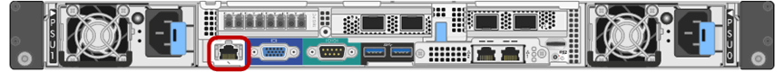

= 设置 BMC 管理端口的 IP 地址
:allow-uri-read: 
:icons: font
:imagesdir: ../media/

[role="lead"]
在访问BMC界面之前、请先配置SGF6112、SG6000-CN控制器或服务设备上BMC管理端口的IP地址。

如果使用ConfigBuilder生成JSON文件、则可以自动配置IP地址。请参见 link:automating-appliance-installation-and-configuration.html["自动安装和配置设备"]。

.开始之前
* 管理客户端正在使用 https://docs.netapp.com/us-en/storagegrid-118/admin/web-browser-requirements.html["支持的 Web 浏览器"^]。
* 您正在使用可连接到 StorageGRID 网络的任何管理客户端。
* BMC 管理端口将连接到您计划使用的管理网络。
+
[role="tabbed-block"]
====
.SG100
--
image::../media/sg100_bmc_management_port.png[SG100 BMC 管理端口]

--
.SG1000
--
image::../media/sg1000_bmc_management_port.png[SG1000 BMC 管理端口]

--
.SG6000
--

--
.SG6100
--
image::../media/sgf6112_cn_bmc_management_port.png[BMC管理端口GF6112]

--
====

.关于此任务
出于支持目的， BMC 管理端口允许进行低级硬件访问。

NOTE: 您只能将此端口连接到安全，可信的内部管理网络。如果没有此类网络可用，请保持 BMC 端口未连接或被阻止，除非技术支持请求 BMC 连接。

.步骤
. 在客户端中、输入StorageGRID 设备安装程序的URL：+
`*https://_Appliance_IP_:8443*`
+
适用于 `Appliance_IP`下、使用任何StorageGRID 网络上设备的IP地址。

+
此时将显示 StorageGRID 设备安装程序主页页面。

. 选择 * 配置硬件 * > * BMC 配置 * 。
+
image::../media/bmc_configuration_page.gif[显示 " 高级 ">"BMC 配置 " 选项的屏幕截图]

+
此时将显示 Baseboard Management Controller Configuration 页面。

. 记下自动显示的 IPv4 地址。
+
DHCP 是为该端口分配 IP 地址的默认方法。

+

NOTE: 显示 DHCP 值可能需要几分钟的时间。

+
image::../media/bmc_configuration_dhcp_address.gif[显示 DHCP 地址的 " 底层管理控制器配置 " 页面]

. 也可以为 BMC 管理端口设置静态 IP 地址。
+

NOTE: 您应该为 BMC 管理端口分配静态 IP ，或者为 DHCP 服务器上的地址分配永久租约。

+
.. 选择 * 静态 * 。
.. 使用 CIDR 表示法输入 IPv4 地址。
.. 输入默认网关。
+
image::../media/bmc_configuration_static_ip.gif[Baseboard Management Controller Configuration Static 选项]

.. 单击 * 保存 * 。
+
应用所做的更改可能需要几分钟的时间。

