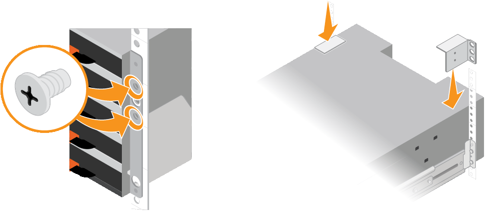

= 安装包含60个驱动器的磁盘架(SG6060)
:allow-uri-read: 
:icons: font
:imagesdir: ../media/

[role="lead"]
您可以在机柜或机架中为E2860控制器架安装一组导轨、然后将控制器架滑入导轨上。如果您要安装 60 个驱动器扩展架，则需要使用相同的操作步骤 。

.开始之前
* 您已查看包装盒中的安全通知文档，并了解移动和安装硬件的预防措施。
* 导轨套件随附了相关说明。

CAUTION: 每个 60 个驱动器架的重量约为 132 磅（ 60 千克），而未安装驱动器。要安全移动磁盘架，需要四个人或一台机械升降机。

CAUTION: 为避免损坏硬件，如果安装了驱动器，请勿移动磁盘架。移动磁盘架之前，必须先卸下所有驱动器。

CAUTION: 安装 E2860 控制器架或可选扩展架时，请从机架或机柜的底部到顶部安装硬件，以防止设备发生倾翻。要确保最重的设备位于机柜或机架的底部，请在 E2860 控制器架和扩展架上方安装 SG6000-CN 控制器。

NOTE: 在提交安装之前，请确认设备随附的 0.5 米光缆或您提供的缆线长度足以满足计划的布局要求。

.步骤
. 请仔细按照导轨套件的说明在机柜或机架中安装导轨。
+
对于方孔机柜、请首先安装提供的固定框架螺母、以便使用螺钉固定磁盘架的前部和后部。

. 卸下设备的外包装箱。然后，向下折叠内箱上的挡板。
. 如果您要用手提设备，请将四个手柄连接到机箱两侧。
+
向上推每个手柄，直到其卡入到位。

+
image::../media/lift_handles.gif[提升把手]

. 将磁盘架的背面（带有连接器的一端）放在导轨上。
. 从底部支撑好磁盘架，将其滑入机柜。如果使用的是手柄，请在滑入磁盘架时使用拇指闩锁一次分离一个手柄。
+
要卸下手柄，请向后拉释放闩锁，向下推，然后从磁盘架中拉出。

. 将磁盘架固定到机柜正面。
+
将螺钉插入两侧磁盘架顶部的第一个和第三个孔中。

. 将磁盘架固定到机柜后部。
+
将两个后支架放在磁盘架后上部分的每一侧。将螺钉插入每个支架的第一个和第三个孔中。

+

. 对任何扩展架重复上述步骤。

