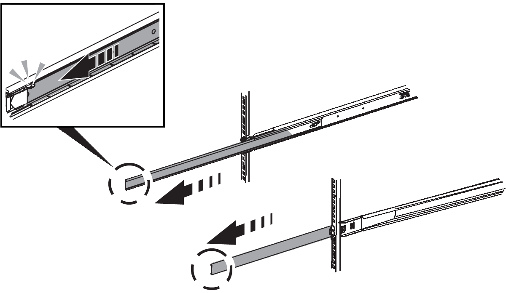
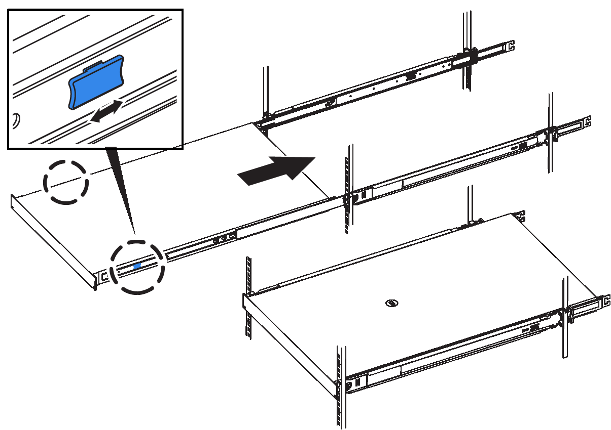
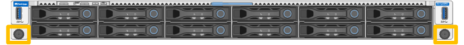

= 为 SG6260 安装 SG6200-CN 控制器
:allow-uri-read: 
:icons: font
:imagesdir: ../media/

[role="lead"]
在机柜或机架中为 SG6200-CN 控制器安装一组滑轨，然后将控制器滑到滑轨上。

.开始之前
* 您已查看 https://library.netapp.com/ecm/ecm_download_file/ECMP12475945["安全通知"^] 将文档记录在包装盒中、了解移动和安装硬件的预防措施。
* 导轨套件随附了相关说明。
* 您已安装E4000控制器架和驱动器。

.步骤
. 请仔细按照导轨套件的说明在机柜或机架中安装导轨。
. 在机柜或机架中安装的两个导轨上，展开导轨的可移动部分，直到听到卡嗒声为止。
+

. 将 SG6200-CN 控制器插入导轨。
. 将控制器滑入机柜或机架。
+
如果无法再移动控制器、请拉动机箱两侧的蓝色闩锁、将控制器完全滑入。

+

+

NOTE: 在打开控制器电源之前、请勿连接前挡板。

. 拧紧控制器前面板上的固定螺钉，将控制器固定在机架中。
+

