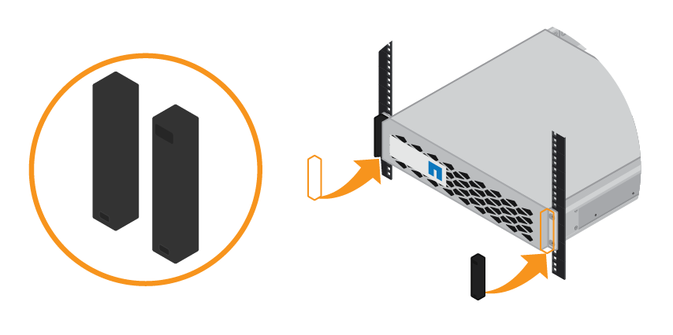

= 安装包含24个驱动器的磁盘架(GF6024)
:allow-uri-read: 
:icons: font
:imagesdir: ../media/

[role="lead"]
您可以在机柜或机架中为EF570控制器架安装一组导轨、然后将阵列滑入导轨上。

.开始之前
* 您已查看 https://library.netapp.com/ecm/ecm_download_file/ECMP12475945["安全通知"^] 将文档记录在包装盒中、了解移动和安装硬件的预防措施。
* 导轨套件随附了相关说明。

.步骤
. 请仔细按照导轨套件的说明在机柜或机架中安装导轨。
+
对于方孔机柜、请首先安装提供的固定框架螺母、以便使用螺钉固定磁盘架的前部和后部。

. 卸下设备的外包装箱。然后，向下折叠内箱上的挡板。
. 将磁盘架的背面（带有连接器的一端）放在导轨上。
+

CAUTION: 满载的磁盘架重约 52 磅（ 24 千克）。需要两个人才能安全地移动机箱。

. 小心地将机箱完全滑入导轨上。
+

CAUTION: 您可能需要调整导轨，以确保机箱一直滑入导轨。

+

CAUTION: 完成机箱安装后、请勿在导轨上放置其他设备。导轨不能承受额外的重量。

+

NOTE: 如果适用，您可能需要卸下磁盘架端盖或系统挡板，以将机箱固定到机架柱上；如果需要，则需要在完成操作后更换端盖或挡板。

. 通过安装支架（预装在机箱正面的任意一侧），机架或系统机柜上的孔以及导轨正面的孔插入两个 M5 螺钉，将机箱固定到机箱或机架和导轨的正面。
+
image::../media/secure_shelf.png[将磁盘架固定到机柜前部]

. 通过将两个 M5 螺钉插入机箱支架和导轨套件支架，将机箱固定到导轨背面。
. 如果适用，请更换磁盘架端盖或系统挡板。
+

