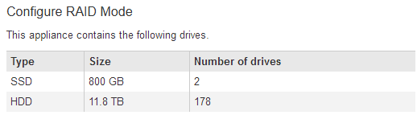

= 排除硬件安装故障(SG5700或SG6000)
:allow-uri-read: 
:icons: font
:imagesdir: ../media/

[role="lead"]
如果您在安装期间遇到问题，查看与硬件设置和连接问题相关的故障排除信息可能会很有帮助。

== 查看启动代码(SG6000-CN控制器)

在为设备接通电源时， BMC 会为 SG6000-CN 控制器记录一系列启动代码。您可以通过多种方式查看这些代码。

.开始之前
* 您知道如何操作 link:accessing-bmc-interface.html["访问BMC信息板"]。
* 如果您要使用 LAN 上串行（ Serial Over LAN ，故障转移），则具有使用 IPMI 故障转移控制台应用程序的经验。

.步骤
. 选择以下方法之一以查看设备控制器的启动代码，并收集所需的设备。
+
[cols="1a,2a"]
|===
| 方法 | 所需设备 

 a| 
VGA 控制台
 a| 
** 支持 VGA 的显示器
** VGA 缆线

 a| 
KVM
 a| 
** RJ-45 缆线

 a| 
串行端口
 a| 
** DB-9 串行缆线
** 虚拟串行终端

 a| 
解决
 a| 
** 虚拟串行终端

|===
. 如果您使用的是 VGA 控制台，请执行以下步骤：
+
.. 将支持 VGA 的显示器连接到设备背面的 VGA 端口。
.. 查看监控器上显示的代码。

. 如果您使用的是 BMC KVM ，请执行以下步骤：
+
.. 连接到BMC管理端口并登录到BMC Web界面。
.. 选择 * 远程控制 * 。
.. 启动 KVM 。
.. 在虚拟监控器上查看代码。

. 如果您使用的是串行端口和终端，请执行以下步骤：
+
.. 连接到设备背面的 DB-9 串行端口。
.. 使用设置 `115200 8-N-1`。
.. 查看通过串行终端打印的代码。

. 如果您使用的是 SOL ，请执行以下步骤：
+
.. 使用 BMC IP 地址和登录凭据连接到 IPMI SOL 。
+
`ipmitool -I lanplus -H _BMC_Port_IP_ -U root -P _Password_ sol activate`

.. 查看虚拟串行终端上的代码。

. 使用下表查找您的设备的代码。
+
[cols="1a,3a"]
|===
| 代码 | 表示 

 a| 
您好
 a| 
主启动脚本已启动。

 a| 
HP
 a| 
系统正在检查是否需要更新网络接口卡（ Network Interface Card ， NIC ）固件。

 a| 
RB
 a| 
应用固件更新后，系统正在重新启动。

 a| 
FP
 a| 
硬件子系统固件更新检查已完成。控制器间通信服务正在启动。

 a| 
他
 a| 
仅适用于设备存储节点：

系统正在等待与存储控制器建立连接并与 SANtricity 操作系统同步。

* 注： * 如果启动操作步骤 在此阶段未进展，请执行以下步骤：

.. 确认 SG6000-CN 控制器与两个存储控制器之间的四根互连缆线已牢固连接。
.. 根据需要更换一根或多根缆线，然后重试。
.. 如果无法解决问题描述 问题，请联系技术支持。

 a| 
HC
 a| 
系统正在检查现有 StorageGRID 安装数据。

 a| 
好的
 a| 
StorageGRID 设备安装程序正在运行。

 a| 
HA
 a| 
StorageGRID 正在运行。

|===

== 查看错误代码(SG6000-CN控制器)

如果在 SG6000-CN 控制器启动时发生硬件错误，则 BMC 会记录一个错误代码。您可以根据需要使用 BMC 界面查看这些错误代码，然后与技术支持联系以解决此问题描述 。

.开始之前
* 您知道如何操作 link:accessing-bmc-interface.html["访问BMC信息板"]。

.步骤
. 从 BMC 信息板中，选择 * BIOS POST Code* 。
. 查看为当前代码和先前代码显示的信息。
+
如果显示以下任一错误代码，请与技术支持联系以解决此问题描述 。

+
[cols="1a,3a"]
|===
| 代码 | 表示 

 a| 
0x0E
 a| 
未找到微代码

 a| 
0x0F
 a| 
未加载微代码

 a| 
0x50
 a| 
内存初始化错误。内存类型无效或内存速度不兼容。

 a| 
0x51
 a| 
内存初始化错误。SPD 读取失败。

 a| 
0x52
 a| 
内存初始化错误。内存大小无效或内存模块不匹配。

 a| 
0x53
 a| 
内存初始化错误。未检测到可用内存。

 a| 
0x54
 a| 
未指定的内存初始化错误

 a| 
0x55
 a| 
未安装内存

 a| 
0x56
 a| 
CPU 类型或速度无效

 a| 
0x57
 a| 
CPU 不匹配

 a| 
0x58
 a| 
CPU 自检失败或可能出现 CPU 缓存错误

 a| 
0x59
 a| 
未找到 CPU 微代码或微代码更新失败

 a| 
0x5A
 a| 
内部 CPU 错误

 a| 
0x5B
 a| 
重置 PPI 不可用

 a| 
0x5C
 a| 
PEI 阶段 BMC 自检失败

 a| 
0xD0
 a| 
CPU 初始化错误

 a| 
0xD1
 a| 
北网桥初始化错误

 a| 
0xD2
 a| 
南桥初始化错误

 a| 
0xD3
 a| 
某些架构协议不可用

 a| 
0xd4
 a| 
PCI 资源分配错误。资源不足。

 a| 
0xD5
 a| 
原有选项 ROM 没有空间

 a| 
0xD6
 a| 
未找到控制台输出设备

 a| 
0xD7
 a| 
未找到控制台输入设备

 a| 
0xD8
 a| 
密码无效

 a| 
0xD9
 a| 
加载启动选项时出错（ LoadImage 返回错误）

 a| 
0xDA
 a| 
启动选项失败（ StartImage 返回错误）

 a| 
0xDB
 a| 
闪存更新失败

 a| 
0xDC
 a| 
重置协议不可用

 a| 
0xDD
 a| 
Dxe 阶段 BMC 自检失败

 a| 
0xE8
 a| 
MRC ： err_no_memory

 a| 
0xE9
 a| 
MRC ： err_lt_lock

 a| 
0xEA
 a| 
MRC ： err_DDR_init

 a| 
0xEB
 a| 
MRC ： ERR_MEM_TEST

 a| 
0xEC
 a| 
MRC ： err_vendor_specific

 a| 
0xED
 a| 
MRC ： ERR_DIMM_COMPAT

 a| 
0xEE
 a| 
MRC ： err_MRC_compatibility

 a| 
0xEF
 a| 
MRC ： err_MRC_struct

 a| 
0xF0
 a| 
MRC ： ERR_SET_VDD

 a| 
0xF1
 a| 
MRC ： ERR_IOT_MEM_buffer

 a| 
0xF2
 a| 
MRC ： err_rc_internal

 a| 
0xF
 a| 
MRC ： err_invalid_REG_access

 a| 
0xf4
 a| 
MRC ： ERR_SET_MC_FRQ

 a| 
0xf5
 a| 
MRC ： err_read_mc_fREQ

 a| 
0x70
 a| 
MRC ： err_DIMM_channel

 a| 
0x74
 a| 
MRC ： err_smix_check

 a| 
0xf6
 a| 
MRC ： err_SMBUS

 a| 
0xF7
 a| 
MRC ： ERR_PCU

 a| 
0xf8.
 a| 
MRC ： err_NGN

 a| 
0xf9
 a| 
MRC ： err_interlef_failure

|===

== 硬件设置似乎挂起(SG6000或SG5700)

如果硬件故障或布线错误导致存储控制器或设备控制器无法完成启动处理、则StorageGRID 设备安装程序可能不可用。

.步骤
[role="tabbed-block"]
====
.SG5700
--
. link:viewing-status-indicators.html["观看SG5700七段显示屏上的代码。"]
+
在启动期间初始化硬件时，两个七段显示一系列代码。硬件成功启动后，七段显示会为每个控制器显示不同的代码。

. 查看 E5700SG 控制器的七段显示屏上的代码。
+

NOTE: 安装和配置需要一些时间。某些安装阶段在几分钟内不会向StorageGRID 设备安装程序报告更新。

+
如果发生错误，七段显示屏将按顺序闪烁，例如， "he" 。

. 要了解这些代码的含义，请参见以下资源：
+
[cols="1a,2a"]
|===
| 控制器 | 参考 

 a| 
E5700SG 控制器
 a| 
** " `s5700SG 控制器上的状态指示符` "
** "`错误：与 SANtricity OS 软件同步时出错` "

 a| 
E2800 控制器
 a| 
https://library.netapp.com/ecmdocs/ECMLP2588751/html/frameset.html["_E5700 和 E2800 系统监控指南 _"^]

*注：* E系列E5700控制器所述代码不适用于设备中的E5700SG控制器。

|===
. 如果无法解决问题描述 问题，请联系技术支持。

--
.SG6000
--
. 对于存储控制器，请查看七段显示器上的代码。
+
在启动期间初始化硬件时，两个七段显示一系列代码。硬件成功启动后、这两个七段显示show `99`。

. 查看 SG6000-CN 控制器上的 LED 以及 BMC 中显示的启动和错误代码。
. 如果您需要有关解决问题描述 的帮助，请联系技术支持。

--
====

== 连接问题(SG5700或SG6000)

如果您在 StorageGRID 设备安装期间遇到连接问题，应执行列出的更正操作步骤。

=== 无法连接到SG6000设备

如果无法连接到设备、则可能存在网络问题描述 、或者硬件安装可能未成功完成。

.步骤
. 如果无法连接到 SANtricity 系统管理器：
+
.. 尝试使用管理网络上任一存储控制器的IP地址对SANtricity System Manager执行ping操作：+
`*ping _Storage_Controller_IP_*`
.. 如果 ping 未收到任何响应，请确认您使用的 IP 地址正确无误。
+
使用任一存储控制器上的管理端口 1 的 IP 地址。

.. 如果 IP 地址正确，请检查设备布线和网络设置。
+
如果无法解决问题描述 问题，请联系技术支持。

.. 如果 ping 成功，请打开 Web 浏览器。
.. 输入SANtricity 系统管理器的URL：+
`*https://_Storage_Controller_IP_*`
+
此时将显示 SANtricity 系统管理器的登录页面。

. 如果无法连接到 SG6000-CN 控制器：
+
.. 尝试使用SG6000-CN控制器的IP地址对设备执行ping操作：+
`*ping _SG6000-CN_Controller_IP_*`
.. 如果 ping 未收到任何响应，请确认您使用的 IP 地址正确无误。
+
您可以使用网格网络，管理网络或客户端网络上设备的 IP 地址。

.. 如果 IP 地址正确，请检查设备布线， SFP 收发器和网络设置。
.. 如果可以物理访问SG6000-CN、则可以直接连接到永久链路本地IP `169.254.0.1` 检查控制器网络配置并根据需要进行更新。有关详细说明，请参见中的步骤 2 link:accessing-storagegrid-appliance-installer.html["访问 StorageGRID 设备安装程序"]。
+
如果无法解决问题描述 问题，请联系技术支持。

.. 如果 ping 成功，请打开 Web 浏览器。
.. 输入StorageGRID 设备安装程序的URL：+
`*https://_SG6000-CN_Controller_IP_:8443*`
+
此时将显示主页页面。

=== SG6060扩展架未显示在设备安装程序中

如果您已为SG6060安装了扩展架、但它们未显示在StorageGRID 设备安装程序中、则应验证这些扩展架是否已完全安装并打开电源。

.关于此任务
您可以通过在 StorageGRID 设备安装程序中查看以下信息来验证扩展架是否已连接到设备：

* 主页 * 页面包含一条有关扩展架的消息。
+
image::../media/expansion_shelf_home_page_msg.png[扩展架消息]

* * 高级 * > * RAID 模式 * 页面可通过驱动器数量指示设备是否包含扩展架。例如，在以下屏幕截图中，显示了两个 SSD 和 178 个 HDD 。包含两个扩展架的 SG6060 总共包含 180 个驱动器。

如果StorageGRID 设备安装程序页面未指示存在扩展架、请遵循此操作步骤。

.步骤
. 确认所有所需的缆线均已牢固连接。请参见 link:cabling-appliance.html["电缆设备"]。
. 验证是否已打开扩展架的电源。请参见 link:connecting-power-cords-and-applying-power.html["连接电源线并接通电源（ SG6000 ）"]。
. 如果您需要有关解决问题描述 的帮助，请联系技术支持。

=== 无法连接到SG5700设备

如果无法连接到设备、则可能存在网络问题描述 、或者硬件安装可能未成功完成。

.步骤
. 如果无法连接到 SANtricity 系统管理器：
+
.. 尝试使用SANtricity System Manager管理网络上E2800控制器的IP地址对设备执行Ping操作：+
`*ping _E2800_Controller_IP_*`
.. 如果 ping 未收到任何响应，请确认您使用的 IP 地址正确无误。
+
使用 E2800 控制器上管理端口 1 的 IP 地址。

.. 如果 IP 地址正确，请检查设备布线和网络设置。
+
如果无法解决问题描述 问题，请联系技术支持。

.. 如果 ping 成功，请打开 Web 浏览器。
.. 输入SANtricity 系统管理器的URL：+
`*https://_E2800_Controller_IP_*`
+
此时将显示 SANtricity 系统管理器的登录页面。

. 如果无法连接到 E5700SG 控制器：
+
.. 尝试使用E5700SG控制器的IP地址对设备执行ping操作：+
`*ping _E5700SG_Controller_IP_*`
.. 如果 ping 未收到任何响应，请确认您使用的 IP 地址正确无误。
+
您可以使用网格网络，管理网络或客户端网络上设备的 IP 地址。

.. 如果 IP 地址正确，请检查设备布线， SFP 收发器和网络设置。
+
如果无法解决问题描述 问题，请联系技术支持。

.. 如果 ping 成功，请打开 Web 浏览器。
.. 输入StorageGRID 设备安装程序的URL：+
`*https://_E5700SG_Controller_IP_:8443*`
+
此时将显示主页页面。

== HE错误：与SANtricity OS软件同步时出错(SG5700)

如果StorageGRID 设备安装程序无法与SANtricity OS软件同步、计算控制器上的七段显示屏将显示HE错误代码。

.关于此任务
如果显示错误代码，请执行此更正操作。

.步骤
. 检查两根 SAS 互连缆线的完整性，并确认它们已牢固连接。
. 根据需要更换一根或两根缆线，然后重试。
. 如果无法解决问题描述 问题，请联系技术支持。

