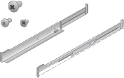

= 打开包装箱
:allow-uri-read: 
:icons: font
:imagesdir: ../media/

[role="lead"]
安装StorageGRID 设备之前，请打开所有包装箱的包装并将物品与装箱单上的物品进行比较。

[role="tabbed-block"]
====
.SG100和SG1000
--
* * 硬件 *
+
SG100或SG1000::
+
--
image::../media/sg6000_cn_front_without_bezel.gif[正面驱动器 SG 100 或 SG1000 服务设备]

--
带说明的导轨套件::
+
--

--

* *电源线*
+

TIP: 您的机柜可能使用专用电源线，而不是设备随附的电源线。

+
您所在国家/地区的两条电源线::
+
--
image::../media/power_cords.gif[电源线]

--

--
.SG5700
--
* * 硬件 *
+
安装了12个驱动器的SG5712设备::
+
--
image::../media/de212c_table_size.gif[SG5712 2U 设备]

--
SG5760设备、但未安装驱动器::
+
--
image::../media/de460c_table_size.gif[SG5760 4U 设备]

--
产品前挡板::
+
--
image::../media/sg5700_front_bezels.gif[SG5712 和 SG5760 的挡板]

--
带说明的导轨套件::
+
--

--
SG5760：60个驱动器::
+
--
image::../media/sg5760_drive.gif[驱动器]

--
SG5760：句柄::
+
--
image::../media/handles.gif[SG5760 句柄]

--
SG5760：用于方孔机架安装的后支架和固定螺帽::
+
--
image::../media/back_brackets_table_size.gif[SG5760 的背面支架和锁紧螺母]

--

* *电缆和连接器*
+

TIP: 您的机柜可能使用专用电源线，而不是设备随附的电源线。

+
您所在国家/地区的两条电源线::
+
--
image::../media/power_cords.gif[电源线]

--
光缆和SFP收发器::
+
--
image::../media/fc_cable_and_sfp.gif[光缆和 SFP]

** 用于 FC 互连端口的两根光缆
** 八个 SFP+ 收发器，与四个 16Gb/s FC 互连端口和四个 10-GbE 网络端口兼容

--

--
.SG6000
--
* *SG6060硬件*
+
SG6000-CN 控制器::
+
--
image::../media/sg6000_cn_front_without_bezel.gif[SG6000-CN 控制器]

--
E2860控制器架、未安装驱动器::
+
--
image::../media/de460c_table_size.gif[SG5760 4U 设备]

--
两个前挡板::
+
--
image::../media/sg6000_front_bezels_for_table.gif[前挡板]

--
两个导轨套件、带说明::
+
--

--
60个驱动器(2个SSD和58个NL)::
+
--
image::../media/sg5760_drive.gif[驱动器]

--
四个手柄::
+
--
image::../media/handles.gif[SG5760 句柄]

--
用于方孔机架安装的后支架和固定螺母::
+
--
image::../media/back_brackets_table_size.gif[SG5760 的背面支架和锁紧螺母]

--

* *SG6060扩展架*
+
扩展架未安装驱动器::
+
--
image::../media/de460c_table_size.gif[SG5760 4U 设备]

--
前挡板::
+
--
image::../media/front_bezel_for_table_de460c.gif[前挡板 DE460C]

--
60 个 NL-SAS 驱动器::
+
--
image::../media/sg5760_drive.gif[驱动器]

--
一个带说明的导轨套件::
+
--

--
四个手柄::
+
--
image::../media/handles.gif[SG5760 句柄]

--
用于方孔机架安装的后支架和固定螺母::
+
--
image::../media/back_brackets_table_size.gif[SG5760 的背面支架和锁紧螺母]

--

* *GF6024硬件*
+
SG6000-CN 控制器::
+
--
image::../media/sg6000_cn_front_without_bezel.gif[SG6000-CN 控制器]

--
安装了24个固态(闪存)驱动器的EF570闪存阵列::
+
--
image::../media/de224c_with_drives.gif[EF570 控制器架]

--
两个前挡板::
+
--
image::../media/sgf6024_front_bezels_for_table.png[SG6024 前挡板]

--
两个导轨套件、带说明::
+
--

--
磁盘架端盖::
+
--
image::../media/endcaps.png[端盖]

--

* *电缆和连接器*
+

TIP: 您的机柜可能使用专用电源线，而不是设备随附的电源线。

+
您所在国家/地区的四根电源线::
+
--
image::../media/power_cords.gif[电源线]

--
光缆和SFP收发器::
+
--
image::../media/fc_cable_and_sfp.gif[光缆和 SFP]

** 用于 FC 互连端口的四根光缆
** 四个 SFP+ 收发器，支持 16 Gb/ 秒 FC

--
可选：两根SAS缆线、用于连接每个SG6060扩展架::
+
--
image::../media/sas_cable.gif[SAS 缆线]

--

--
.SG6100
--
* * 硬件 *
+
GF6112::
+
--
image::../media/sgf6112_front_with_ssds.png[前端驱动器GF6112设备]

--
带说明的导轨套件::
+
--

--
前挡板::
+
--
image::../media/sgf_6112_front_bezel.png[前挡板]

--

* *电源线*
+

TIP: 您的机柜可能使用专用电源线，而不是设备随附的电源线。

+
您所在国家/地区的两条电源线::
+
--
image::../media/power_cords.gif[电源线]

--

--
====