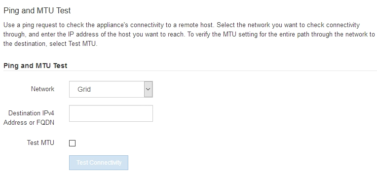

= 验证网络连接
:allow-uri-read: 
:icons: font
:imagesdir: ../media/

[role="lead"]
您应确认可以从设备访问所使用的 StorageGRID 网络。要验证通过网络网关的路由，您应测试 StorageGRID 设备安装程序与不同子网上的 IP 地址之间的连接。您还可以验证 MTU 设置。

.步骤
. 从 StorageGRID 设备安装程序的菜单栏中，单击 * 配置网络连接 * > * Ping 和 MTU 测试 * 。
+
此时将显示 Ping 和 MTU 测试页面。

+

. 从 * 网络 * 下拉框中，选择要测试的网络：网格，管理员或客户端。
. 输入该网络上某个主机的 IPv4 地址或完全限定域名（ FQDN ）。
+
例如，您可能需要对网络或主管理节点上的网关执行 ping 操作。

. (可选)选中*Test MTU*复选框，验证通过网络到目标的整个路径的MTU设置。
+
例如，您可以测试设备节点与其他站点的节点之间的路径。

. 单击 * 测试连接 * 。
+
如果网络连接有效，则会显示 "Ping test passed" 消息，并列出 ping 命令输出。

+
image::../media/ping_test_passed.png[StorageGRID设备安装程序中ping测试结果的屏幕截图]

.相关信息
* link:configuring-network-links.html["配置网络链路"]
* link:../commonhardware/changing-mtu-setting.html["更改 MTU 设置"]

