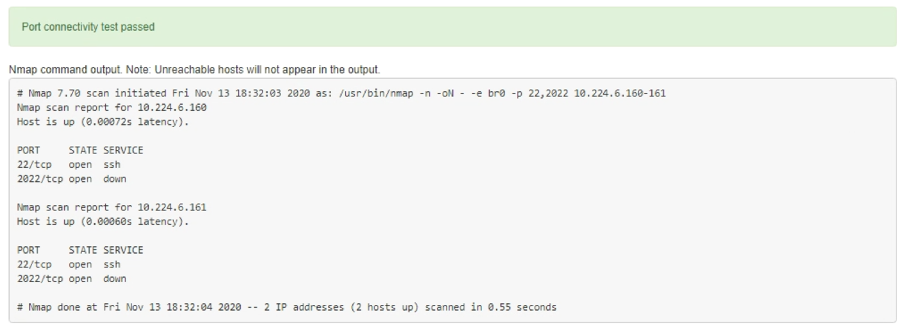

= 验证端口级别的网络连接
:allow-uri-read: 
:icons: font
:imagesdir: ../media/

[role="lead"]
要确保 StorageGRID 设备安装程序与其他节点之间的访问不会受到防火墙的阻碍，请确认 StorageGRID 设备安装程序可以连接到指定 IP 地址或地址范围内的特定 TCP 端口或端口集。

.关于此任务
使用 StorageGRID 设备安装程序中提供的端口列表，您可以测试设备与网格网络中其他节点之间的连接。

此外，您还可以在管理和客户端网络以及 UDP 端口上测试连接，例如用于外部 NFS 或 DNS 服务器的端口。有关这些端口的列表、请参见 https://docs.netapp.com/us-en/storagegrid-118/network/network-port-reference.html["网络端口参考"^]。

NOTE: 端口连接表中列出的网格网络端口仅适用于StorageGRID 11.7或更高版本。要验证每种节点类型的端口是否正确，您应始终参考适用于您的 StorageGRID 版本的网络连接准则。

.步骤
. 在 StorageGRID 设备安装程序中，单击 * 配置网络连接 * > * 端口连接测试（ nmap ） * 。
+
此时将显示端口连接测试页面。

+
端口连接表列出了网格网络上需要 TCP 连接的节点类型。对于每种节点类型，此表列出了设备应可访问的网格网络端口。

+
您可以测试表中列出的设备端口与网格网络中的其他节点之间的连接。

. 从 * 网络 * 下拉列表中，选择要测试的网络： * 网格 * ， * 管理 * 或 * 客户端 * 。
. 为该网络上的主机指定一个 IPv4 地址范围。
+
例如，您可能需要探测网络或主管理节点上的网关。

+
使用连字符指定一个范围，如示例所示。

. 输入 TCP 端口号，以逗号分隔的端口列表或端口范围。
+
image::../media/port_connectivity_test_start.png[端口连接测试]

. 单击 * 测试连接 * 。
+
** 如果选定的端口级别网络连接有效，则绿色横幅中会显示 "`Port connectivity test passed` " 消息。nmap 命令输出列在横幅下方。
+

** 如果与远程主机建立了端口级网络连接，但主机未侦听一个或多个选定端口，则黄色横幅中会显示 "`Port connectivity test failed` " 消息。nmap 命令输出列在横幅下方。
+
主机未侦听的任何远程端口的状态为 "`closed" 。` 例如，当您尝试连接的节点处于预安装状态且 StorageGRID NMS 服务尚未在该节点上运行时，您可能会看到此黄色横幅。

+
image::../media/nmap_test_yellow_banner.png[nmap 测试黄色横幅]

** 如果无法为一个或多个选定端口建立端口级网络连接、则红色横幅中会显示"`Port connection test failed`"消息。nmap 命令输出列在横幅下方。
+
红色横幅表示已尝试通过 TCP 连接到远程主机上的某个端口，但未向发送方返回任何内容。如果未返回任何响应，则此端口的状态为 " 已筛选 " ，并且可能会被防火墙阻止。

+

NOTE: 此外，还会列出带有 "`closed` " 的端口。

+
image::../media/nmap_test_red_banner.png[nmap 测试红色横幅]

