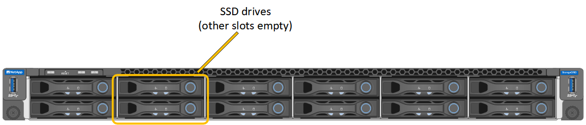
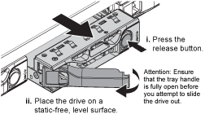
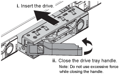

= 更换 SG100 或 SG1000 中的驱动器
:allow-uri-read: 
:icons: font
:imagesdir: ../media/

[role="lead"]
服务设备中的 SSD 包含 StorageGRID 操作系统。此外，如果将设备配置为管理节点，则 SSD 还包含审核日志，指标和数据库表。驱动器使用 RAID1 进行镜像以实现冗余。如果其中一个驱动器发生故障，您必须尽快更换它以确保冗余。

.开始之前
* 您已拥有 link:locating-controller-in-data-center.html["已物理定位设备"]。
* 您已通过注意到左侧 LED 呈琥珀色闪烁来验证哪个驱动器出现故障。
+
两个SSD将按下图所示放置在插槽中：

+

+

CAUTION: 如果您删除工作正常的驱动器，则会关闭设备节点。请参见有关查看状态指示器的信息以验证故障。

* 您已获得替代驱动器。
* 您已获得适当的 ESD 保护。

.步骤
. 验证要更换的驱动器的左侧指示灯是否呈琥珀色闪烁。如果在网格管理器或BMC用户界面中报告了驱动器问题描述、则会将硬盘驱动器02或硬盘驱动器2连接到上部插槽中、将硬盘驱动器03或硬盘驱动器3连接到下部插槽中的驱动器。
+
您还可以使用 Grid Manager 来监控 SSD 的状态。选择 *Nodes*。然后选择 `*Appliance Node*` > *Hardware*。如果驱动器出现故障，Storage RAID Mode 字段将包含有关哪个驱动器出现故障的消息。

. 将 ESD 腕带的腕带一端绕在腕带上，并将扣具一端固定到金属接地，以防止静电放电。
. 拆开备用驱动器的包装，并将其放在设备附近的无静电水平表面上。
+
节省所有包装材料。

. 按下故障驱动器上的释放按钮。
+

+
驱动器弹出器上的手柄部分打开，驱动器从插槽中释放。

. 打开手柄，滑出驱动器，然后将其放在无静电的水平表面上。
. 在将替代驱动器插入驱动器插槽之前，请按此驱动器上的释放按钮。
+
闩锁会弹开。

+

. 将替代驱动器插入插槽，然后合上驱动器手柄。
+

CAUTION: 合上手柄时不要用力过大。

+
驱动器完全插入后，您会听到卡嗒声。

+
使用来自工作驱动器的镜像数据自动重建驱动器。可以使用 Grid Manager 检查重建的状态。选择 *Nodes*。然后选择 `*Appliance Node*` > *Hardware*。Storage RAID Mode 字段包含"`rebuilding`"消息，直到驱动器完全重建。

更换零件后，将故障零件退回 NetApp，如套件附带的 RMA 说明中所述。有关更多信息，请参阅 https://mysupport.netapp.com/site/info/rma["零件退货  更换"^]页面。
