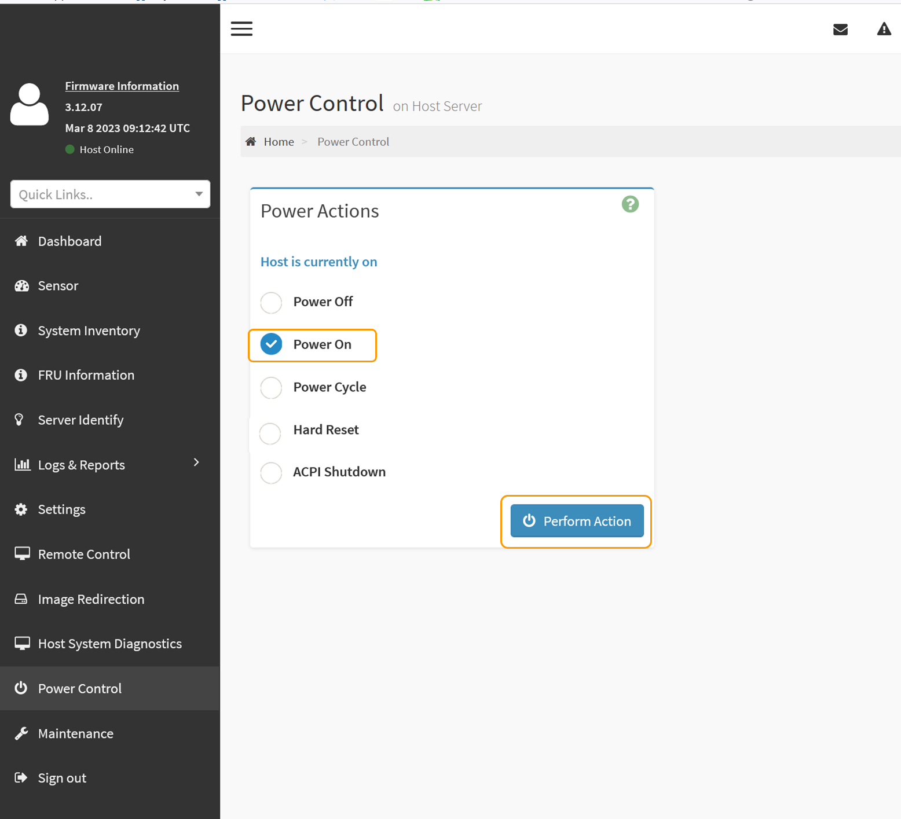

= 关闭和打开SG110或SG1100电源
:allow-uri-read: 
:icons: font
:imagesdir: ../media/

[role="lead"]
您可以关闭SG110或SG1100设备、然后重新打开其电源以执行维护。

== 关闭SG110或SG1100设备

关闭设备以执行硬件维护。

.开始之前
您已拥有 link:locating-sg110-and-sg1100-in-data-center.html["已物理定位设备"]。

.关于此任务
为了防止服务中断、请在计划的维护时段关闭设备、此时可以接受服务中断。

.步骤
. 关闭产品：
+

CAUTION: 您必须输入以下指定的命令，以有控制的方式关闭设备。最佳做法是、尽可能执行可控关闭、以避免不必要的警报、确保完整日志可用并避免服务中断。

+
.. 如果尚未登录到网格节点、请使用PuTTY或其他ssh客户端登录：
+
... 输入以下命令： `ssh admin@_grid_node_IP_`
... 输入中列出的密码 `Passwords.txt` 文件
... 输入以下命令切换到root： `su -`
... 输入中列出的密码 `Passwords.txt` 文件
+
以root用户身份登录后、提示符将从变为 `$` to `#`。

.. 关闭设备：+
`*shutdown -h now*`
+
此命令可能需要长达 10 分钟才能完成。

. 使用以下方法之一验证设备是否已关闭：
+
** 查看设备正面的电源 LED ，确认其已关闭。
** 检查 BMC 界面的电源控制页面，确认设备已关闭。

== 启动SG110或SG1100并验证操作

完成维护后，打开控制器电源。

.开始之前
* 您已拥有 link:reinstalling-sg110-and-sg1100-into-cabinet-or-rack.html["已将控制器安装在机柜或机架中"] 并连接了数据线和电源线。
* 您已拥有 link:locating-sg110-and-sg1100-in-data-center.html["物理上位于数据中心内的控制器"]。

.步骤
. 打开产品电源。
+
您可能需要卸下挡板才能接触到电源开关；如果是、请记得稍后重新安装。

. 使用以下方法之一监控控制器LED和启动代码：
+
** 按下控制器正面的电源开关。
** 使用控制器 BMC 界面：
+
... link:../installconfig/accessing-bmc-interface.html["访问控制器BMC界面"]。
... 选择 * 电源控制 * 。
... 选择*开机*，然后选择*执行操作*。
+

+
使用 BMC 界面监控启动状态。

. 确认设备控制器显示在网格管理器中且未显示任何警报。
+
控制器可能需要长达 20 分钟才能显示在网格管理器中。

+

CAUTION: 除非此设备具有绿色图标、否则请勿使其他设备节点脱机。

. 使用PuTTY或其他ssh客户端登录到网格节点、以确认新设备完全正常运行：
+
.. 输入以下命令： `ssh _Appliance_IP_`
.. 输入中列出的密码 `Passwords.txt` 文件
.. 输入以下命令切换到root： `su -`
.. 输入中列出的密码 `Passwords.txt` 文件
+
以root用户身份登录后、提示符将从变为 `$` to `#`。

.相关信息
link:../installconfig/viewing-status-indicators.html["查看状态指示器"]
