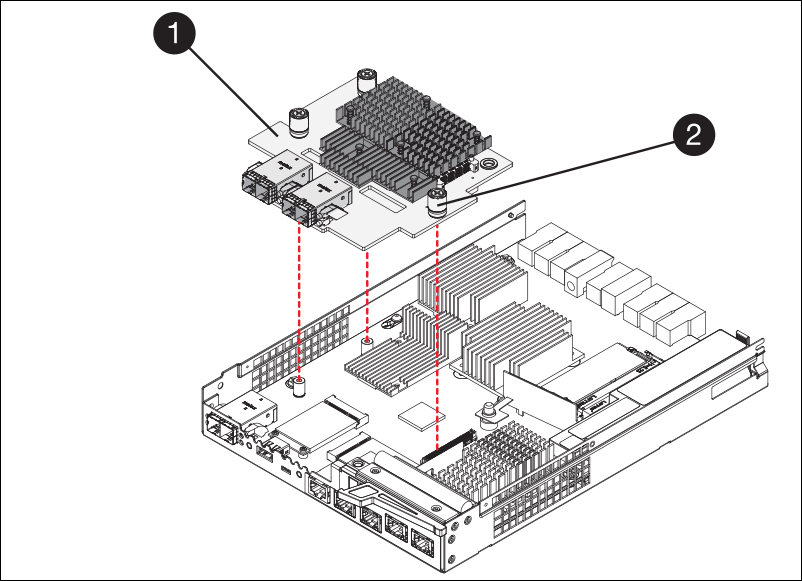

= 更换SG5700中的E2800系列存储控制器
:allow-uri-read: 
:icons: font
:imagesdir: ../media/

[role="lead"]
如果E2800系列控制器运行不正常或出现故障、您可能需要更换它。

.开始之前
* 您的更换控制器的部件号与要更换的控制器相同。
+

NOTE: 请勿依靠E系列说明来更换StorageGRID 设备中的控制器、因为更换过程不同。

* 您可以通过标签来识别连接到控制器的每个缆线。
* 如果所有驱动器都受到保护、您已查看中的步骤 https://docs.netapp.com/us-en/e-series/maintenance-e2800/controllers-simplex-supertask-task.html#step-1-prepare-to-replace-controller-simplex["单工E2800系列控制器更换操作步骤"^]其中包括从NetApp 支持站点 下载并安装E系列SANtricity系统管理器，然后在更换控制器后使用企业管理窗口(Enterprise Management, EMW)解锁受保护的驱动器。
+

CAUTION: 只有在使用已保存的密钥解锁驱动器后，才能使用此设备。

* 您必须具有特定的访问权限。
* 您必须使用登录到网格管理器 https://docs.netapp.com/us-en/storagegrid/admin/web-browser-requirements.html["支持的 Web 浏览器"^]。

.关于此任务
您可以通过以下两种方式确定控制器箱是否发生故障：

* SANtricity System Manager 中的恢复 Guru 可指示您更换控制器。
* 控制器上的琥珀色警示 LED 亮起，表示控制器出现故障。

更换控制器后，无法访问设备存储节点。如果E2800系列控制器运行正常、您可以 link:../commonhardware/placing-appliance-into-maintenance-mode.html["将 E5700SG 控制器置于维护模式"]。

更换控制器时，您必须从原始控制器中取出电池，然后将其安装到替代控制器中。在某些情况下，您可能还需要从原始控制器中卸下主机接口卡，并将其安装在替代控制器中。

NOTE: 大多数设备型号中的存储控制器不包括主机接口卡(Host Interface Card、HIC)。

== 第1步：准备卸下控制器

这些图显示了E2800A控制器和E2800B控制器。用于更换E2800系列控制器和EF570控制器的操作步骤 是相同的。

E2800A存储控制器：

image::../media/e2800_labels_on_controller.gif[E2800A控制器上的MAC和FRU标签]

E2800B存储控制器：

image::../media/e2800B_labels_on_controller.gif[E2800A控制器上的MAC和FRU标签]

[cols="1a,2a,4a"]
|===
| Label | 组件 | Description 

 a| 
1.
 a| 
MAC 地址
 a| 
管理端口1的MAC地址(E2800A上的"`P1"和E2800B`上的0a)。如果您使用 DHCP 获取原始控制器的 IP 地址，则需要使用此地址连接到新控制器。

 a| 
2.
 a| 
FRU 部件号
 a| 
FRU 部件号。此编号必须与当前安装的控制器的更换部件号匹配。

 a| 
3.
 a| 
4端口HIC
 a| 
4端口主机接口卡(HIC)。在执行更换时、必须将此卡移至新控制器。

*注*：E2800A控制器没有HIC。

|===
按照 E2800 控制器更换操作步骤 中的说明准备卸下控制器。

您可以使用SANtricity系统管理器执行以下步骤。

.步骤
. 记下控制器上当前安装的 SANtricity OS 软件版本。
. 记下当前安装的 NVSRAM 版本。
. 如果启用了驱动器安全功能，请确保存在已保存的密钥，并且您知道安装该密钥所需的密码短语。
+

CAUTION: *可能无法访问数据。&&如果设备中的所有驱动器都启用了安全保护，则新控制器将无法访问设备，直到您使用SANtricity 系统管理器中的“企业管理”窗口解锁受保护的驱动器。

. 备份配置数据库。
+
如果删除控制器时出现问题，您可以使用保存的文件还原配置。

. 收集设备的支持数据。
+

NOTE: 在更换组件前后收集支持数据可确保在更换组件无法解决问题时、您可以向技术支持发送一整套日志。

== 第2步：使控制器脱机

使控制器脱机并确认所有操作均已完成。

.步骤
. 如果 StorageGRID 设备正在 StorageGRID 系统中运行， link:../commonhardware/placing-appliance-into-maintenance-mode.html["将 E5700SG 控制器置于维护模式"]。
. 如果 E2800 控制器运行充分，可以进行可控的关闭，请确认所有操作均已完成。
+
.. 从 SANtricity 系统管理器的主页中，选择 * 查看正在执行的操作 * 。
.. 确认所有操作均已完成。

. 关闭控制器架。

== 第3步：卸下控制器

从设备中删除故障控制器。

.步骤
. 戴上 ESD 腕带或采取其他防静电预防措施。
. 为缆线贴上标签，然后断开缆线和 SFP 的连接。
+

NOTE: 为防止性能下降、请勿扭曲、折叠、挤压或踩踏缆线。

. 通过挤压凸轮把手上的闩锁，直到其释放，然后打开右侧的凸轮把手，将控制器从设备中释放。
. 用两只手和凸轮把手将控制器滑出设备。
+

CAUTION: 请始终用双手支撑控制器的重量。

. 将控制器放在无静电的平面上，可拆卸盖朝上。
. 向下按按钮并滑动外盖，以卸下外盖。

== 第4步：将电池移至新控制器

从发生故障的控制器中取出电池、然后将其安装到更换用的控制器中。

.步骤
. 确认控制器（电池和 DIMM 之间）中的绿色 LED 熄灭。
+
如果此绿色 LED 亮起，则表示控制器仍在使用电池电源。您必须等待此 LED 熄灭，然后才能卸下任何组件。

+
image::../media/e2800_internal_cache_active_led.gif[E2800 上的绿色 LED]

+
[cols="1a,2a"]
|===
| 项目 | Description 

 a| 
1.
 a| 
内部缓存活动 LED

 a| 
2.
 a| 
电池

|===
. 找到电池的蓝色释放闩锁。
. 向下推动释放闩锁并将其从控制器中移出，以解锁电池。
+
image::../media/e2800_remove_battery.gif[电池闩锁]

+
[cols="1a,2a"]
|===
| 项目 | Description 

 a| 
1.
 a| 
电池释放闩锁

 a| 
2.
 a| 
电池

|===
. 抬起电池，将其滑出控制器。
. 从更换用的控制器上卸下盖板。
. 调整更换控制器的方向，使电池插槽面向您。
. 将电池略微向下插入控制器。
+
您必须将电池前部的金属法兰插入控制器底部的插槽中，然后将电池顶部滑入控制器左侧的小对齐销下。

. 向上移动电池闩锁以固定电池。
+
当闩锁卡入到位时，闩锁的底部会挂到机箱上的金属插槽中。

. 将控制器翻转，以确认电池安装正确。
+

CAUTION: * 可能的硬件损坏 * —电池正面的金属法兰必须完全插入控制器上的插槽（如第一图所示）。如果电池安装不正确（如图 2 所示），则金属法兰可能会接触控制器板，从而导致损坏。

+
** *正确—电池的金属法兰已完全插入控制器上的插槽：*
+
image::../media/e2800_battery_flange_ok.gif[电池法兰正确]

** * 不正确 - 电池的金属法兰未插入控制器上的插槽： *
+
image::../media/e2800_battery_flange_not_ok.gif[电池法兰不正确]

. 更换控制器盖板。

== 第5步：根据需要将HIC移至新控制器

如果故障控制器包含主机接口卡(HIC)、请将HIC从故障控制器移至更换控制器。

单独的HIC仅用于E2800B控制器。HIC安装在主控制器板上、并包含两个SPF连接器。

NOTE: 此操作步骤 中的插图显示了一个双端口HIC。控制器中的HIC可能具有不同数量的端口。

[role="tabbed-block"]
====
.E2800A
--
E2800A控制器没有HIC。

装回E2800A控制器护盖、然后转至 <<step6_replace_controller,第6步：更换控制器>>

--
.E2800B
--
将HIC从发生故障的E2800B控制器移至替代控制器。

.步骤
. 从HIC中删除所有SFP。
. 使用1号十字螺丝刀卸下将HIC面板连接到控制器的螺钉。
+
有四个螺钉：一个在顶部，一个在侧面，两个在正面。

+
image::../media/28_dwg_e2800_hic_faceplace_screws_maint-e2800.png[E2800面板螺钉]

. 卸下 HIC 面板。
. 使用您的手指或十字螺丝刀松开将 HIC 固定到控制器卡的三个翼形螺钉。
. 小心地将 HIC 从控制器卡上卸下，方法是将该卡抬起并滑回。
+

CAUTION: 请注意，不要擦除或撞击 HIC 底部或控制器卡顶部的组件。

+

+
[cols="1a,2a"]
|===
| Label | Description 

 a| 
1.
 a| 
主机接口卡

 a| 
2.
 a| 
翼形螺钉

|===
. 将 HIC 放置在无静电表面上。
. 使用1号十字螺丝刀卸下将空白面板连接到更换用控制器的四个螺钉、然后卸下面板。
. 将HIC上的三个翼形螺钉与更换用的控制器上的相应孔对齐、并将HIC底部的连接器与控制器卡上的HIC接口连接器对齐。
+
请注意，不要擦除或撞击 HIC 底部或控制器卡顶部的组件。

. 小心地将 HIC 放低到位，然后轻按 HIC 以固定 HIC 连接器。
+

CAUTION: *设备可能损坏*--小心不要在HIC和指旋螺钉之间夹住控制器LED的金色带状连接器。

+
image::../media/28_dwg_e2800_hic_thumbscrews_maint-e2800.gif[E2800A HIC拧紧螺钉]

+
[cols="1a,2a"]
|===
| Label | Description 

 a| 
1.
 a| 
主机接口卡

 a| 
2.
 a| 
翼形螺钉

|===
. 手动拧紧 HIC 翼形螺钉。
+
请勿使用螺丝刀、否则可能会将螺钉拧得过紧。

. 使用1号十字螺丝刀、使用四个螺钉将从原始控制器上卸下的HIC面板连接到新控制器。
+
image::../media/28_dwg_e2800_hic_faceplace_screws_maint-e2800.png[E2800A面板螺钉]

. 将所有已删除的SFP重新安装到HIC中。

--
====

== 第6步：更换控制器

安装替代控制器并验证它是否已重新加入网格。

.步骤
. 将替代控制器安装到设备中。
+
.. 将控制器翻转，使可拆卸盖朝下。
.. 在凸轮把手处于打开位置的情况下，将控制器完全滑入设备中。
.. 将凸轮把手移至左侧，将控制器锁定到位。
.. 更换缆线和 SFP 。
.. 打开控制器架的电源。
.. 等待 E2800 控制器重新启动。验证七段显示器是否显示状态 `99`。
.. 确定如何为替代控制器分配 IP 地址。
+

NOTE: 为替代控制器分配 IP 地址的步骤取决于您是否已将管理端口 1 连接到使用 DHCP 服务器的网络，以及所有驱动器是否都安全。

+
如果管理端口 1 连接到使用 DHCP 服务器的网络，则新控制器将从 DHCP 服务器获取其 IP 地址。此值可能与原始控制器的 IP 地址不同。

. 如果设备使用安全驱动器，请按照 E2800 控制器更换操作步骤 中的说明导入驱动器安全密钥。
. 将设备恢复到正常运行模式。在 StorageGRID 设备安装程序中，选择 * 高级 * > * 重新启动控制器 * ，然后选择 * 重新启动至 StorageGRID * 。
+
image::../media/reboot_controller_from_maintenance_mode.png[在维护模式下重新启动控制器]

. 在重新启动期间、监控节点的状态、以确定节点何时重新加入网格。
+
设备将重新启动并重新加入网格。此过程可能需要长达 20 分钟。

. 确认重新启动已完成，并且节点已重新加入网格。在网格管理器中、验证节点页面是否为设备节点显示正常状态(节点名称左侧的绿色复选标记图标)、表示没有处于活动状态image:../media/icon_alert_green_checkmark.png["绿色复选标记"]的警报、并且节点已连接到网格。
+
image::../media/nodes_menu.png[设备节点已重新加入网格]

. 从 SANtricity 系统管理器中，确认新控制器处于最佳状态，然后收集支持数据。

更换部件后，按照套件随附的 RMA 说明将故障部件退回 NetApp 。请参见 https://mysupport.netapp.com/site/info/rma["部件退回和放大器；更换"^] 第页，了解更多信息。
