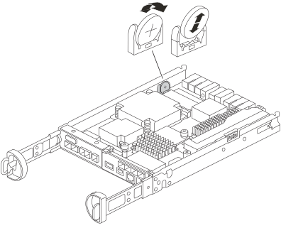

= 更换 SG5800 控制器中的 CMOS 电池
:allow-uri-read: 
:icons: font
:imagesdir: ../media/

[role="lead"]
您可能需要更换 SG5800 控制器中的 CMOS 电池，以便系统的服务和应用程序具有准确的时间同步并继续正常运行。

.关于此任务
更换 CMOS 电池时，您将无法访问设备 Storage Node。为了防止服务中断，请在开始更换 CMOS 电池之前确认所有其他 Storage Node 已连接到电网，或者在可以接受服务中断期间的计划维护窗口期间更换电池。

== 步骤 1：关闭 SG5800 控制器

.步骤
. 登录到网格节点：
+
.. 输入以下命令： `ssh admin@grid_node_IP`
.. 输入中列出的密码 `Passwords.txt` 文件
.. 输入以下命令切换到root： `su -`
.. 输入中列出的密码 `Passwords.txt` 文件
+
以root用户身份登录后、提示符将从变为 `$` to `#`。

. 关闭SG完全 控制器：
+
*`shutdown -h now`*

== 步骤 2：从设备中卸下控制器

.步骤
. 戴上 ESD 腕带或采取其他防静电预防措施。
. 为缆线贴上标签，然后断开缆线和 SFP 的连接。
+

NOTE: 为防止性能下降，请勿扭曲、折叠、夹紧或踩踏电缆。

. 通过挤压凸轮把手上的闩锁，直到其释放，然后打开右侧的凸轮把手，将控制器从设备中释放。
. 用两只手和凸轮把手将控制器滑出设备。
+

NOTE: 请始终用双手支撑控制器的重量。

. 将控制器模块翻转过来，放置在平坦、稳定的表面上。
. 按下控制器模块两侧的蓝色按钮打开盖子，然后将盖子向上旋转并从控制器模块上取下。
+
image::../media/drw_sg5800_open_controller_module_cover_IEOPS-695.svg[打开 SG5800 控制器模块盖]

== 步骤 3：更换 CMOS 电池

.步骤
. 找到 CMOS 电池。
+

+

NOTE: 您的控制器可能与图中所示的控制器不同。但是，CMOS 电池的位置是相同的。

. 轻轻地将电池从支架上推开并旋转，然后将其从设备中取出。
+

NOTE: 从支架上取下电池时，请注意电池的极性。电池标有加号，必须正确放置在支架中。支架附近有一个加号，告诉您应如何放置电池。

. 从防静电运输袋中取出更换电池。
. 在控制器模块中找到空电池座。
. 注意 CMOS 电池的极性，然后通过将电池倾斜一定角度并向下推将其插入支架。
. 目视检查电池，确保电池已完全安装到支架中，并且极性正确。
. 重新安装控制器外盖。

== 步骤 4：将控制器重新安装到设备中

.步骤
. 将控制器安装到设备中：
+
.. 将控制器翻转过来，使可拆卸盖朝下。
.. 在凸轮把手处于打开位置的情况下，将控制器完全滑入设备中。
.. 将凸轮把手移至左侧，将控制器锁定到位。
.. 重新连接电缆。

. 控制器重新启动且设备重新加入电网后，确认设备存储节点出现在电网管理器中并且没有出现警报。

更换部件后，按照套件随附的 RMA 说明将故障部件退回 NetApp 。请参见 https://mysupport.netapp.com/site/info/rma["部件退回和放大器；更换"] 第页，了解更多信息。
