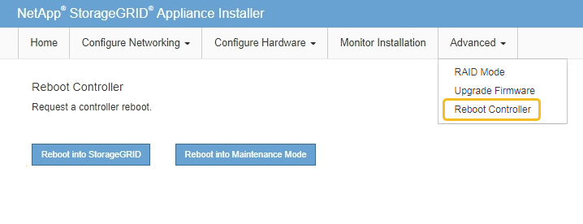

= 更改 SG6000-CN 控制器的链路配置
:allow-uri-read: 
:icons: font
:imagesdir: ../media/

[role="lead"]
您可以更改 SG6000-CN 控制器的以太网链路配置。您可以更改端口绑定模式，网络绑定模式和链路速度。

.开始之前
此设备已运行 link:../commonhardware/placing-appliance-into-maintenance-mode.html["已置于维护模式"]。

.关于此任务
更改 SG6000-CN 控制器的以太网链路配置的选项包括：

* 将 * 端口绑定模式 * 从 " 固定 " 更改为 " 聚合 " 或从 " 聚合 " 更改为 " 固定 "
* 将 * 网络绑定模式 * 从主动备份更改为 LACP 或从 LACP 更改为主动备份
* 启用或禁用 VLAN 标记，或者更改 VLAN 标记的值
* 更改链路速度。

.步骤
. 从 StorageGRID 设备安装程序中，选择 * 配置网络连接 * > * 链路配置 * 。
+
image::../media/link_configuration_option.gif[链路配置]

. 【 link_config_changes ， start=2]] 对链路配置进行所需的更改。
+
有关这些选项的详细信息、请参见 link:../installconfig/configuring-network-links.html["配置网络链路"]。

. 对所做的选择感到满意后，单击 * 保存 * 。
+

NOTE: 如果更改了所连接的网络或链路，则可能会断开连接。如果您未在1分钟内重新连接、请使用分配给设备的其他IP地址之一重新输入StorageGRID 设备安装程序的URL：+
`*https://_Appliance_Controller_IP_:8443*`

+
如果更改了 VLAN 设置，则设备的子网可能已更改。如果需要更改设备的IP地址、请按照说明进行操作 https://docs.netapp.com/us-en/storagegrid/maintain/configuring-ip-addresses.html["配置 IP 地址"^]。

+
link:../installconfig/setting-ip-configuration.html["配置 StorageGRID IP 地址"]

. 从菜单中选择 * 配置网络连接 * > * Ping 测试 * 。
. 使用 Ping 测试工具检查可能受中所做链路配置更改影响的任何网络上的 IP 地址连接 <<link_config_changes,链路配置更改>> 步骤。
+
除了您选择执行的任何其他测试之外，请确认您可以对主管理节点的网格网络 IP 地址以及至少一个其他存储节点的网格网络 IP 地址执行 ping 操作。如有必要，请返回到 <<link_config_changes,链路配置更改>> 执行步骤并更正任何链路配置问题。

. 如果您对链路配置更改是否正常工作感到满意，并且在节点处于维护模式时还需要执行其他步骤，请立即执行这些操作。完成后，或者如果遇到任何故障并希望重新启动，请选择 * 高级 * > * 重新启动控制器 * ，然后选择以下选项之一：
+
** 选择 * 重新启动到 StorageGRID *
** 选择 * 重新启动至维护模式 * 以重新启动控制器，同时使节点仍处于维护模式。  如果您在操作步骤 期间遇到任何故障并希望重新启动，请选择此选项。  节点重新启动至维护模式后，从出现故障的操作步骤 中的相应步骤重新启动。
+

+
设备重新启动并重新加入网格可能需要长达 20 分钟的时间。要确认重新启动已完成且节点已重新加入网格，请返回网格管理器。n节点*页面应显示正常状态(绿色复选标记图标 image:../media/icon_alert_green_checkmark.png["绿色复选标记"] 节点名称左侧)、表示没有处于活动状态的警报、并且节点已连接到网格。

+
image::../media/nodes_menu.png[设备节点已重新加入网格]

