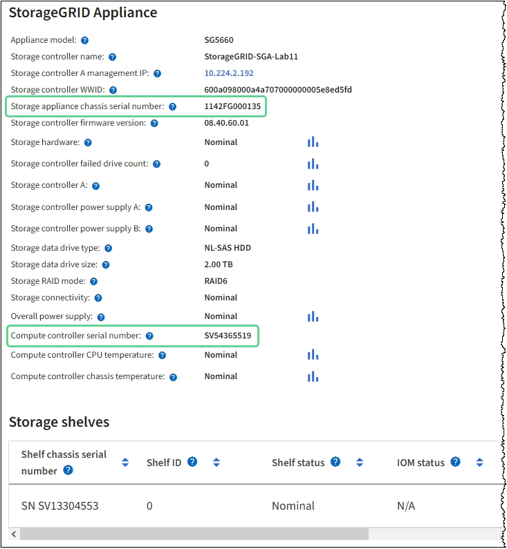

= 更换SG6000中的光纤通道HBA
:allow-uri-read: 
:icons: font
:imagesdir: ../media/

[role="lead"]
如果光纤通道HBA未以最佳状态运行或发生故障、您可能需要更换它。

== 确认要更换的光纤通道 HBA

如果您不确定要更换哪个光纤通道主机总线适配器（ HBA ），请完成此操作步骤 以进行识别。

.开始之前
* 您拥有需要更换光纤通道 HBA 的存储设备或 SG6000-CN 控制器的序列号。
+

NOTE: 如果包含要更换的光纤通道 HBA 的存储设备的序列号以字母 Q 开头，则它不会在网格管理器中列出。您必须检查附加到数据中心中每个 SG6000-CN 控制器正面的标签，直到找到匹配项为止。

* 您已使用登录到网格管理器 https://docs.netapp.com/us-en/storagegrid/admin/web-browser-requirements.html["支持的 Web 浏览器"^]。

.步骤
. 在网格管理器中，选择 * 节点 * 。
. 从节点页面上的表中，选择设备存储节点。
. 选择 * 硬件 * 选项卡。
+
检查 StorageGRID 设备部分中的 * 存储设备机箱序列号 * 和 * 计算控制器序列号 * 。查看其中一个序列号是否与要更换光纤通道 HBA 的存储设备的序列号匹配。如果任一序列号匹配，则表明您找到了正确的设备。

+

+
** 如果未显示 StorageGRID 设备部分，则选定节点不是 StorageGRID 设备。从树视图中选择其他节点。
** 如果设备型号不是SG6060或SG6060X、请从树视图中选择其他节点。
** 如果序列号不匹配、请从树视图中选择其他节点。

. 找到需要更换光纤通道 HBA 的节点后，记下 StorageGRID 设备部分列出的计算控制器 BMC IP 地址。
+
您可以将此IP地址用于 link:turning-controller-identify-led-on-and-off.html["打开计算控制器标识LED"]，以帮助您在数据中心内找到设备。

== 删除光纤通道 HBA

如果 SG6000-CN 控制器运行不正常或发生故障，您可能需要更换该控制器中的光纤通道主机总线适配器（ HBA ）。

.开始之前
* 您拥有正确的替代光纤通道 HBA 。
* 您已拥有 link:reinstalling-fibre-channel-hba.html#verify-fibre-channel-hba-to-replace["已确定哪个SG6000-CN控制器包含要更换的光纤通道HBA"]。
* 您已拥有 link:locating-controller-in-data-center.html["以物理方式定位SG6000-CN控制器"] 在数据中心。
* 您已拥有 link:power-sg6000-cn-controller-off-on.html#shut-down-sg6000-cn-controller["关闭SG6000-CN控制器"]。
+

CAUTION: 从机架中卸下控制器之前、需要进行有控制的关闭。

* 您已拥有 link:reinstalling-sg6000-cn-controller-into-cabinet-or-rack.html#remove-sg6000-cn-controller-from-cabinet-or-rack["已从机柜或机架中卸下控制器"]。
* 您已拥有 link:reinstalling-sg6000-cn-controller-cover.html#remove-sg6000-cn-controller-cover["已卸下控制器盖板"]。

.关于此任务
为了防止服务中断、请在开始更换光纤通道HBA之前确认所有其他存储节点均已连接到网格、或者在计划的维护时段(服务中断期可接受)更换适配器。请参见有关的信息 https://docs.netapp.com/us-en/storagegrid/monitor/monitoring-system-health.html#monitor-node-connection-states["监控节点连接状态"^]。

CAUTION: 如果您使用的 ILM 规则只创建一个对象的一个副本，则必须在计划的维护窗口期间更换光纤通道 HBA 。否则，在此操作步骤 期间，您可能暂时无法访问这些对象。+查看有关的信息 https://docs.netapp.com/us-en/storagegrid/ilm/why-you-should-not-use-single-copy-replication.html["为什么不应使用单副本复制"^]。

.步骤
. 将 ESD 腕带的腕带一端绕在腕带上，并将扣具一端固定到金属接地，以防止静电放电。
. 找到包含光纤通道 HBA 的控制器背面的提升板部件。
+
image::../media/sg6060_riser_assembly_location.jpg[SG6060 提升板部件位置]

. 抓住竖板部件并穿过蓝色标记的孔，然后小心地将其向上提起。提起提升板部件时，将其向机箱前部移动，以使其已安装适配器中的外部连接器能够脱离机箱。
. 将提升板卡放在平坦的防静电表面上，并使金属机架朝下，以便接触适配器。
+
image::../media/sg6060_fc_hba_location.jpg[SG6060 光纤通道 HBA 位于提升板部件中]

+
提升板部件中有两个适配器：一个光纤通道 HBA 和一个以太网网络适配器。图中显示了光纤通道 HBA 。

. 打开蓝色适配器闩锁（带圆圈），然后小心地从提升板部件中卸下光纤通道 HBA 。稍微摇晃适配器，以便从其连接器中卸下适配器。切勿用力过度。
. 将适配器放在平坦的防静电表面上。

.完成后
link:reinstalling-fibre-channel-hba.html["安装替代光纤通道HBA"]。

更换部件后，按照套件随附的 RMA 说明将故障部件退回 NetApp 。请参见 https://mysupport.netapp.com/site/info/rma["部件退回和放大器；更换"^] 第页，了解更多信息。

== 重新安装光纤通道 HBA

替代光纤通道 HBA 安装在与已删除的光纤通道 HBA 相同的位置。

.开始之前
* 您拥有正确的替代光纤通道 HBA 。
* 您已删除现有光纤通道 HBA 。
+
link:reinstalling-fibre-channel-hba.html#remove-fibre-channel-hba["删除光纤通道 HBA"]

.步骤
. 将 ESD 腕带的腕带一端绕在腕带上，并将扣具一端固定到金属接地，以防止静电放电。
. 从包装中取出更换用的光纤通道 HBA 。
. 在蓝色适配器闩锁处于打开位置的情况下，将光纤通道 HBA 与其在提升板部件上的连接器对齐；然后，小心地将适配器按入连接器中，直到其完全就位。
+
image::../media/sg6060_fc_hba_location.jpg[SG6060 光纤通道 HBA 位于提升板部件中]

+
提升板部件中有两个适配器：一个光纤通道 HBA 和一个以太网网络适配器。图中显示了光纤通道 HBA 。

. 找到与系统板上的导销对齐的竖板部件上的对齐孔（带圆圈），以确保竖板部件正确定位。
+
image::../media/sg6060_riser_alignment_hole.jpg[SG6060 提升板部件上的对齐孔]

. 将提升板部件置于机箱中，确保其与系统板上的连接器和导销对齐；然后，插入提升板部件。
. 小心地将竖板部件沿着其中心线，蓝色标记的孔旁边按到位，直到其完全就位。
. 从要重新安装缆线的光纤通道 HBA 端口上取下保护盖。

.完成后
如果在控制器中没有其他维护过程、 link:reinstalling-sg6000-cn-controller-cover.html["重新安装控制器护盖"]。
