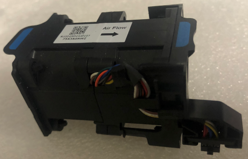
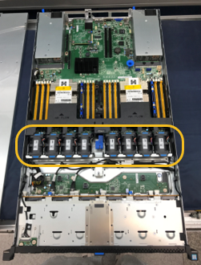
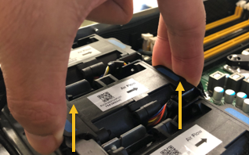
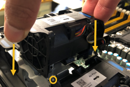
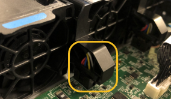

= 更换 SG6000-CN 计算控制器中的风扇
:allow-uri-read: 
:icons: font
:imagesdir: ../media/

[role="lead"]
SG6000-CN 计算控制器有八个冷却风扇。如果其中一个风扇出现故障，则必须尽快更换它以确保控制器正常冷却。

.开始之前
* 您已卸载替代风扇。
* 您已拥有 link:locating-controller-in-data-center.html["已物理定位设备"]。
* 您已确认其他风扇已安装并正在运行。

.关于此任务
更换风扇时，存储节点将无法访问。

照片展示了 SG6000-CN 计算控制器的风扇。取下控制器的顶盖后即可看到冷却风扇。

NOTE: 两个电源设备中的每个设备都包含一个风扇。这些风扇不包括在此操作步骤 中。

.步骤
. link:power-sg6000-cn-controller-off-on.html["关闭 SG6000-CN 控制器"] 。
. 提起顶盖上的闩锁，然后从设备中卸下此盖板。
. 找到出现故障的风扇。
+

. 将故障风扇从机箱中提出。
+

. 将替代风扇滑入机箱中的打开插槽。
+
将风扇边缘与导销对中。此销在照片中圈出。

+

. 将风扇连接器稳固地按入电路板。
+

. 将顶盖重新放在设备上，然后向下按压闩锁以将盖固定到位。
. link:power-sg6000-cn-controller-off-on.html#poweron["打开 SG6000-CN 控制器的电源"] 。
. 确认设备节点显示在网格管理器中且未显示任何警报。

更换零件后，将故障零件退回 NetApp，如套件附带的 RMA 说明中所述。有关更多信息，请参阅 https://mysupport.netapp.com/site/info/rma["零件退货  更换"^]页面。
