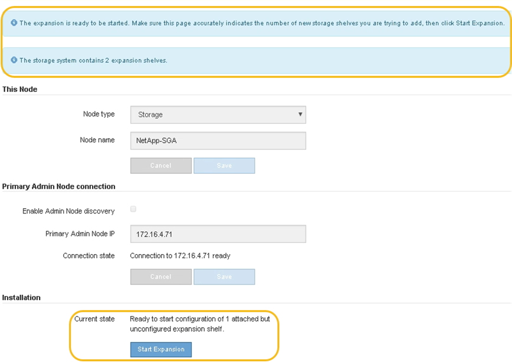

= 将扩展架添加到已部署的SG6160
:allow-uri-read: 
:icons: font
:imagesdir: ../media/

[role="lead"]
要增加存储容量、您可以向StorageGRID系统中已部署的SG6160添加一个或两个扩展架。

.开始之前
* 您必须具有配置密码短语。
* 必须运行StorageGRID 11.8.
* 每个扩展架都有扩展架和两根 SAS 缆线。
* 您已将要在数据中心中添加扩展架的存储设备物理定位。
+
link:locating-sgf6112-in-data-center.html["在数据中心中找到控制器"]

.关于此任务
要添加扩展架，请执行以下高级步骤：

* 在机柜或机架中安装硬件。
* 将SG6160置于维护模式。
* 将扩展架连接到E4000控制器架或其他扩展架。
* 使用StorageGRID设备安装程序开始扩展。
* 请稍候，直到配置完新卷为止。

每个设备节点为一个或两个扩展架完成操作步骤 所需时间应至少为一小时。为了最大限度地减少停机时间、以下步骤将指导您在将SG6160置于维护模式之前安装新的扩展架和驱动器。每个设备节点的其余步骤大约需要 20 到 30 分钟。

.步骤
. 按照的说明进行操作 link:../installconfig/sg6160-installing-60-drive-shelves-into-cabinet-or-rack.html["将包含60个驱动器的磁盘架安装到机柜或机架中"]。
. 在网格管理器中， link:../commonhardware/placing-appliance-into-maintenance-mode.html["将SG6100-CN控制器置于维护模式"]。
. 如图所示、将每个扩展架连接到E4000控制器架。
+
此图显示了两个扩展架。如果只有一个，请将 IOM A 连接到控制器 A ，并将 IOM B 连接到控制器 B

+
image::../media/expansion_shelves_connections_sg6160.png[SG6160扩展架连接]

+
[cols="1a,2a"]
|===
| Callout | Description 

 a| 
1.
 a| 
SG6100-CN

 a| 
2.
 a| 
E4000控制器架

 a| 
3.
 a| 
控制器 A

 a| 
4.
 a| 
控制器 B

 a| 
5.
 a| 
扩展架 1

 a| 
6.
 a| 
扩展架 1 的 IOM A

 a| 
7.
 a| 
扩展架 1 的 IOM B

 a| 
8.
 a| 
扩展架 2.

 a| 
9
 a| 
扩展架 2 的 IOM A

 a| 
10
 a| 
扩展架 2 的 IOM B

|===
. 连接电源线并为扩展架通电。
+
.. 将电源线连接到每个扩展架中的两个电源设备中的每个设备。
.. 将每个扩展架中的两条电源线连接到机柜或机架中的两个不同 PDU 。
.. 打开每个扩展架的两个电源开关。
+
*** 在开机过程中、请勿关闭电源开关。
*** 首次启动时，扩展架中的风扇可能会发出很大的声音。启动期间发出较大的噪音是正常的。

. 监控 StorageGRID 设备安装程序的主页页面。
+
大约五分钟后，扩展架将完成启动，系统会检测到这些扩展架。主页页面将显示检测到的新扩展架数量，并且已启用开始扩展按钮。

+
屏幕截图显示了主页上可能显示的消息示例，具体取决于现有或新扩展架的数量，如下所示：

+
** 此页面顶部圈出的横幅指示检测到的扩展架总数。
+
*** 此横幅将指示扩展架的总数，无论是已配置和部署磁盘架，还是新磁盘架和未配置磁盘架。
*** 如果未检测到扩展架，则不会显示横幅。

** 页面底部圆圈内的消息表示扩展已准备就绪，可以启动。
+
*** 此消息指示 StorageGRID 检测到的新扩展架数量。"`Attached` " 表示检测到磁盘架。"`Unconfigured` " 表示磁盘架为新磁盘架，尚未使用 StorageGRID 设备安装程序进行配置。
+

NOTE: 此消息不包括已部署的扩展架。它们包含在页面顶部横幅的计数中。

*** 如果未检测到新的扩展架、则不会显示此消息。
+

. 如有必要，请解决主页上的消息中所述的任何问题。
+
例如，使用 SANtricity 系统管理器解决任何存储硬件问题。

. 验证主页上显示的扩展架数量是否与要添加的扩展架数量匹配。
+

NOTE: 如果未检测到新的扩展架，请验证它们是否已正确布线并已启动。

. [start_expand]] 单击 * 启动扩展 * 以配置扩展架并使其可用于对象存储。
. 监控扩展架配置的进度。
+
进度条会显示在网页上，就像在初始安装期间一样。

+
image::../media/monitor_expansion_for_new_appliance_shelf.png[监控扩展架配置]

+
配置完成后，设备将自动重新启动以退出维护模式并重新加入网格。此过程可能需要长达 20 分钟。

+

NOTE: 要在扩展架配置失败时重试此配置，请转到 StorageGRID 设备安装程序，选择 * 高级 * > * 重新启动控制器 * ，然后选择 * 重新启动至维护模式 * 。节点重新启动后，重试 <<start_expansion,扩展架配置>>。

+
重新启动完成后， * 任务 * 选项卡将显示以下屏幕截图：

+
image::../media/appliance_installer_reboot_complete.png[重新启动完成]

. 验证设备存储节点和新扩展架的状态。
+
.. 在网格管理器中，选择*N节点*并验证设备存储节点是否具有绿色复选标记图标。
+
绿色复选标记图标表示没有处于活动状态的警报、并且节点已连接到网格。有关节点图标的问题描述 、请参见 https://docs.netapp.com/us-en/storagegrid-118/monitor/monitoring-system-health.html#monitor-node-connection-states["监控节点连接状态"^]。

.. 选择 * 存储 * 选项卡，然后确认添加的每个扩展架的对象存储表中显示了 16 个新的对象存储。
.. 验证每个新扩展架的磁盘架状态是否为标称，配置状态是否为已配置。

