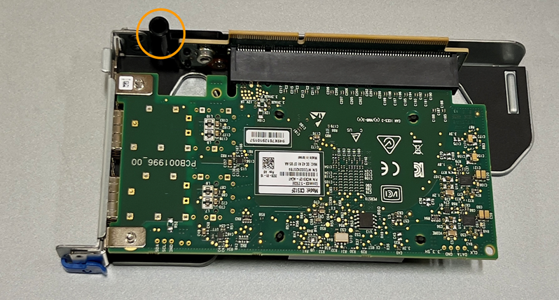

= 更换SGF6112或SG6100-CN中的内部NIC
:allow-uri-read: 
:icons: font
:imagesdir: ../media/

[role="lead"]
如果SGF6112或SG6100-CN中的内部网络接口卡(NIC)运行不正常或出现故障、则可能需要更换该卡。

使用这些过程可以：

* 卸下NIC
* 重新安装NIC

== 卸下内部NIC

.开始之前
* 您拥有正确的替代NIC。
* 您已确定 link:verify-component-to-replace.html["要更换的NIC的位置"]。
* 您已拥有 link:locating-sgf6112-in-data-center.html["物理位置：SGF6112设备或SG6100-CN控制器"] 要更换数据中心中的NIC的位置。
+

NOTE: 答 link:power-sgf6112-off-on.html#shut-down-the-sgf6112-appliance["受控关闭设备"] 在从机架中卸下设备之前需要。

* 您已断开所有缆线和 link:reinstalling-sgf6112-cover.html["已卸下产品盖"]。

.关于此任务
为了防止服务中断、请在开始更换网络接口卡(Network Interface Card、NIC)之前确认所有其他存储节点均已连接到网格、或者在计划的维护时段内可接受服务中断期间更换NIC。请参见有关的信息 https://docs.netapp.com/us-en/storagegrid-118/monitor/monitoring-system-health.html#monitor-node-connection-states["监控节点连接状态"^]。

CAUTION: 如果您使用的ILM规则仅为对象创建一个副本、则必须在计划的维护时段更换NIC、因为在此操作步骤期间、您可能会暂时无法访问这些对象。请参见有关的信息 https://docs.netapp.com/us-en/storagegrid-118/ilm/why-you-should-not-use-single-copy-replication.html["为什么不应使用单副本复制"^]。

.步骤
. 将 ESD 腕带的腕带一端绕在腕带上，并将扣具一端固定到金属接地，以防止静电放电。
. 在设备背面找到包含NIC的提升板组件。
+
设备中的三个NIC位于图中所示机箱位置的两个提升板部件中(设备背面已卸下顶盖，如图所示)：

+
image::../media/sgf6112-nic-positions.jpg[NIC位置]

+
[cols="1a,2a,4a"]
|===
|  | 设备或部件名称 | Description 

 a| 
1.
 a| 
一、二
 a| 
双端口提升板部件中的10/C5-GbE以太网端口

 a| 
2.
 a| 
mtc1/mTC2
 a| 
双端口提升板部件中的1/10GbBase-T管理端口

 a| 
3.
 a| 
问题3 /问题4
 a| 
单端口提升板部件中的10/C5-GbE以太网端口

 a| 
4.
 a| 
双插槽提升板部件
 a| 
支持其中一个10/C5-GbE NIC和1/10GBase-T NIC

 a| 
5.
 a| 
单插槽提升板部件
 a| 
支持其中一个10/C5-GbE NIC

|===
. 抓住带有故障NIC的提升板部件、使其穿过蓝色标记的孔、然后小心地向上提起。提起提升板部件时，将其朝机箱正面移动，以使其安装的NIC中的外部连接器能够脱离机箱。
. 将提升板放在平坦的防静电表面上、金属框架面朝下、以便接触到NIC。
+
** *带有两个NIC*的双插槽提升板部件
+
image::../media/two-slot-assembly-sgf6112.png[双插槽提升板部件中的两个NIC]

** *带有一个NIC*的单插槽提升板部件
+
image::../media/one-slot-assembly-sgf6112.png[单插槽提升板部件中的NIC]

. 打开要更换的NIC上的蓝色闩锁(圈出)、然后小心地从提升板部件中卸下NIC。轻轻摇动NIC、以帮助从其连接器中卸下NIC。切勿用力过度。
. 将NIC放在平坦的防静电表面上。

== 重新安装内部NIC

将更换用的NIC安装到与已卸下的NIC相同的位置。

.开始之前
* 您拥有正确的替代NIC。
* 您已删除现有故障NIC。

.步骤
. 将 ESD 腕带的腕带一端绕在腕带上，并将扣具一端固定到金属接地，以防止静电放电。
. 从包装中取出替代NIC。
. 如果要更换双插槽提升板部件中的一个NIC，请执行以下步骤：
+
.. 确保蓝色闩锁处于打开位置。
.. 将NIC与其在提升板部件上的连接器对齐。小心地将NIC按入连接器，直至完全就位(如图所示)，然后合上蓝色闩锁。
+
image::../media/two-slot-assembly-sgf6112.png[双插槽提升板部件中的两个NIC]

.. 找到与系统板上的导销对齐的双插槽提升板部件上的定位孔(圈出)、以确保提升板部件正确定位。
+
image::../media/sgf6112_two-slot-riser_alignment_hole.png[大提升板部件上的定位孔]

.. 找到系统板上的导销
+
image::../media/sgf6112_two-slot-riser_guide-pin.png[双插槽提升板部件的导销]

.. 将提升板部件置于机箱中、确保其与系统板上的连接器和导销对齐。
.. 沿着中间线(靠近蓝色标记的孔)小心地将双插槽提升板部件按入到位，直至其完全就位。

. 如果要更换单插槽提升板部件中的NIC，请执行以下步骤：
+
.. 确保蓝色闩锁处于打开位置。
.. 将NIC与其在提升板部件上的连接器对齐。小心地将NIC按入连接器，直至其完全就位(如图所示)，然后合上蓝色闩锁。
+
image::../media/one-slot-assembly-sgf6112.png[单插槽提升板部件中的NIC]

.. 找到与系统板上的导销对齐的单插槽提升板部件上的定位孔(圈出)、以确保提升板部件正确定位。
+

.. 找到系统板上的导销
+
image::../media/sgf6112_one-slot-riser_system-pin.png[单插槽提升板部件上的导销]

.. 将单插槽提升板部件置于机箱中、确保其与系统板上的连接器和导销对齐。
.. 沿着中间线(靠近蓝色标记的孔)小心地将单插槽提升板部件按入到位，直至其完全就位。

. 从要重新安装缆线的NIC端口上取下保护帽。

.完成后
如果您不需要对设备执行其他维护步骤、请重新安装设备盖、将设备装回机架、连接电缆并接通电源。

更换部件后，按照套件随附的 RMA 说明将故障部件退回 NetApp 。请参见 https://mysupport.netapp.com/site/info/rma["部件退回和放大器；更换"^] 第页，了解更多信息。
