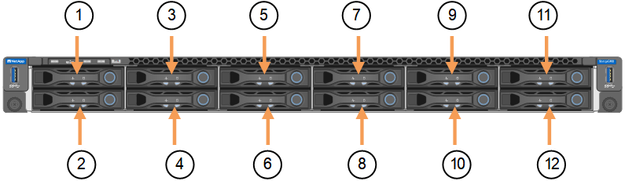

= 更换 SGF6112 中的驱动器
:allow-uri-read: 
:icons: font
:imagesdir: ../media/

[role="lead"]
SGF6112存储设备包含12个SSD驱动器。驱动器上的数据受RAID方案保护、该方案使设备能够从任何单个驱动器故障中恢复、而无需从另一个节点复制数据。

如果在更正初始驱动器故障之前第二个驱动器发生故障、则可能需要从其他节点复制数据以恢复冗余。如果正在使用或过去使用单副本ILM规则、或者其他节点上的故障已影响数据冗余、则此冗余还原可能需要更长时间、并且可能无法完成。因此、如果其中一个GF6112驱动器发生故障、您必须尽快更换它以确保冗余。

.开始之前
* 您已拥有 link:locating-sgf6112-in-data-center.html["已物理定位设备"]。
* 您已注意到驱动器的左侧LED呈稳定琥珀色或使用网格管理器确认哪个驱动器出现故障 link:verify-component-to-replace.html["查看由故障驱动器引起的警报"]。
+

NOTE: 请参见有关查看状态指示器的信息以验证故障。

* 您已获得替代驱动器。
* 您已获得适当的 ESD 保护。

.步骤
. 验证驱动器左侧的故障LED是否为琥珀色、或者使用警报中的驱动器插槽ID找到驱动器。
+
12个驱动器位于机箱中的以下位置(所示为已卸下挡板的机箱正面)：

+

+
|===
| Position | 驱动器 

 a| 
1.
 a| 
HDD00

 a| 
2.
 a| 
HDD01

 a| 
3.
 a| 
HDD02

 a| 
4.
 a| 
HDD03

 a| 
5.
 a| 
HDD04

 a| 
6.
 a| 
HDD05

 a| 
7.
 a| 
HDD06

 a| 
8.
 a| 
HDD07

 a| 
9
 a| 
HDD08

 a| 
10
 a| 
HDD09

 a| 
11.
 a| 
HDD10

 a| 
12
 a| 
HDD11

|===
+
您还可以使用 Grid Manager 监控 SSD 驱动器的状态。选择 *Nodes*。然后选择 `*Storage Node*` > *Hardware*。如果驱动器出现故障，Storage RAID Mode 字段将包含有关哪个驱动器出现故障的消息。

. 将 ESD 腕带的腕带一端绕在腕带上，并将扣具一端固定到金属接地，以防止静电放电。
. 拆开备用驱动器的包装，并将其放在设备附近的无静电水平表面上。
+
节省所有包装材料。

. 按下故障驱动器上的释放按钮。
+
image::../media/h600s_driveremoval.gif[驱动器删除]

+
驱动器弹出器上的手柄部分打开，驱动器从插槽中释放。

. 打开手柄，滑出驱动器，然后将其放在无静电的水平表面上。
. 在将替代驱动器插入驱动器插槽之前，请按此驱动器上的释放按钮。
+
闩锁会弹开。

+
image::../media/h600s_driveinstall.gif[驱动器安装]

. 将替代驱动器插入插槽，然后合上驱动器手柄。
+

NOTE: 合上手柄时不要用力过大。

+
驱动器完全插入后，您会听到卡嗒声。

+
更换后的驱动器会使用工作驱动器中的镜像数据自动重建。驱动器LED最初应闪烁、但一旦系统确定驱动器具有足够的容量且正常工作、此指示灯就会停止闪烁。

+
您可以使用网格管理器检查重建的状态。

. 如果多个驱动器出现故障并已更换，则可能会出现警报，指示某些卷需要将数据还原到它们。如果您收到警报，在尝试卷恢复之前，请选择 *节点* >  `*appliance Storage Node*` > *硬件*。在页面的 StorageGRID 设备部分，验证存储 RAID 模式是否正常或正在重建。如果状态列出了一个或多个故障驱动器，请在尝试还原卷之前更正此情况。
. 在 Grid Manager 中，转到 *Nodes* > `*appliance Storage Node*` > *Hardware*。在页面的 StorageGRID Appliance 部分，验证存储 RAID 模式是否正常。

更换零件后，将故障零件退回 NetApp，如套件附带的 RMA 说明中所述。有关更多信息，请参阅 https://mysupport.netapp.com/site/info/rma["零件退货  更换"^]页面。
