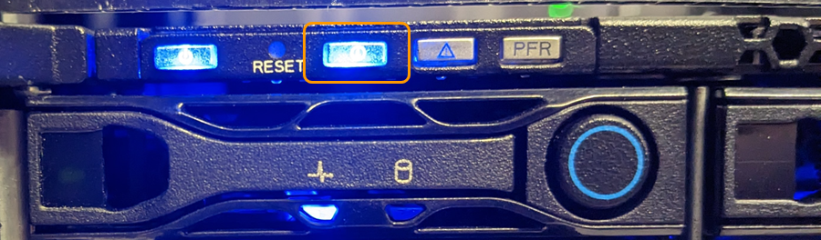

= 打开和关闭SGF6112设备识别LED
:allow-uri-read: 
:icons: font
:imagesdir: ../media/

[role="lead"]
可以打开设备正面和背面的蓝色识别LED指示灯、以帮助在数据中心内定位设备。

.开始之前
您知道要标识的设备的BMC IP地址。

.步骤
. link:../installconfig/accessing-bmc-interface.html["访问设备BMC界面"]。
. 选择 * 服务器标识 * 。
+
已选择识别LED的当前状态。

. 选择*on*或*off*，然后选择*Perform Action*。
+
当您选择*on*时，产品正面(典型显示)和背面的蓝色识别LED指示灯将亮起。

+

+

NOTE: 如果控制器上安装了挡板，则可能很难看到正面的识别 LED 。

+
后部的识别LED指示灯位于设备中央、位于Micro SD插槽下方。

. 根据需要打开和关闭识别LED。

.相关信息
link:locating-sgf6112-in-data-center.html["在数据中心内找到设备"]
