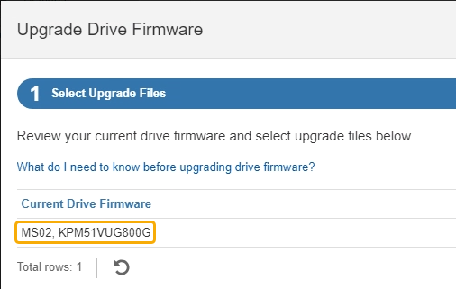

= 使用SANtricity系统管理器联机方法升级SG6100驱动器固件(SG6160)
:allow-uri-read: 
:icons: font
:imagesdir: ../media/

[role="lead"]
使用SANtricity系统管理器联机方法升级设备中驱动器上的固件、以确保您拥有所有最新功能和错误修复。

NOTE: 此操作步骤*不*适用于SG6100-CN中的NVMe SSD、SG6100-CN会在StorageGRID软件升级期间进行更新。使用此操作步骤只能更新E4000中的驱动器。

.开始之前
* 存储设备处于最佳状态。
* 所有驱动器均处于最佳状态。

CAUTION: 请勿一次升级多个StorageGRID 设备上的驱动器固件。这样做可能会导致发生原因 数据不可用、具体取决于您的部署模式和ILM策略。

.关于此任务
在设备执行I/O时、一次升级一个驱动器此方法不要求您将设备置于维护模式。但是、系统性能可能会受到影响、并且升级所需时间可能比脱机方法要长几小时。

[NOTE]
====
对于属于不具有冗余的卷的驱动器、必须使用进行更新 link:upgrading-drive-firmware-using-santricity-system-manager-offline.html["脱机方法"]。对于当前已降级的任何池或卷组、应使用脱机方法。

====
.步骤
. 使用以下方法之一访问 SANtricity System Manager ：
+
** 使用 StorageGRID 设备安装程序并选择 * 高级 * > * SANtricity 系统管理器 *
** 使用网格管理器并选择*N节点*>*_Storage N点SANtricity 系统管理器*
** 通过浏览到存储控制器IP来使用SANtricity系统管理器：
+
`*https://_Storage_Controller_IP_*`

. 如果需要，输入 SANtricity System Manager 管理员用户名和密码。
. 验证存储设备中当前安装的驱动器固件版本：
+
.. 在 SANtricity 系统管理器中，选择 * 支持 * > * 升级中心 * 。
.. 在驱动器固件升级下，选择 * 开始升级 * 。
+
升级驱动器固件页面将显示当前安装的驱动器固件文件。

.. 请在当前驱动器固件列中记下当前驱动器固件版本和驱动器标识符。
+

+
在此示例中：

+
*** 驱动器固件修订版为 * 。 MS02* 。
*** 驱动器标识符为 * 。 KPM51 VVG800G* 。

.. 在关联驱动器列中选择 * 查看驱动器 * ，以显示这些驱动器在存储设备中的安装位置。
.. 关闭升级驱动器固件窗口。

. 下载并准备可用的驱动器固件升级：
+
.. 在驱动器固件升级下，选择 * NetApp 支持 * 。
.. 在NetApp 支持站点 上，选择*Downloads*选项卡，然后选择*E系列磁盘驱动器固件*。
+
此时将显示 E 系列磁盘固件页面。

.. 搜索存储设备中安装的每个 * 驱动器标识符 * ，并验证每个驱动器标识符是否具有最新的固件版本。
+
*** 如果固件版本不是链接，则此驱动器标识符的固件版本为最新。
*** 如果为驱动器标识符列出了一个或多个驱动器部件号，则可以对这些驱动器进行固件升级。您可以选择任何链接来下载固件文件。
+
image::../media/storagegrid_drive_firmware_download.png[E 系列磁盘固件页面]

.. 如果列出了更高版本的固件，请选择固件修订版中的链接(download)列以下载 `.zip` 包含固件文件的归档。
.. 提取（解压缩）从支持站点下载的驱动器固件归档文件。

. 安装驱动器固件升级：
+
.. 在 SANtricity 系统管理器的驱动器固件升级下，选择 * 开始升级 * 。
.. 选择 * 浏览 * ，然后选择从支持站点下载的新驱动器固件文件。
+
驱动器固件文件的文件名类似于 `D_HUC101212CSS600_30602291_MS01_2800_0002.dlp`。

+
您最多可以选择四个驱动器固件文件，一次一个。如果多个驱动器固件文件与同一驱动器兼容，则会收到文件冲突错误。确定要用于升级的驱动器固件文件，然后删除另一个驱动器固件文件。

.. 选择 * 下一步 * 。
+
* 选择驱动器 * 列出了可使用选定固件文件进行升级的驱动器。

+
仅显示兼容的驱动器。

+
为驱动器选择的固件将显示在*建议的固件*列中。如果必须更改此固件，请选择 * 返回 * 。

.. 选择*联机升级所有驱动器*—升级存储阵列处理I/O时可支持固件下载的驱动器如果选择此升级方法、则不必停止使用这些驱动器对关联卷的I/O。
+

NOTE: 联机升级可能比脱机升级需要几个小时。

.. 在表的第一列中，选择要升级的一个或多个驱动器。
+
最佳实践是，将所有相同型号的驱动器升级到相同的固件修订版。

.. 选择*Start*并确认要执行升级。
+
如果需要停止升级，请选择 * 停止 * 。当前正在进行的所有固件下载均已完成。已取消所有尚未启动的固件下载。

+

CAUTION: 停止驱动器固件升级可能会导致数据丢失或驱动器不可用。

.. （可选）要查看已升级内容的列表，请选择 * 保存日志 * 。
+
日志文件将保存在浏览器的下载文件夹中、并带有名称 `latest-upgrade-log-timestamp.txt`。

+
link:troubleshoot-upgrading-drive-firmware-using-santricity-system-manager.html["如果需要、请对驱动程序固件升级错误进行故障排除"]。

