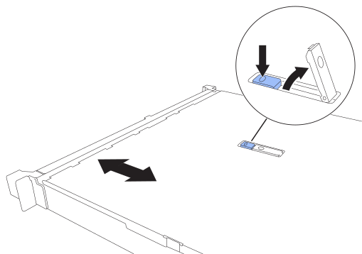

= 更换 SGF6212 或 SG6200-CN 盖
:allow-uri-read: 
:icons: font
:imagesdir: ../media/

[role="lead"]
卸下产品盖板以接触内部组件进行维护，完成后更换盖板。

== 步骤 1：取下盖子

.步骤
. 将ESD腕带的腕带端缠绕在手腕上，并将扣具端固定到金属接地，以防止在产品内部工作时发生静电释放。
. link:reinstalling-sg6200-into-cabinet-or-rack.html["从机柜或机架中取出产品"] 以访问顶盖。

. 按下设备外壳上的蓝色锁定按钮，解锁外壳闩锁。
+

. 将闩锁向上并向后朝产品机箱背面旋转，直至其停止；然后小心地将机箱盖从机箱中提起并放在一旁。

== 步骤 2：重新安装盖板

.步骤
. 打开盖板闩锁，将盖板对准机箱上方并小心放下。
. 向前和向下旋转机箱盖闩锁，直到其停止，并且机箱盖完全就位到机箱中。确认外盖前边缘没有间隙。
+
如果护盖未完全就位，您可能无法将产品滑入机架。

. link:reinstalling-sg6200-into-cabinet-or-rack.html["将产品重新安装到机柜或机架中"]。

