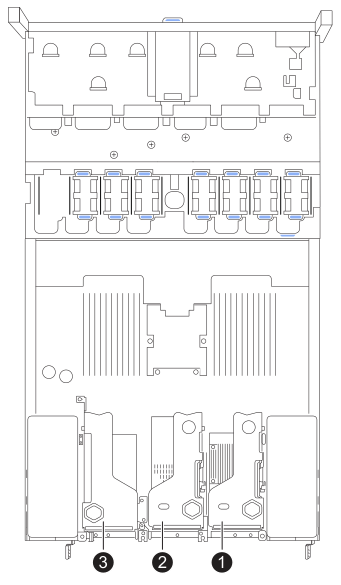
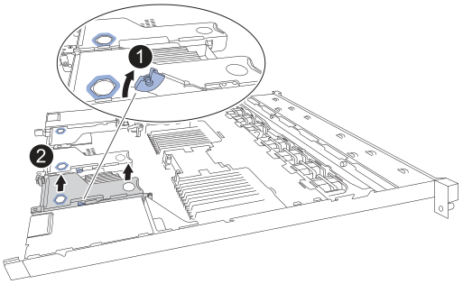
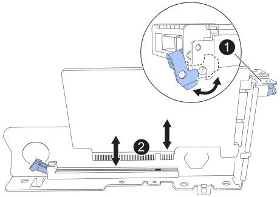
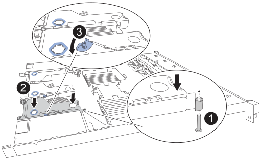
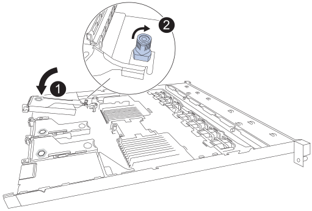

= 更换 SGF6212 或 SG6200-CN 中的内部网卡
:allow-uri-read: 
:icons: font
:imagesdir: ../media/

[role="lead"]
如果 SGF6212 或 SG6200-CN 无法正常工作或出现故障，您可能需要更换其内部网络接口卡 (NIC)。

.关于此任务
为了防止服务中断、请在开始更换网络接口卡(Network Interface Card、NIC)之前确认所有其他存储节点均已连接到网格、或者在计划的维护时段内可接受服务中断期间更换NIC。请参见有关的信息 https://docs.netapp.com/us-en/storagegrid/monitor/monitoring-system-health.html#monitor-node-connection-states["监控节点连接状态"^]。

CAUTION: 如果您使用的ILM规则仅为对象创建一个副本、则必须在计划的维护时段更换NIC、因为在此操作步骤期间、您可能会暂时无法访问这些对象。请参阅有关的信息 https://docs.netapp.com/us-en/storagegrid/ilm/why-you-should-not-use-single-copy-replication.html["为什么不应使用单副本复制"^]。

.开始之前
* 您拥有正确的替代NIC。
* 您有link:locating-sg6200-in-data-center.html["物理定位 SGF6212 设备或 SG6200-CN 控制器"]，您正在数据中心中更换 NIC。
+

NOTE: 从机架上卸下设备之前，需要link:power-sg6200-off-on.html#shut-down-the-sgf6212-appliance-or-sg6200-cn-controller["受控关闭设备"]。

* 您已断开所有电缆和 link:reinstalling-sg6200-cover.html["已卸下产品盖"] 的连接。
* 您已确定 link:verify-component-to-replace.html["要更换的NIC的位置"]。
+
设备中的三个 NIC 位于机箱中以下位置的三个提升管组件中（如图所示，设备后部已卸下顶盖）：

+

+
[cols="1a,3a,5a"]
|===
|  | 设备或部件名称 | Description 

 a| 
1.
 a| 
单槽提升板组件中的 NIC 1
 a| 
用于网格和客户端网络的 10/25-GbE 以太网端口

 a| 
2.
 a| 
单槽提升板组件中的 NIC 2
 a| 
用于管理网络的 1/10-GbE 以太网端口

 a| 
3.
 a| 
单槽提升板组件中的 NIC 3
 a| 
用于网格和客户端网络的 10/25-GbE 以太网端口

|===
+

NOTE: 某些设备支持更高速度的网络端口，并可能安装了更高速度的 NIC。

[[step-1-remove-the-nic]]
== 步骤 1：卸下 NIC

[role="tabbed-block"]
====
.NIC 1/NIC 2
--
.步骤
. 将 ESD 腕带的腕带一端绕在腕带上，并将扣具一端固定到金属接地，以防止静电放电。
. 在设备背面找到包含NIC的提升板组件。
. 将有故障 NIC 的转接卡上的蓝色锁定闩锁向上旋转并打开。
+

. 使用蓝色标记的孔小心地向上抬起有故障 NIC 的立管组件。抬起立管组件时，将立管组件朝向机箱前方移动，以使其安装的 NIC 中的外部连接器清除机箱。
. 将立管放置在金属框架侧向下的平坦防静电表面上，以访问 NIC。
. 打开故障 NIC 上的蓝色闩锁，并小心地将其从提升管组件中取出。稍微摇动 NIC，以帮助从其连接器中取出 NIC。请勿使用过度的力。
+

. 将立管和 NIC 放在平坦的防静电表面上。

--
.NIC 3
--
.步骤
. 将 ESD 腕带的腕带一端绕在腕带上，并将扣具一端固定到金属接地，以防止静电放电。
. 将具有故障 NIC 的 Riser 卡上的蓝色锁定旋转到打开位置。
+

. 使用蓝色标记的孔和立管边缘小心地向上提起立管组件。抬起立管组件时，将立管组件朝向机箱前方移动，以使其安装的 NIC 中的外部连接器清除机箱。
. 将立管放置在金属框架侧向下的平坦防静电表面上，以访问 NIC。
. 打开故障 NIC 上的蓝色闩锁，并小心地将其从提升管组件中取出。稍微摇动 NIC，以帮助从其连接器中取出 NIC。请勿使用过度的力。
+

. 将立管和 NIC 放在平坦的防静电表面上。

--
====

[[step-2-reinstall-the-internal-nic]]
== 步骤 2：重新安装内部 NIC

将更换用的NIC安装到与已卸下的NIC相同的位置。

[role="tabbed-block"]
====
.NIC 1/NIC 2
--
.步骤
. 将 ESD 腕带的腕带一端绕在腕带上，并将扣具一端固定到金属接地，以防止静电放电。
. 从包装中取出替代NIC。
. 将更换 NIC 安装到提升管组件中。
+
.. 确保蓝色闩锁处于打开位置。
+

.. 将 NIC 与立管组件上的连接器对齐。小心地将 NIC 按入连接器，直到其完全就位，然后关闭蓝色闩锁。

. 将提升管组件重新安装到机箱中。
+
.. 定位转接卡组件上的对准孔，该孔与系统主板上的导销对准，以确保正确定位转接卡组件。
+

.. 将提升板部件置于机箱中、确保其与系统板上的连接器和导销对齐。
.. 小心地将竖板部件沿着其中心线，蓝色标记的孔旁边按到位，直到其完全就位。

. 如果您不需要对设备执行其他维护步骤、请重新安装设备盖、将设备装回机架、连接电缆并接通电源。

更换零件后，将故障零件退回 NetApp，如套件附带的 RMA 说明中所述。有关更多信息，请参阅 https://mysupport.netapp.com/site/info/rma["零件退货  更换"^]页面。

--
.NIC 3
--
.步骤
. 将 ESD 腕带的腕带一端绕在腕带上，并将扣具一端固定到金属接地，以防止静电放电。
. 从包装中取出替代NIC。
. 将更换 NIC 安装到提升管组件中。
+
.. 确保蓝色闩锁处于打开位置。
+

.. 将 NIC 与立管组件上的连接器对齐。小心地将 NIC 按入连接器，直到其完全就位，然后关闭蓝色闩锁。

. 将提升管组件重新安装到机箱中。
+
.. 将立管组件放置在机箱中，确保立管组件的边缘与机箱的边缘正确对齐。
+

.. 沿着其中心线，小心地将立管组件按到位，靠近蓝色标记的孔，直到其完全就位。
.. 将立管上的蓝色锁旋转到关闭位置。

. 从要重新安装缆线的NIC端口上取下保护帽。
. 如果您不需要对设备执行其他维护步骤、请重新安装设备盖、将设备装回机架、连接电缆并接通电源。

更换零件后，将故障零件退回 NetApp，如套件附带的 RMA 说明中所述。有关更多信息，请参阅 https://mysupport.netapp.com/site/info/rma["零件退货  更换"^]页面。

--
====