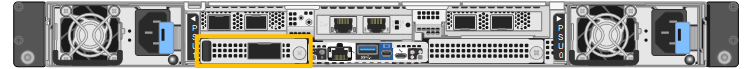

= 更换 SG6200-CN 中的外部 NIC
:allow-uri-read: 
:icons: font
:imagesdir: ../media/

[role="lead"]
如果 SG6200-CN 的外部网络接口卡 (NIC) 无法正常工作或出现故障，则可能需要更换该卡。

.关于此任务
为防止服务中断，请在启动网络接口卡 (NIC) 更换之前确认所有其他存储节点已连接到网格，或在可接受服务中断期间的计划维护时段更换 NIC。请参阅有关 link:https://docs.netapp.com/us-en/storagegrid/monitor/monitoring-system-health.html#monitor-node-connection-states["监控节点连接状态"] 的信息。

CAUTION: 如果您曾经使用过仅创建一个对象副本的 ILM 规则，则必须在计划的维护时间段内更换 NIC，因为在此过程中，您可能会暂时失去对这些对象的访问权限。查看有关 link:https://docs.netapp.com/us-en/storagegrid/ilm/why-you-should-not-use-single-copy-replication.html["为什么不应使用单副本复制"] 的信息。

.开始之前
* 您拥有正确的替代NIC。
* 您已确定 link:verify-component-to-replace.html["要更换的NIC的位置"]。
+

* 您有link:locating-sg6200-in-data-center.html["物理定位 SG6200-CN 控制器"]，您正在数据中心中更换 NIC。
+

NOTE: 此过程*不*支持热插拔。在断开电缆和卸下 NIC 之前，需要link:power-sg6200-off-on.html#shut-down-the-sgf6212-appliance-or-sg6200-cn-controller["受控关闭设备"]。

* 您已断开所有电缆，包括 SG6200-CN 上的两根电源线。
* *可选*：如果当地法规要求、您已将控制器从机架中取出。由于NIC可从外部访问、因此不需要卸下。

[[step-1-remove-the-external-nic]]
== 步骤 1：卸下外部 NIC

.步骤
. 将ESD腕带的腕带端缠绕在手腕上、并将扣具端固定到金属接地以防止静电放电。
. 使用螺丝刀拧松NIC面的螺钉。
+

CAUTION: 此操作步骤*不支持热插拔。在卸下NIC之前、必须先断开控制器的电源。

. 拉动卡舌，小心地卸下网卡。将NIC放在平坦的防静电表面上。

[[step-2-reinstall-the-external-nic]]
== 步骤 2：重新安装外部 NIC

.步骤
. 将ESD腕带的腕带端缠绕在手腕上、并将扣具端固定到金属接地以防止静电放电。
. 从包装中取出替代NIC。
. 将NIC与机箱中的开口对齐、然后小心地将其推入、直至完全就位。
. 拧紧NIC盖件上的螺钉。

.完成后
如果您不需要对设备执行其他维护过程、请将设备装回机架(如果已将其卸下)、连接缆线并接通电源。

更换零件后，将故障零件退回 NetApp，如套件附带的 RMA 说明中所述。有关更多信息，请参阅 https://mysupport.netapp.com/site/info/rma["零件退货  更换"^]页面。
