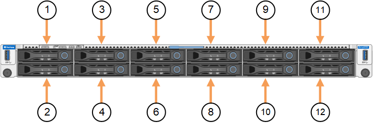
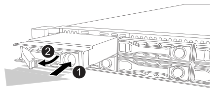

= 更换 SGF6212 中的驱动器
:allow-uri-read: 
:icons: font
:imagesdir: ../media/

[role="lead"]
SGF6212 存储设备包含 12 个 SSD 驱动器。对于作为存储节点运行的 SGF6212，驱动器上的数据受到 RAID 方案的保护，该方案使设备能够从任何单个驱动器故障中恢复，而无需从另一个节点复制数据。对于作为网关节点运行的 SGF6212，单个驱动器故障会导致缓存容量降低。

如果 SGF6212 作为存储节点运行，则在纠正初始驱动器故障之前第二个驱动器的故障可能需要从其他节点复制数据以恢复冗余。如果单拷贝 ILM 规则正在使用或过去使用过，或者数据冗余受到其他节点故障的影响，则冗余恢复可能需要更长时间，并且可能是不可能的。因此，如果其中一个 SGF6212 驱动器出现故障，您必须尽快更换以确保冗余。

如果 SGF6212 作为网关节点运行，则 SGF6212 中的每个驱动器故障都会导致缓存容量进一步降低。此外，故障驱动器上的任何缓存数据将不再缓存。其他驱动器故障可能会导致操作系统故障，因此必须尽快更换故障驱动器以确保可用性。

CAUTION: 如果三个或更多驱动器发生故障，节点可能无法运行 StorageGRID。它将离开网格，重新启动并启动 StorageGRID Appliance Installer，以方便诊断和修复存储问题。

.开始之前
* 您有 link:locating-sg6200-in-data-center.html["已物理定位设备"]。
* 您已注意到驱动器的左侧LED呈稳定琥珀色或使用网格管理器确认哪个驱动器出现故障 link:verify-component-to-replace.html["查看由故障驱动器引起的警报"]。
+

NOTE: 请参见有关查看状态指示器的信息以验证故障。

* 您已获得替代驱动器。
* 您已获得适当的 ESD 保护。

.步骤
. 验证驱动器左侧的故障LED是否为琥珀色、或者使用警报中的驱动器插槽ID找到驱动器。
+
12个驱动器位于机箱中的以下位置(所示为已卸下挡板的机箱正面)：

+

+
|===
| Position | 驱动器 

 a| 
1.
 a| 
HDD00

 a| 
2.
 a| 
HDD01

 a| 
3.
 a| 
HDD02

 a| 
4.
 a| 
HDD03

 a| 
5.
 a| 
HDD04

 a| 
6.
 a| 
HDD05

 a| 
7.
 a| 
HDD06

 a| 
8.
 a| 
HDD07

 a| 
9
 a| 
HDD08

 a| 
10
 a| 
HDD09

 a| 
11.
 a| 
HDD10

 a| 
12
 a| 
HDD11

|===
+
您还可以使用 Grid Manager 监控 SSD 驱动器的状态。选择 *Nodes*。然后选择 `*Storage Node*` > *Hardware*。如果驱动器出现故障，Storage RAID Mode 字段将包含有关哪个驱动器出现故障的消息。

. 将 ESD 腕带的腕带一端绕在腕带上，并将扣具一端固定到金属接地，以防止静电放电。
. 拆开备用驱动器的包装，并将其放在设备附近的无静电水平表面上。
+
节省所有包装材料。

. 按下故障驱动器上的释放按钮。
+

+
驱动器弹出器上的手柄部分打开，驱动器从插槽中释放。

. 打开手柄，滑出驱动器，然后将其放在无静电的水平表面上。
. 在将替代驱动器插入驱动器插槽之前，请按此驱动器上的释放按钮。
+
闩锁会弹开。

. 将替代驱动器插入插槽，然后合上驱动器手柄。
+

NOTE: 合上手柄时不要用力过大。

+
驱动器完全插入后，您会听到卡嗒声。

+
更换后的驱动器会使用工作驱动器中的镜像数据自动重建。驱动器LED最初应闪烁、但一旦系统确定驱动器具有足够的容量且正常工作、此指示灯就会停止闪烁。

+
您可以使用网格管理器检查重建的状态。

. 如果 SGF6212 作为存储节点运行，并且多个驱动器出现故障并被更换，则可能会出现警报，指示某些卷需要将数据还原到它们。如果您收到警报，在尝试卷恢复之前，请选择 *Nodes* > `*appliance Storage Node*` > *Hardware*。在页面的 StorageGRID Appliance 部分，验证存储 RAID 模式是否正常或正在重建。如果状态列出了一个或多个故障驱动器，请在尝试恢复卷之前更正此情况。
. 在 Grid Manager 中，转到 *Nodes* > `*appliance Storage Node*` > *Hardware*。在页面的 StorageGRID Appliance 部分，验证存储 RAID 模式是否正常。

更换零件后，将故障零件退回 NetApp，如套件附带的 RMA 说明中所述。有关更多信息，请参阅 https://mysupport.netapp.com/site/info/rma["零件退货  更换"^]页面。
