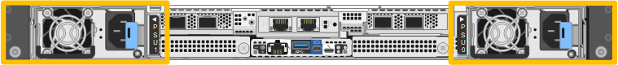
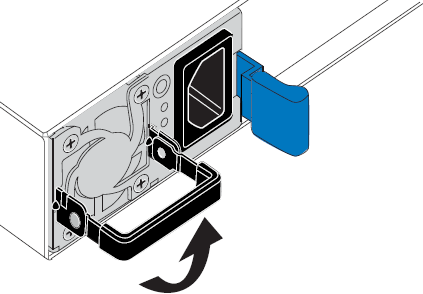
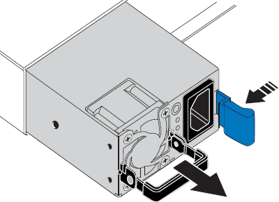
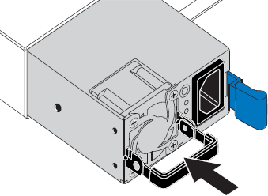

= 更换 SGF6212 或 SG6200-CN 中的一个或两个电源
:allow-uri-read: 
:icons: font
:imagesdir: ../media/

[role="lead"]
SGF6212 设备和 SG6200-CN 计算节点具有两个冗余电源。如果其中一个电源出现故障，则必须尽快更换，以确保设备具有冗余电源。设备中运行的两个电源必须具有相同的型号和功率。

.关于此任务
图中显示了两个电源装置的位置。可从设备背面接入电源。

+ 注意：图片显示 SGF6212 设备，但电源位于 SG6200-CN 计算节点上的相同位置。

.开始之前
* 您有link:locating-sg6200-in-data-center.html["已物理定位设备"]需要更换电源。
* 您已拥有 link:verify-component-to-replace.html["已确定要更换的电源的位置"]。
* 如果仅更换一个电源：
+
** 您已卸载更换用的电源设备，并确保其型号和功率与要更换的电源设备相同。
** 您已确认另一个电源已安装且正在运行。

* 如果要同时更换两个电源：
+
** 您已卸载替代电源设备，并确保其型号和功率相同。

.步骤
. 如果您只更换一个电源，则无需关闭设备。转至 <<Unplug_the_power_cord,拔下电源线>> 步骤。如果要同时更换两个电源，请在拔下电源线之前执行以下操作：
+
.. link:power-sg6200-off-on.html#shut-down-the-sgf6212-appliance-or-sg6200-cn-controller["关闭设备"]。
+

CAUTION: 如果您曾经使用仅创建一个对象的一个副本的ILM规则、而您要同时更换两个电源、则必须在计划的维护时段更换这些电源、因为在此操作步骤期间、您可能会暂时无法访问这些对象。请参阅有关的信息 https://docs.netapp.com/us-en/storagegrid/ilm/why-you-should-not-use-single-copy-replication.html["为什么不应使用单副本复制"^]。

. 【拔掉电源线， start=2]] 从要更换的每个电源中拔下电源线。
+
从产品背面看，电源A (PSU0)位于右侧，电源B (PSU1)位于左侧。

. 提起要更换的第一个耗材的手柄。
+

. 按下蓝色闩锁并拉出电源。
+

. 使蓝色闩锁位于右侧，将替代电源滑入机箱。
+

NOTE: 安装的两个电源必须具有相同的型号和功率。

+
在中滑动更换部件时，请确保蓝色闩锁位于右侧。

+
当电源锁定到位时、您会感觉到卡嗒声。

+

. 向下按压手柄、使其紧靠PSU主体。
. 如果要更换这两个电源，请重复步骤 2 到 6 以更换第二个电源。
. link:../installconfig/connecting-power-cords-and-applying-power.html["将电源线连接到更换的设备并接通电源"]。

更换零件后，将故障零件退回 NetApp，如套件附带的 RMA 说明中所述。有关更多信息，请参阅 https://mysupport.netapp.com/site/info/rma["零件退货  更换"^]页面。
